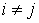
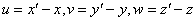
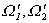

§<b>5&nbsp; </b><b>弹性理论与有限元解法</b>

有限元法用来解弹性体的小变形问题是很有效的.这是由于变形能与外力势能或总势能可以表示为形式划一的二次泛函.由于弹性力学问题提法,特别是边界条件的复杂性,要使有限元解法灵活运用,还需要对各种问题作些分析与讨论.因此本节除了介绍各类问题与§1中<i>B</i>、<i>D</i>等有关的基本关系式外，还着重分析边界条件在有关变分问题中所起的作用，并讨论各类变分问题与微分方程定解问题的等价性。

一、&nbsp; 一、&nbsp;&nbsp;&nbsp;&nbsp;&nbsp;&nbsp;&nbsp; 三维的弹性问题

本节在直角坐标系(<i>x</i>,<i>y</i>,<i>z</i>)中讨论弹性体内部受力与形变的情况.为了简化论述,假设弹性体是单连通、均匀并各向同性的,必要时还用通常的矢量记号以突出其力学意义.

[应力与平衡方程]&nbsp; 弹性体在外力、温差等作用下，各部分之间将产生内力，表示内力的大小是作用面上受力的强度或单位面积所受的力,即所谓应力.对弹性体内的一点<i>P</i>,可在其邻近作一微元六面体，其棱边平行于坐标轴。六面体的六个面中有三个面其外法线方向分别与<i>x</i>轴、<i>y</i>轴或<i>z</i>轴同向（其余三个则与坐标轴反向）,可分别称为<i>x</i>,<i>y</i>,<i>z</i>坐标面(或第1,2,3坐标面).设分别表示作用于<i>x</i>,<i>y</i>,<i>z</i>坐标面的应力,并记的三个分量为(对其余三个面的应力取号相反.例如,图19.18上所示的分量全是正的),这九个分量(<i>i</i><i>,j</i>=1,2,3) 构成一个张量,称为应力张量.

从图可看出,分量表示第<i>i</i>坐标面上的正应力(受拉取正,受压为负);而分量则表示沿第<i>i</i>坐标面剪应力的二分量(使扭角变成锐角的为正).由微元六面体力矩的平衡可得剪应力互等定律,即

&nbsp;=&nbsp;&nbsp;&nbsp;&nbsp;&nbsp;&nbsp;&nbsp;&nbsp;&nbsp;&nbsp;&nbsp;&nbsp;&nbsp;
()

因此应力张量是对称的,其分量只有六个是独立的.在有限元解法中,一般是把这六个分量按如下次序排成列矢量,并记作

设过点<i>P</i>作一任意的斜面,其法线<b><i>n</i></b>的方向余弦为(),则利用与三坐标面围成的四面体的平衡条件可得作用于该斜面的应力的三个分量

&nbsp;&nbsp;&nbsp;&nbsp;&nbsp;&nbsp;&nbsp;&nbsp;&nbsp;&nbsp;
(<i>j</i>=1,2,3)

于是在方向余弦为()的直线上的投影,即其分量为

这表明,一个点的应力状态完全由该点的六个应力分量{s}所决定.例如,作用于上述斜面的正应力为

而沿该斜面的剪应力方向取,大小等于

反过来,对于的斜面称为<i>P</i>点的应力主面,相应的法线称为<i>P</i>点的应力主轴,而其正应力称为<i>P</i>点的主应力.可以证明,在弹性体内任意一点,一定存在三个互相正交的主应力,而且其中最大(小)的一个就是该点的极大(小)正应力.三个正应力之和

称为体积应力,它在坐标变换下是个不变量,因而等于三个主应力之和.

设,表示作用于<i>P</i>点的体力(单位体积的外力),对体积元素作积分或均值分析都可以推出力的平衡方程

<pre style='text-align:right' align=right>&nbsp;&nbsp;&nbsp;&nbsp;&nbsp;&nbsp;&nbsp;&nbsp;&nbsp; (<i>i</i>=1,2,3) &nbsp;&nbsp;&nbsp;&nbsp;&nbsp;&nbsp;&nbsp;(26)</pre>

[应变与几何方程]&nbsp; 弹性体内任一点<i>P</i>(<i>x</i>,<i>y</i>,<i>z</i>)在小变形后移到其位移函数为

式中

它们是(<i>x</i>,<i>y</i>,<i>z</i>)的微量函数,假定有一微小线段<i>PN</i><i>=dr</i>其方向余弦为(),经过小变形变为,则沿该方向的正应变定义为单位伸长,即

从变形前后的与<i>dr</i>关于位移的表达式不难得出

展开右端的根式并略去高阶无穷小量(即位移导数的高次项),就得到

设另一线段<i>PM</i>的方向余弦为(),变形前的夹角,则

<pre style='text-align:right' align=right>&nbsp;&nbsp;&nbsp;&nbsp;&nbsp;&nbsp;&nbsp; (27)</pre>

设变形后的夹角(图19.19),则

根据变形前后两线段大小、方向的变化,不难得出

<pre style='text-align:right' align=right>&nbsp;&nbsp;&nbsp;&nbsp;&nbsp;&nbsp;&nbsp;&nbsp;&nbsp;&nbsp;&nbsp;&nbsp;&nbsp;&nbsp;&nbsp;&nbsp;&nbsp;&nbsp;&nbsp;&nbsp;&nbsp;&nbsp;&nbsp;&nbsp;&nbsp;&nbsp;&nbsp;&nbsp;&nbsp;&nbsp;&nbsp;&nbsp;&nbsp;&nbsp;&nbsp;&nbsp;&nbsp;&nbsp;&nbsp;&nbsp;&nbsp;&nbsp;&nbsp;&nbsp;&nbsp;&nbsp;&nbsp;&nbsp;&nbsp; (28)</pre>

对照(27),(28)可知,只要在<i>P</i>点给定如下六个导数值:

<pre style='text-align:right' align=right>&nbsp;&nbsp;&nbsp;&nbsp;&nbsp;&nbsp; &nbsp;&nbsp;&nbsp;&nbsp;&nbsp;&nbsp;&nbsp;&nbsp;&nbsp;&nbsp;&nbsp;&nbsp;&nbsp;&nbsp;&nbsp;&nbsp;&nbsp;&nbsp;&nbsp;&nbsp;&nbsp;&nbsp;&nbsp;&nbsp;&nbsp; &nbsp;&nbsp;&nbsp;&nbsp;&nbsp;&nbsp;&nbsp;&nbsp;&nbsp;&nbsp;&nbsp;&nbsp;&nbsp;&nbsp; &nbsp;(29)</pre>

就可以完全确定<i>P</i>点邻近的变形状态.表示沿第<i>i</i>坐标轴的正应变,表示经过小变形第<i>i</i>,<i>j</i>坐标方向之间的直角改变量即所谓剪应变(如图19.20所示,变形后成锐角为正,成钝角为负).这六个量称为应变分量,记作

同样可以证明,在弹性体内任意一点,一定存在互相正交的应变主轴,变形后三轴交角仍然保持直角,即剪应变为零;三主轴的正应变称为主应变,而且其中最大(小)的一个就是该点的极大(小)的正应变.三个正应变之和

称为体积应变,也是个不变量,而且表示微元中每单位体积的改变量.对于各向同性体来说,应力主轴与应变主轴的方向还是一致的.§1中所述的变形能密度

正是把坐标系变换到共同的主轴方向并应用虎克定律而推导出来的.

关系式(29)称为几何方程,其矩阵形式为

[物理方程与弹性系数] 对杆件作简单拉、压的小变形实验证明,单独的轴向(取为<i>x</i>轴)力不会引起剪应变,其正压力与正应变之间具有如下的线性关系

或

如果考虑到沿<i>x</i>方向的伸长还伴有侧向收缩,则产生沿<i>y</i>,<i>z</i>方向的正应变

或

这就是虎克定律,式中系数<i>E</i>,<i>v</i>分别称为弹性模数和泊松比.从胡克定律就可以推导出应变与应力之间的一般关系式,即所谓物理方程

式中称为剪切弹性模数.

从(30)求逆得出应力与应变之间的关系式

或写成矩阵形式:

&nbsp;&nbsp;&nbsp;&nbsp;&nbsp;&nbsp;
 &nbsp;

式中与<i>G</i>称为拉梅系数,<i>e</i>就是体积应变.它与体积应力Θ成正比:

&nbsp;&nbsp;&nbsp; 或&nbsp;&nbsp;&nbsp;&nbsp;

式中比例常数称为体积弹性模数.

[边界条件]&nbsp; 弹性体<i>Ω</i>的边界<i>Ω</i><i>'</i>承受面力

有三种方式:固定支承,荷载支承和弹性支承.假定<i>Ω</i><i>'</i>接受这三种支承的部分分别记作和,则其边界条件可表示为

1°&nbsp;&nbsp;&nbsp;&nbsp;&nbsp;&nbsp;
1°&nbsp;&nbsp;&nbsp;&nbsp;&nbsp;&nbsp; 几何约束条件: 在上给定位移,即

2°&nbsp;&nbsp;&nbsp; 2°&nbsp;&nbsp; &nbsp;面力平衡条件: 在上给定荷载即面力<b><i>q</i></b>,()表示上任一面积元素的外法线方向余弦.由于应力要与面力平衡,从(27)可得其条件为

<pre>&nbsp;&nbsp;&nbsp;&nbsp;&nbsp;&nbsp;&nbsp;&nbsp;&nbsp;&nbsp;&nbsp;&nbsp;&nbsp;&nbsp;&nbsp;&nbsp;&nbsp;&nbsp;&nbsp;&nbsp;&nbsp;&nbsp;&nbsp;&nbsp;&nbsp;&nbsp;&nbsp;&nbsp;&nbsp;&nbsp;&nbsp;&nbsp;&nbsp; </pre>

3°&nbsp;&nbsp;&nbsp; 3°&nbsp;&nbsp; &nbsp;耦合平衡条件: 在上弹性体与另一弹性结构耦合,这些耦合边界上的位移既不受约束也不完全自由,而是接受与其位移偏差(相对于某一给定的位移值)成正比的弹性反力.每单位面积上它的三个分量可表示为

这里弹性支承系数矩阵<i>C</i>=()是正定的,而可看作给定的面力.同样,这反力应由上的应力来平衡.于是其条件可写成

[外力势能及其计算公式]&nbsp; 弹性体内及其边界上,凡给定的外力因变形而作功的部分都要累加起来,再补上负号可看作弹性体相对于外力系统的势能,即所谓外力势能-<i>F</i>(<b><i>u</i></b>).例如在弹性体内部除体力<b><i>f</i></b>外,也可能有部分施加集中的面力、线力和点力，这些力与该部分的位移的内积就是它们所作的功，因此都要算进去。在边界上，除几何约束的部分外，施加在其余部分的外力,包括面力、线力和点力对外力势能都有贡献,也要引入公式.为了简化计算公式,同式(1)~(7)只列出体力<b><i>f</i></b>与面力<b><i>q</i></b>一样,这里也不考虑集中力的情况.

假定在弹性体<i>Ω</i>的边界的部分,和上分别施加几何约束、面力与弹性反力,则外力由于变形而作的功等于

取内积记号

式中<i>C</i>=()表示正定的弹性耦合系数矩阵,而-<i>C<b>u</b></i>就是因位移<b><i>u</i></b>而产生的弹性反力.于是,外力所作的功<i>W</i>可简写成

<pre>&nbsp;&nbsp;&nbsp;&nbsp;&nbsp;&nbsp;&nbsp;&nbsp;&nbsp;&nbsp;&nbsp;&nbsp;&nbsp;&nbsp;&nbsp;&nbsp;&nbsp;&nbsp;&nbsp;&nbsp;&nbsp;&nbsp;&nbsp;&nbsp;&nbsp;&nbsp;&nbsp;&nbsp; </pre>

上式右边第三个积分是由于边界变形而产生的外功，它是<b><i>u</i></b>的二次泛函，因此改号后可看作弹性体变形能的一部分，于是总势能可写成

<pre style='text-align:right' align=right>&nbsp;&nbsp;&nbsp;&nbsp;&nbsp;&nbsp;&nbsp;&nbsp;&nbsp;&nbsp;&nbsp;&nbsp;&nbsp;&nbsp;&nbsp;&nbsp;&nbsp;&nbsp;&nbsp;&nbsp;&nbsp;&nbsp;&nbsp;&nbsp;&nbsp;&nbsp;&nbsp;&nbsp;&nbsp;&nbsp;&nbsp;&nbsp;&nbsp;&nbsp; （32）</pre>

式中表示变形能,-<i>F</i>(<b><i>u</i></b>)表示外力势能,即

&nbsp;&nbsp;&nbsp;&nbsp;&nbsp;&nbsp;&nbsp;&nbsp;&nbsp;&nbsp;

