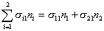
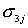
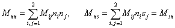
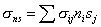
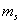

二、&nbsp; 二、&nbsp;&nbsp;&nbsp;&nbsp;&nbsp;&nbsp;&nbsp; 二维的弹性问题

本段只在直角坐标系中讨论平面应力、平面应变以及薄板弯曲等三个常见的问题。对于抗拉薄板,可以认为沿板厚方向的正应力与剪应力都等于零.一般以薄板的中面为<i>xy</i>面,可假定 

只有沿<i>xy</i>平面的三个应力分量:和,而且它们与坐标<i>z</i>无关.这就是平面应力问题.反过来,分析相当长棱柱体(例如重力坝)在受到沿长度不变的外力作用下的变形,可以认为各点只有平行其横截面(取为<i>xy</i>平面)的位移(即<i>w</i>=0),而且其位移沿长度不变(即<i>u</i>,<i>v</i>与<i>z</i>无关),从几何方程可知

只有沿<i>xy</i>平面的和,而且与<i>z</i>无关,这就是平面应变问题.

分析薄板受横向荷载而引起的弯曲的情况,可以认为中面各点不作纵向位移,即当<i>z</i>=0时,<i>u</i>=<i>v</i>=0,而板的横向位移<i>w</i>不沿厚度变化,即<i>w</i> =<i> w</i>(<i>x</i>,<i>y</i>)与<i>z</i>无关.此外,由于沿板厚方向的正应力与剪应力虽不等于零,但远小于其他应力分量,对变形的影响可忽略不计,因此又有同平面应力问题一样的物理方程.

[平面应力问题]&nbsp; 作用于法线的方向余弦为()的截面上的应力分量为&nbsp;&nbsp;&nbsp;&nbsp; &nbsp;&nbsp;&nbsp;

1°&nbsp;&nbsp;&nbsp;&nbsp;&nbsp;&nbsp;
1°&nbsp;&nbsp;&nbsp;&nbsp;&nbsp;&nbsp; 力的平衡方程

2°&nbsp;&nbsp;&nbsp;&nbsp;&nbsp;&nbsp;
2°&nbsp;&nbsp;&nbsp;&nbsp;&nbsp;&nbsp; 边界条件&nbsp; 假定边界接受固定支承,荷载支承和弹性支承的部分分别记作,则其边界条件可表示为

3°&nbsp;&nbsp;&nbsp;&nbsp;&nbsp;&nbsp;
3°&nbsp;&nbsp;&nbsp;&nbsp;&nbsp;&nbsp; 几何方程

4°&nbsp;&nbsp;&nbsp;&nbsp;&nbsp;&nbsp;
4°&nbsp;&nbsp;&nbsp;&nbsp;&nbsp;&nbsp; 物理方程

&nbsp;&nbsp;&nbsp;&nbsp;&nbsp;
或&nbsp;&nbsp;&nbsp;&nbsp;&nbsp;

5°&nbsp;&nbsp;&nbsp;&nbsp;&nbsp;&nbsp;
5°&nbsp;&nbsp;&nbsp;&nbsp;&nbsp;&nbsp; 矩阵<i>B</i>与<i>D</i>

注意,从物理方程(30)还推导出

它是单位板厚的改变量.

6°&nbsp;&nbsp;&nbsp;&nbsp;&nbsp;&nbsp;
6°&nbsp;&nbsp;&nbsp;&nbsp;&nbsp;&nbsp; 总势能表达式形式上与(32)完全一样,只须注意这里是二维情况.

[平面应变问题]&nbsp; 力的平衡方程、边界条件、几何方程(因而矩阵<i>B</i>)以及总势能的表达式同平面应力问题一样.从和(30)可推出其物理方程

&nbsp;
或&nbsp;&nbsp; 

对照平面应力问题的物理方程看出,只要把其中的<i>E</i>,<i>v</i>分别改成,就得到平面应变问题的物理方程.这表示弹性系数为的材料的平面应力问题同弹性系数为的材料的平面应变问题是一致的.相应的矩阵<i>D</i>可写成

注意,从物理方程(30)还得出纵向的正压力

它是使棱柱体纵向无应变所应加于其两端的面力.

[薄板弯曲问题]&nbsp; 薄板的小变形可完全由中面(取作<i>xy</i>坐标平面)的挠度(即沿<i>z</i>方向的位移)<i>w</i>=<i> w</i>(<i>x</i>,<i>y</i>)来表示.也就是要得出板中面<i>z</i>=0变形后的弹性曲面<i>z</i>=<i> w</i>(<i>x</i>,<i>y</i>).这时板中面点(<i>x</i>,<i>y</i>,0)的法向线段,依假定只作刚性位移变到该曲面的法向线段(图19.22右),其方向数为。

&nbsp;&nbsp;&nbsp;&nbsp;&nbsp;&nbsp;&nbsp;&nbsp;&nbsp;&nbsp;&nbsp;&nbsp;&nbsp;&nbsp;&nbsp;&nbsp;

因此,薄板中任一点(<i>x</i>,<i>y</i>,<i>z</i>)(,<i>h</i>为板的厚度)的位移分量可写成

这里略去了微量的高阶项.同样,我们可记变形后曲面的三个曲率分量的一阶近似为

而把几何方程写成

物理方程中主要的应力分量则可写成

这些分量与上述的应变分量成对地出现于变形能的积分式中,并含有的公因子.现在把中的<i>z</i>移到上并考虑如下积分

&nbsp;&nbsp; 

式中

称为板的抗弯刚度，而与就是同<i>x,y</i>轴正交的单宽截面上所受的弯矩与扭矩。

这些内力与应力之间显然有如下关系:

因此把称为广义应力,称为广义应变,而(33)就称为广义的胡克定律.如果记

则变形能可写成

式中<i></i>表示薄板中面的区域.由于待定函数只有位移分量<i>w</i>(<i>x,y)</i>,&nbsp;&nbsp; 于是可令

&nbsp;&nbsp;&nbsp;&nbsp;&nbsp;&nbsp;&nbsp;&nbsp; 

并把{<i>k</i>}=<i>B w,</i>{<i>M</i>}=<i>D</i>{<i>k</i>}代入(34),得到

积分式中出现位移函数<i>w</i>的二阶偏导数,与平面问题仅出现位移函数<i>u,v</i>的一阶偏导数有本质上的不同.

[弹性曲面与板的总势能]

1°&nbsp;&nbsp;&nbsp;&nbsp;&nbsp;&nbsp;
1°&nbsp;&nbsp;&nbsp;&nbsp;&nbsp;&nbsp; 弹性曲面的微分方程&nbsp; 在应力分量中,不但对变形影响较大,而且由它们所产生的弯矩、扭矩在把荷载传递到边界的作用中是基本的内力.但直接同外力平衡的内力却是其余的分量.因此,为了得出弹性曲面的形状,还要考虑到各应力分量 (<i>j=</i>1<i>,</i>2<i>,</i>3)与<i>w</i>之间的关系.

由于薄板的体力可忽略不计,根据应力平衡方程(26)与上下板面的边界条件,通过对<i>z</i>的积分可得

再代入(26)第三方程就能求出.一般地说,下板面悬空即无面力,于是依其边界条件:通过对<i>z</i>的积分可得

最后根据施加于上板面的荷载强度<i>q</i>(向下为正)的边界条件,并利用拉普拉斯算子的记号可得

这就是弹性曲面的四阶微分方程,式中<i>d</i>为板的抗弯刚度.为了求解<i>w</i>,还需要考虑沿薄板边缘(截面)的边界条件.

2°&nbsp;&nbsp;&nbsp;&nbsp;&nbsp;&nbsp;
2°&nbsp;&nbsp;&nbsp;&nbsp;&nbsp;&nbsp; 板的边界条件 为了统一表达式,设分别表示垂直于<i>x,y</i>轴的单宽截面上由所产生的切力

<pre style='text-align:right' align=right>&nbsp;&nbsp;&nbsp;&nbsp;&nbsp;&nbsp;&nbsp;&nbsp;&nbsp;&nbsp; &nbsp;&nbsp;&nbsp;&nbsp;&nbsp;&nbsp;&nbsp;&nbsp;&nbsp;&nbsp;&nbsp;&nbsp;&nbsp;&nbsp;&nbsp;&nbsp;&nbsp; &nbsp;(35)</pre>

其次在中面区域<i></i>的边界<i></i>上作切线方向<b><i>s</i></b>与外法线方向<b><i>n</i></b>,使<b><i>n</i></b>,<b><i>s</i></b>与<i>z</i>轴构成右手的局部坐标系(参考图19.24),并设<b><i>s,n</i></b>的方向余弦分别为。

对比(33),(35)显然有平衡方程:

如果以表示作用于外法向为<b><i>n</i></b>的单宽边缘截面的切力,则得平衡方程:

式中

它们分别表示作用于边缘截面的正应力与剪应力所产生的单宽弯矩与扭矩.

薄板的各种边界条件基本上可分为以下三类:

(i)&nbsp;&nbsp;&nbsp;&nbsp;&nbsp;&nbsp;&nbsp;
(i)&nbsp; &nbsp;&nbsp;几何约束

(a)&nbsp;&nbsp;&nbsp;&nbsp;&nbsp;
(a)&nbsp; &nbsp;&nbsp;给定某部分边界的挠度:。例如固定边、简支边都要给定<i>w=</i>0<i>。</i>

(b)&nbsp;&nbsp;&nbsp;&nbsp;
(b)&nbsp; &nbsp;&nbsp;给定边缘截面绕切向<b><i>s</i></b>的转角。例如固定边除<i>w=</i>0外,还要给定=0 。

(ii)&nbsp;&nbsp;&nbsp;&nbsp;&nbsp;
(ii)&nbsp; 荷载支承

(a)&nbsp;&nbsp;&nbsp;&nbsp;&nbsp;
(a)&nbsp; &nbsp;&nbsp;在单宽边界上给定横向的线力荷载<i>p</i>,它是由边缘截面上的切力和扭矩的切向变化率所产生的切力来平衡,即

&nbsp;&nbsp;&nbsp;&nbsp;&nbsp;&nbsp;&nbsp;&nbsp;&nbsp;
(<i>p</i>朝<i>z</i>方向为正)

例如在自由边部分<i>p=</i>0,依上述公式左端包含<i>w</i>的三阶偏导数.

(b)&nbsp;&nbsp;&nbsp;&nbsp;
(b)&nbsp; &nbsp;&nbsp;对单宽边缘截面给定绕切向<b><i>s</i></b>的力矩荷载即。例如在自由边部分同<i>p</i>一样，。

（iii)&nbsp;&nbsp;&nbsp;&nbsp;&nbsp;&nbsp;&nbsp;&nbsp;&nbsp;&nbsp;
（iii)&nbsp;&nbsp;&nbsp; &nbsp;&nbsp;弹性支承

(a)&nbsp;&nbsp;&nbsp; (a)&nbsp;&nbsp;&nbsp;&nbsp;&nbsp; &nbsp;除横向的线力荷载外还承受与挠度成正比的弹性反力-<i>cw</i>，其中<i>c</i>&gt;0为弹性耦合系数，其条件可写成

(b)&nbsp;&nbsp; (b)&nbsp;&nbsp;&nbsp;&nbsp;&nbsp; &nbsp;除了力矩荷载外还承受与截面绕切向的转角成正比的弹性反力矩，其中&gt;0也是弹性耦合系数。其条件可写成

注意，在同一边界上给定的二条件不能同样是（<i>a</i>）型或（<i>b</i>）型的。

3°&nbsp;&nbsp;&nbsp; 3°&nbsp;&nbsp;&nbsp;&nbsp;&nbsp;&nbsp;
总势能的表达式&nbsp; 给定的二条件假定在中面区域的边界上都是弹性支承，其平衡条件为

&nbsp;&nbsp;&nbsp;&nbsp;&nbsp; (<i>c</i>,
&gt;0)

变形能与外力势能的表达式可分别写成

如果在部分边界上分别给定挠度和绕切向<b><i>s</i></b>的转角，则在表达式的后面二线积分中应分别去掉与这些几何约束有关的积分线段。于是总势能可写成

当其他部分改为荷载支承时，只要把该部分的<i>c</i>或取零，表达式照旧。

