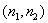

三、&nbsp; 三、&nbsp;&nbsp;&nbsp;&nbsp;&nbsp;&nbsp;&nbsp; 一维的弹性问题

本段只讨论柱体的扭转问题，因为它是用扭转率作为广义应变的.其他问题如杆的伸缩、梁的弯曲等可看作二维问题的简化而且与有限元法关系不大,从略.

[圆柱的扭转]&nbsp; 圆柱的半径为<i>R</i>,圆柱的中心轴取作<i>z</i>轴,两端为<i>z</i>=0,<i>z</i>=<i>l</i>,体力不计.首先考虑只在两端截面受相反的力偶矩<i>M</i>(图19.24)而产生的扭转变形.一般可假定只有沿各横截面产生抗扭的剪应力而其余的分量

&nbsp;&nbsp;&nbsp;&nbsp;&nbsp;&nbsp;&nbsp;
(<i>i</i>=1,2,3)

从物理方程可知它也是一种纯剪切变形。在圆截面上取极坐标也构成右手坐标系(图19.24)&nbsp;&nbsp; 对圆柱的扭转，还进一步假定

（i)&nbsp;&nbsp;&nbsp;&nbsp;&nbsp;&nbsp;&nbsp;&nbsp;&nbsp;&nbsp;&nbsp;&nbsp;&nbsp;
（i)&nbsp;&nbsp;&nbsp;&nbsp;&nbsp;&nbsp;&nbsp;&nbsp;&nbsp;
，即各圆截面无轴向位移；

（ii)&nbsp;&nbsp;&nbsp;&nbsp;&nbsp;&nbsp;&nbsp;&nbsp;&nbsp;&nbsp;&nbsp;&nbsp;
（ii)&nbsp;&nbsp;&nbsp;&nbsp;&nbsp;&nbsp;&nbsp;
任一圆截面将绕圆心作微小的转动。

设转动角为<i>ω</i>(<i>z</i>),则<i>ω</i>(<i>z</i>)-<i>ω</i>(0)表示相对于端面<i>z</i>截面<i>z</i>=0的扭转角，而<i>ω</i>(<i>l</i>)-<i>ω</i>(0)就是柱体的总扭转角。一般可令<i>ω</i>(0)=0，即一端固定。

考虑半径为<i>r</i>在<i>z</i>与<i>z</i>+<i>dz</i>截面之间的环面,不难看出,由于相对扭转角<i>d</i><i>ω</i>而产生的直角改变量即剪应变

它是由环面上沿<i>q</i> 方向（或垂直于半径<i>r</i>）的剪应力作用的结果，依虎克定律

根据剪应力的对称性可得沿<i>z</i>截面的扭矩

式中就是截面对中心轴的惯矩。于是变形能可写成

因此，圆柱扭转问题的扭矩<i></i>与扭转率可分别看作广义的剪应力与剪应变。系数称为柱体的抗扭刚度。对这问题，§1中<i>B</i>是微分算子，<i>D</i>是，待定函数就是广义的位移即扭转角<i>ω</i>(<i>z</i>)。

推广到一般情况。如果沿柱体每单位长度施加分布荷载即扭转，则平衡方程可写成

而其边界条件同样有三种支承形式：

（i)&nbsp;&nbsp;&nbsp;&nbsp;&nbsp;&nbsp;&nbsp;&nbsp;&nbsp;&nbsp;&nbsp;&nbsp;&nbsp;
（i)&nbsp;&nbsp;&nbsp;&nbsp;&nbsp;&nbsp;&nbsp;&nbsp;&nbsp;
几何约束&nbsp;&nbsp; 对柱端截面给定扭转角<i>ω</i>。例如

（ii)&nbsp;&nbsp;&nbsp;&nbsp;&nbsp;&nbsp;&nbsp;&nbsp;&nbsp;&nbsp;&nbsp;&nbsp;
（ii)&nbsp;&nbsp;&nbsp;&nbsp;&nbsp;&nbsp;&nbsp;
荷载支承&nbsp;&nbsp; 对柱端截面施加一定的扭转。例如

或

（iii)&nbsp;&nbsp;&nbsp;&nbsp;&nbsp;&nbsp;&nbsp;&nbsp;&nbsp;&nbsp;
（iii)&nbsp;&nbsp;&nbsp;&nbsp;&nbsp;&nbsp;
弹性支承&nbsp; 在柱端截面给定与扭角偏差成正比的弹性反矩。例如 

或

式中为弹性耦合系数。

总势能的表达式&nbsp;&nbsp;&nbsp;&nbsp;&nbsp;&nbsp; 由于体力不计，对弹性支承的情况，变形能与外力势能可分别表示<i>ω</i>(<i>z</i>)的泛函形式：

<pre>&nbsp;&nbsp;&nbsp;&nbsp;&nbsp;&nbsp;&nbsp;&nbsp;&nbsp;&nbsp;&nbsp;&nbsp;&nbsp;&nbsp;&nbsp;&nbsp;&nbsp;&nbsp;&nbsp;&nbsp;&nbsp;&nbsp;&nbsp;&nbsp; </pre>

若某端为荷载支承，可取该端，则表达式照旧；若某端（例如<i>z</i>=0）给定扭转角，则在上二式中含端点<i>z</i>=0的项都要去掉，而总势能的表达式可写成

<pre>&nbsp;&nbsp;&nbsp;&nbsp;&nbsp;&nbsp;&nbsp;&nbsp;&nbsp;&nbsp;&nbsp;&nbsp;&nbsp;&nbsp;&nbsp;&nbsp;&nbsp;&nbsp;&nbsp;&nbsp;&nbsp;&nbsp;&nbsp; </pre>

[柱体的扭转]&nbsp;&nbsp; 同圆柱扭转一样，假定，体力与侧面的面力不计，只在两端施加力偶矩<i>M</i>，其扭矩的位移分量可写成

其中为扭转率，称为翘曲函数。

几何方程&nbsp;&nbsp;&nbsp;&nbsp;&nbsp;&nbsp; 

物理方程

<pre>&nbsp;&nbsp;&nbsp;&nbsp;&nbsp;&nbsp;&nbsp;&nbsp;&nbsp;&nbsp;&nbsp;&nbsp;&nbsp;&nbsp;&nbsp;&nbsp;&nbsp;&nbsp;&nbsp;&nbsp;&nbsp;&nbsp;&nbsp;&nbsp;&nbsp;&nbsp;&nbsp;&nbsp;&nbsp;&nbsp;&nbsp;&nbsp;&nbsp;&nbsp;&nbsp;&nbsp; </pre><pre>&nbsp;&nbsp;&nbsp;&nbsp;&nbsp;&nbsp;&nbsp;&nbsp;&nbsp;&nbsp;&nbsp;&nbsp;&nbsp;&nbsp;&nbsp;&nbsp;&nbsp;&nbsp;&nbsp;&nbsp;&nbsp;&nbsp;&nbsp;&nbsp;&nbsp;&nbsp;&nbsp;&nbsp;&nbsp;&nbsp;&nbsp;&nbsp;&nbsp;&nbsp;&nbsp;&nbsp;</pre>

平衡方程&nbsp;&nbsp;&nbsp;&nbsp; 从可得

其中为柱体截面。

边界条件&nbsp;&nbsp; 设的边界的外法线的方向余弦为，由于柱侧面不受面力，从物理方程可得边界条件

根据，从平衡方程与边界条件可知其一般解的形式为（为任意常数）。<i>a</i>可由两端截面的力矩平衡条件来确定，例如从端面<i>z</i>=<i>l</i>的扭矩

可得出扭转率

于是，可看作位移，问题归结为求使总势能

达到极值的解。

