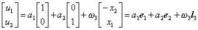
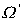
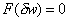
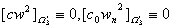
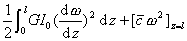
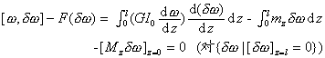
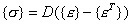
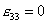

四、&nbsp; 四、&nbsp;&nbsp;&nbsp;&nbsp;&nbsp;&nbsp;&nbsp; 与有限元解法有关的问题

在讨论空间与平面问题时,为简化起见,坐标(<i>x</i>,<i>y</i>,<i>z</i>)改用(),<b><i>u</i></b>仍表示位移列矢量,其三分量用()代替(<i>u,v,w</i>);对体力<b><i>f</i></b>等荷载仍用()表示其分量;对积分,除列式演算外,一般只用一个积分号表示.

[变形能的正定性与刚性位移]&nbsp; 弹性系数矩阵<i>D</i>是正定的,从变形能<i>V</i>=0可推出,即对应变来说它是正定的,但是对位移来说,它却退化为非负的,即不能由推出,因为弹性体还存在无应变的位移即刚性位移.

1°&nbsp;&nbsp;&nbsp;&nbsp;&nbsp;&nbsp;
1°&nbsp;&nbsp;&nbsp;&nbsp;&nbsp;&nbsp; 一般空间问题&nbsp; 设位移矢量场<b><i>u</i></b>的旋度<i>rot<b>u</b></i>的分量为

<pre align=left>&nbsp;&nbsp;&nbsp;&nbsp;&nbsp;&nbsp;&nbsp;&nbsp;&nbsp;&nbsp;&nbsp;&nbsp;&nbsp;&nbsp;&nbsp;&nbsp;&nbsp;&nbsp;&nbsp;&nbsp;&nbsp;&nbsp;&nbsp; </pre>

它与位移分量以及应变分量之间的关系式为

&nbsp;&nbsp;&nbsp;&nbsp;&nbsp;&nbsp;&nbsp;&nbsp;&nbsp;&nbsp;
&nbsp;&nbsp;&nbsp;&nbsp;&nbsp; 

因此,在小变形的假定下,应变表示整个弹性体除了作微小的位移外,还可作微小的转动,它的刚性位移可写成

式中表示平移的分量,表示绕三坐标轴的转角,它们都是任意微小的常量.总之,弹性体无应变的微小刚性位移共有六个自由度,设

则上式可简写成

式中就是第<i>i</i>坐标轴的单位矢量,就是绕第<i>i</i>坐标轴的旋臂矢量.于是

&nbsp;&nbsp;&nbsp;&nbsp;&nbsp;&nbsp;&nbsp;&nbsp;
(<i>i</i>=1,2,3)&nbsp;&nbsp;&nbsp;&nbsp;&nbsp;&nbsp;&nbsp;&nbsp;&nbsp; 

分别表示分布体力<b><i>f</i></b>对弹性体的合力与合力矩沿第<i>i</i>坐标轴方向的分量.对面力<b><i>q</i></b>等分布荷载也有类似的结果.

2°&nbsp;&nbsp;&nbsp;&nbsp;&nbsp;&nbsp;
2°&nbsp;&nbsp;&nbsp;&nbsp;&nbsp;&nbsp; 平面应力、应变问题&nbsp;&nbsp; 由于,刚性位移简化为

其自由度等于3.分布荷载与,的内积也有类似的定义与含意.

3°&nbsp;&nbsp;&nbsp;&nbsp;&nbsp;&nbsp;
3°&nbsp;&nbsp;&nbsp;&nbsp;&nbsp;&nbsp; 薄板弯曲问题&nbsp; 由于位移分量只有挠度,刚性位移可写成

&nbsp;&nbsp;&nbsp; (即）

其自由度等于3.内积

分别表示分布荷载<i>q</i>沿中面的合力以及绕轴的合力矩.

4°&nbsp;&nbsp;&nbsp;&nbsp;&nbsp;&nbsp;
4°&nbsp;&nbsp;&nbsp;&nbsp;&nbsp;&nbsp; 圆柱扭转问题&nbsp; 根据假定<i>w</i>=0与广义剪应变,即扭转率可得无应变的刚性位移为.相应的旋臂矢量为.这时,位移也可写成

&nbsp;&nbsp;&nbsp;&nbsp;&nbsp;&nbsp; (即&nbsp; )

其自由度等于1.设在端面给定分布荷载切力<b><i>Q</i></b>(其分布,严格地说,应与剪应力相同),则内积就是沿端面的合力矩<i>M</i>.

[变分问题的可解性]&nbsp; 这里只讨论一般空间问题、薄板弯曲问题与圆柱扭转问题,其他问题类推.

1°1°&nbsp;&nbsp; 一般空间问题&nbsp; 先考虑边界纯荷载支承的情况.从§1可以看出,求解位移函数<b><i>u</i></b>使弹性体的总势能达到极小值,即

的变分问题可以归结为求解变分方程

&nbsp; (对一切）

的问题,其中位移<b><i>u</i></b>的变分力学上称为虚位移,而积分

称为虚功泛函,它是位移<b><i>u</i></b>和虚位移的双线性泛函.

上面已经指出,变形能只能得出是任意刚性的虚位移.反之,对一切非刚性的虚位移..因此利用等式

可以证明,变分问题有解的充分必要条件是

&nbsp;&nbsp; (对一切刚性的虚位移）

由于刚性位移的自由度为6, 又可分写为6个条件

这表明,要使弹性体在纯荷载支承下达到平衡状态的充分必要条件就是外力对整个弹性体所产生的合力与合力矩都等于零.

反过来,设变分问题有一解,则位移与任意微小的刚性位移之和+也是它的解,这表明弹性体的平衡状态可以相差一个微小的刚性位移,具有6个自由度.换句话说,解的一般形式可写成

如果边界上还有一部分受几何约束或弹性支承,则有解的充分必要条件的个数或自由度都会相应地减少,只要这部分边界条件使弹性体不可能有微小的刚性位移,则问题的解存在而且唯一.例如当<b><i>u</i></b>在部分边界上给定位移值时,变分方程改为

&nbsp;&nbsp;&nbsp; （对于)

只要包含不共线的三点,条件就排除一切刚性的虚位移,解存在的充分必要条件的个数等于零了.如果在部分边界上施加弹性支承,则从变形能

与二积分的正定性可得

而<i>C</i>的正定性又推出.因此,只要包含不共线的三点,那末变形能对位移<b><i>u</i></b>就是正定的,问题的解也就存在而且唯一.

2°&nbsp;&nbsp;&nbsp;&nbsp;&nbsp;&nbsp;
2°&nbsp;&nbsp;&nbsp;&nbsp;&nbsp;&nbsp; 薄板弯曲问题 考虑纯荷载支承的情况,其变形能与外力势能可用广义应变表示如下

变分问题

可归结为求解变分方程

&nbsp;&nbsp;
(对一切虚位移)

同样[,]=0只能得出广义应变,刚性虚位移可表示为

其自由度等于3,而变分方程有解的充分必要条件是

&nbsp;&nbsp;&nbsp;&nbsp; (对一切刚性虚位移)

由于上式可分写为三个条件:

<pre>&nbsp; &nbsp;&nbsp;&nbsp;&nbsp;&nbsp;&nbsp;&nbsp;&nbsp;&nbsp;&nbsp;&nbsp;&nbsp;&nbsp;&nbsp;&nbsp;&nbsp;&nbsp;&nbsp;&nbsp;&nbsp;&nbsp;&nbsp;&nbsp;&nbsp;&nbsp;&nbsp;&nbsp;&nbsp;&nbsp;&nbsp;&nbsp;&nbsp;&nbsp;&nbsp;</pre>

&nbsp;

前一条件是沿板厚度方向的外力要取得平衡使板不产生移动;后二条件分别表示外力对板所产生的绕<i>x</i>,<i>y</i>轴方向的力矩要取得平衡,使板不产生转动.在这些条件下,板的平衡状态也不唯一而具有3个自由度,即问题的解可写成

如果边界上还有一部分受几何约束或弹性支承,则可解的充分必要条件的个数或自由度都会减少或等于零.例如,只要有不共线的三点给定挠度,或给定一点的挠度与两个绕不同方向的转角就使板不可能有微小的刚性位移,这时问题的解存在而且唯一.对部分边界施加弹性反力或反力矩也会提高变形能的正定性.例如在部分边界上给定弹性反力-<i>cw</i>与反力矩,则从可得<i>Bw</i>&ordm;0 与,即使只是一个点也减少两个自由度,如果有两个不同的外法线方向,则自由度为零.这时[<i>w</i>,<i> w</i>]对<i>w</i>是正定的,问题的解也就存在而且唯一.

3o&nbsp;
圆柱扭转问题&nbsp; 考虑纯荷载支承的情况,其变形能与外力势能可用广义位移(即扭转角)<i>ω</i>表示如下

变分问题

可归结为求解变分方程

&nbsp;(对一切)

同样, [,]=0只能得出扭转率.而刚性(广义)虚位移可表示为,其自由度等于1.变分方程有解的充分必要条件是

(对一切绕<i>z</i>轴的扭转角)

这表示沿整个柱面的扭矩要取得平衡.在这个条件下,圆柱的平衡状态可相差一微小的扭转角,即其解可写成

只要有一端受几何约束,自由度就消失;如果有一端(例如<i>z</i>=<i>l</i>)给予弹性支承,则相应的变形能(例如)对就是正定的了.对于这些情况,问题的解存在而且唯一

[变分问题与微分方程定解问题的等价性] 弹性体内部力的平衡方程是在平衡状态下对其微元进行均值分析而推导出来的;同样,其边界条件也是边界微元上内力与外力达到平衡的体现.因此,弹性力学中各种微分方程定解问题就是要找出弹性体因连续变形而产生的内、外力平衡状态.变分问题则是以整个弹性体的能量的形式来表达这种平衡状态,不论是用变形能泛函或虚功泛函,其实质是一样的.这里还要指出它与微分方程定解问题的等价性.下面仍以一般空间问题、薄板弯曲问题与圆柱扭转问题为范例作简单介绍.

1°&nbsp;&nbsp;&nbsp; 1°&nbsp;&nbsp;&nbsp;&nbsp;&nbsp;&nbsp;
一般空间问题&nbsp; 力的平衡方程

可以看作一组关于位移分量()的二阶微分方程,其边界条件仍按三种支承方式分别表达如下:

&nbsp;&nbsp;&nbsp;&nbsp;&nbsp;&nbsp;&nbsp;&nbsp;&nbsp;&nbsp;&nbsp;&nbsp;&nbsp;&nbsp;&nbsp;&nbsp;&nbsp;

&nbsp;&nbsp;&nbsp;&nbsp;&nbsp;&nbsp; &nbsp;&nbsp;&nbsp;&nbsp;&nbsp;&nbsp;

&nbsp;&nbsp;&nbsp;&nbsp;&nbsp; 

它们包含位移分量及其一阶偏导数.

现在从虚功泛函的形式出发,考虑如下的变分方程

&nbsp;&nbsp;&nbsp; （对)

对应用高斯公式进行分部积分可得

从和变分方程就得到在<i>W</i>内力的平衡方程和,上的边界条件.至于在上的几何约束条件由于在<i>P</i>(<b><i>u</i></b>)中没有反映出来,需要强加上去,即在解变分方程时,除了对变分加上条件外,还得要求其满足.反过来,以满足的变分乘上弹性体<i>W</i>内部力的平衡方程与上的边界条件并且作相应的积分,应用高斯公式显然也得出上述的变分方程.

2°2°薄板弯曲问题&nbsp; 以中面<i></i>的挠度<i>w</i>(<i>x</i>,<i>y</i>)为待定函数,弹性体内部力的平衡方程在推导过程已自行满足,而以上板面的边界条件作为<i>w</i>所满足的微分方程

<i></i>&nbsp;&nbsp;&nbsp;&nbsp;&nbsp; 

对应的边界条件是由板的边缘截面内外力平衡来确定.由于支承方式的复杂性,下面先对纯弹性支承的情况的虚功泛函作分部积分得出一般形式,然后再来考虑其他支承对各项积分的影响.设

代以<i>B</i>,<i>D</i>及内力等表达式并分部积分,可以证明

式中为边界<i></i>上沿<i>s</i>正向依序排成的拐点.

由于荷载支承可看作弹性支承的特例(即<i>c</i>或的情况),只要考虑在部分边界上分别给定挠度和转角:

&nbsp;&nbsp; (另一条件只能是弹性反力矩)

&nbsp;(另一条件只能是弹性反力)

(可以重迭)并在拐点有集中力(可以取零,特别当)的情况,这时相应的外力势能可写成

同样在变形能中应加上条件:

对照上述二式,可知变分问题:满足强加的条件

且使

&nbsp;(对)

的解<i>w</i>,是下面微分方程的定解问题的解:

反过来,这个问题的解<i>w</i>显然也是上述变分问题的解,因此它们是等价的.

3°3°&nbsp; 圆柱扭转问题&nbsp; 以柱体横截面的扭转角<i>w</i>(<i>z</i>)为待定函数,其广义力(即扭矩)的平衡方程为沿柱长的微分方程:

先考虑纯弹性支承的情况,其边界条件可写成

相应的虚功泛函与外力势能为

对前一式作分部积分,再对照后一式不难看出求解变分方程

&nbsp; （对一切）

的问题同上述二阶常微分方程的定解问题是等价的.端点受荷载支承的情况可看作其特例(即的情况).对于端点受几何约束的情况,只要把变分方程中与该端有关的各项去掉并对<i>ω</i>及改为强加条件,两个问题仍然等价.例如求满足及变分方程

的函数<i>ω</i>(<i>z</i>)的问题与下面微分方程的定解问题是等价的:

[热效应与热当量荷载]&nbsp;
在弹性问题中,弹性体由于受热引起各微元的胀缩,从而调整弹性体内部应力或应变的分布,这种作用称为热效应.设为零应变状态的温度分布;<i>T</i>为小变形后的温度分布,由于温升,弹性体将向周围作均匀的膨胀(或收缩,当).在任何直角坐标系中,其位移分量只与有关,即只有线应变而无剪应变(<i>i</i>&sup1;<i>j</i>),而且在小变形假定下,它们与有线性关系:

式中<i>α</i>称为线膨胀系数.

如果考虑热效应,则弹性体的总应变为

式中就是无温差的应变.在小变形的假定下,有

<pre style='text-align:right' align=right>&nbsp;&nbsp;&nbsp;&nbsp;&nbsp;&nbsp; &nbsp;&nbsp;&nbsp;&nbsp; (36)</pre>

因此对于圆柱扭转等仅与剪应变有关的问题,热效应为零.对一般的空间问题,可令

则有

或

可看作总应变的零次项.它表明在无应力状态(例如弹性体完全自由膨胀)下,弹性体也有热应变;而在无应变状态(例如其边界全部受约束)下,弹性体由于温升可产生热应力-<i>D</i>.现在令=<i>D</i>,则有

式中

对于平面应变问题,由于(注意,不是),可直接用(36)第三式:

代入(36)前二式,得出零次项为.记从相应的矩阵<i>D</i>可得

对于平面应力问题,假定并不改变(36)前二式零次项的值,于是根据相应的矩阵<i>D</i>得出

对于薄板弯曲问题,把温升分布函数近似写成

其中与可分别看作沿厚度的平均值与梯度.于是总应变

与零次项相应的应力与弯矩分别为

这表明板的弯矩只与温升的梯度成正比,而不受板中面的温升分布的影响.

对空间问题,由于的出现使得虚功泛函中与有关的第一项应改写成

等式右边第二个积分就是由于热效应产生的一项.其中并不出现<b><i>u</i></b>.这表明在变形能中,热效应的部分对<b><i>u</i></b>是线性的,不妨把它归入外力势能.这同弹性反力所产生的外力势能中的一部分（<i>C<b>u</b></i>,<b><i>u</i></b>),由于对<b><i>u</i></b>是二次的而归入虚功泛函恰恰相反.为了突出,再对这一项作分部积分:

对照中的被积函数,可知热效应就象对弹性体分别加上体力和面力:

这些力可称为热当量荷载.就是完全受约束的热(正)应力的梯度,当为常量时，这时热当量荷载就只有面力了。

对薄板弯曲问题，由于热效应虚功泛函多出一项积分，同样可把它归入外力势能并作两次分部积分就可得到

对照中的被积函数，可知热效应就象对薄板分别对上板面施加面力对单宽边界侧面施加横向线力和绕切向的力矩的结果一样。当取常量时，热当量荷载就只有力矩了。

[位移法与力法]&nbsp; 位移法是位移、广义位移或象柱体扭转问题中的翘曲函数<i>y</i>作为待定的；力法是以应力或如下应力函数<i>F</i>作为待定的。仅以柱体扭转问题为例作些说明。

对单连通区域<i>W</i> ，平衡方程就保证存在一函数<i>F</i>（<i>x</i>,<i>y</i>),使得

这个<i>F</i>（<i>x</i>,<i>y</i>)称为扭转的应力函数。与上述的物理方程对照可得它与翘曲函数之间的关系：

由于位移<i>w</i>或<i>y</i> 存在的充分必要条件为：，因而可得<i>F</i>所满足的

协调方程：&nbsp;&nbsp;&nbsp;&nbsp;&nbsp;&nbsp;&nbsp;&nbsp;&nbsp;&nbsp;&nbsp; 

由于侧面无外力，即,可得

这表示<i>F</i>沿截面边界取常数（不妨取作零），从而可得

边界条件：&nbsp;&nbsp;&nbsp;&nbsp;&nbsp; 

令则是泊松方程第一类边值问题：

的解。根据端面<i>z</i>=<i>l</i>的力偶矩为<i>M</i>的条件：

就得出扭转率

也可看作“应力”而归结为如下变分问题：求满足，且使总势能

取极值的解。

注意，力法是归结为求泊松方程第一类边值问题的解，比位移法归结为第二类边值问题较为简单。但是当区域是复连通时，协调条件或位移的单值性，在其每个内边界还要满足积分条件

其中为所围的面积，<i>p</i>为区域<i>W</i> 的连通度。在这种情况下，在上取常数值也是待定的，因此当截面为连通度为<i>p</i>的区域时，力法则归结为泊松方程附加<i>p</i>个积分条件并含有<i>p</i>个待定常数的第一边值问题，较之位移法反而复杂化了。

除了这两种方法还有兼用位移与应力为待定函数的混合方法，如果应用得当，可使问题的解法大大简化。

