

<b>附录</b><b>&nbsp;&nbsp; </b><b>有限元法中的数值积分</b>

在单元分析中需要计算大量数值积分，这些积分常常通过坐标变换把被积函数（包括对整体直角坐标的微分算子矩阵<i>B</i>)全部化为局部坐标的函数，并且其中大部分是关于局部坐标的多项式。对于方块剖分，它可化为坐标变量<i>x</i>，<i>h</i>，<i>z</i>的幂函数的积分，对于三角剖分，它可化为自然坐标的幂函数的积分，它们都不难求积。下面列出有关公式。对于被积函数不是多项式的积分，则需用高斯型求积公式求其近似值。关于局部坐标（<i>x</i>，<i>h</i>，<i>z</i>）的函数的数值积分可参看第六章，这里仅列出关于自然坐标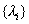的函数的高斯型数值积分表。

[线段单元]

1°&nbsp;&nbsp;&nbsp;
1°&nbsp;&nbsp; &nbsp;&nbsp;含距离坐标的积分公式

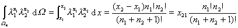

由于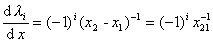，结合上式，可得出包含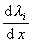的积分公式。

2°&nbsp;&nbsp;&nbsp;
2°&nbsp;&nbsp; &nbsp;&nbsp;常用的数值积分表

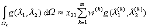

<table class=MsoNormalTable border=1 cellspacing=0 cellpadding=0
 style='border-collapse:collapse;border:none'>
 <tr>
  <td width=142 style='width:106.5pt;border:solid windowtext 1.0pt;border-left:
  none;padding:0mm 5.4pt 0mm 5.4pt'>
  
求积节点个数<i>m</i>

  </td>
  <td width=177 style='width:132.9pt;border:solid windowtext 1.0pt;border-left:
  none;padding:0mm 5.4pt 0mm 5.4pt'>
  
求积节点坐标&nbsp;&nbsp;&nbsp;&nbsp;&nbsp;&nbsp;&nbsp;&nbsp;&nbsp;
  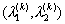

  </td>
  <td width=107 style='width:80.1pt;border:solid windowtext 1.0pt;border-left:
  none;padding:0mm 5.4pt 0mm 5.4pt'>
  
求积系数

  

  </td>
  <td width=122 style='width:91.6pt;border-top:solid windowtext 1.0pt;
  border-left:none;border-bottom:solid windowtext 1.0pt;border-right:none;
  padding:0mm 5.4pt 0mm 5.4pt'>
  
代数精确度<a href="#None"
  name="_ftnref1" title="">*</a><i>n</i>

  </td>
 </tr>
 <tr>
  <td width=142 style='width:106.5pt;border-top:none;border-left:none;
  border-bottom:solid windowtext 1.0pt;border-right:solid windowtext 1.0pt;
  padding:0mm 5.4pt 0mm 5.4pt'>
  
1

  </td>
  <td width=177 style='width:132.9pt;border-top:none;border-left:none;
  border-bottom:solid windowtext 1.0pt;border-right:solid windowtext 1.0pt;
  padding:0mm 5.4pt 0mm 5.4pt'>
  
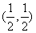

  </td>
  <td width=107 style='width:80.1pt;border-top:none;border-left:none;
  border-bottom:solid windowtext 1.0pt;border-right:solid windowtext 1.0pt;
  padding:0mm 5.4pt 0mm 5.4pt'>
  
1

  </td>
  <td width=122 style='width:91.6pt;border:none;border-bottom:solid windowtext 1.0pt;
  padding:0mm 5.4pt 0mm 5.4pt'>
  
1

  </td>
 </tr>
 <tr>
  <td width=142 style='width:106.5pt;border-top:none;border-left:none;
  border-bottom:solid windowtext 1.0pt;border-right:solid windowtext 1.0pt;
  padding:0mm 5.4pt 0mm 5.4pt'>
  
2

  </td>
  <td width=177 style='width:132.9pt;border-top:none;border-left:none;
  border-bottom:solid windowtext 1.0pt;border-right:solid windowtext 1.0pt;
  padding:0mm 5.4pt 0mm 5.4pt'>
  
(<i>α</i><i>,</i>1),(1<i>,</i><i>α</i>)

  
其中<i>α</i>=0.2113248654 

  </td>
  <td width=107 style='width:80.1pt;border-top:none;border-left:none;
  border-bottom:solid windowtext 1.0pt;border-right:solid windowtext 1.0pt;
  padding:0mm 5.4pt 0mm 5.4pt'>
  
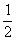

  </td>
  <td width=122 style='width:91.6pt;border:none;border-bottom:solid windowtext 1.0pt;
  padding:0mm 5.4pt 0mm 5.4pt'>
  
3

  </td>
 </tr>
 <tr>
  <td width=142 style='width:106.5pt;border-top:none;border-left:none;
  border-bottom:solid windowtext 1.0pt;border-right:solid windowtext 1.0pt;
  padding:0mm 5.4pt 0mm 5.4pt'>
  
3

  </td>
  <td width=177 style='width:132.9pt;border-top:none;border-left:none;
  border-bottom:solid windowtext 1.0pt;border-right:solid windowtext 1.0pt;
  padding:0mm 5.4pt 0mm 5.4pt'>
  
&nbsp;&nbsp;
  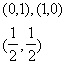

  </td>
  <td width=107 style='width:80.1pt;border-top:none;border-left:none;
  border-bottom:solid windowtext 1.0pt;border-right:solid windowtext 1.0pt;
  padding:0mm 5.4pt 0mm 5.4pt'>
  
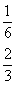

  </td>
  <td width=122 style='width:91.6pt;border:none;border-bottom:solid windowtext 1.0pt;
  padding:0mm 5.4pt 0mm 5.4pt'>
  
3

  </td>
 </tr>
 <tr style='height:46.7pt'>
  <td width=142 style='width:106.5pt;border-top:none;border-left:none;
  border-bottom:solid windowtext 1.0pt;border-right:solid windowtext 1.0pt;
  padding:0mm 5.4pt 0mm 5.4pt;height:46.7pt'>
  
3

  </td>
  <td width=177 style='width:132.9pt;border-top:none;border-left:none;
  border-bottom:solid windowtext 1.0pt;border-right:solid windowtext 1.0pt;
  padding:0mm 5.4pt 0mm 5.4pt;height:46.7pt'>
  
(<i>α</i><i>,</i>1),(1<i>,</i><i>α</i>)

  
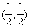

  
其中<i>α</i>=0.1127016654

  </td>
  <td width=107 style='width:80.1pt;border-top:none;border-left:none;
  border-bottom:solid windowtext 1.0pt;border-right:solid windowtext 1.0pt;
  padding:0mm 5.4pt 0mm 5.4pt;height:46.7pt'>
  
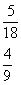

  </td>
  <td width=122 style='width:91.6pt;border:none;border-bottom:solid windowtext 1.0pt;
  padding:0mm 5.4pt 0mm 5.4pt;height:46.7pt'>
  
5

  </td>
 </tr>
</table>

[三边形单元]

1°&nbsp;&nbsp;&nbsp;
1°&nbsp;&nbsp;&nbsp;&nbsp;
&nbsp;含面积坐标的积分公式

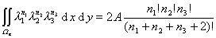

式中<i>A</i>为单元的面积。从系数矩阵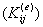的积分公式（2）看出，被积函数不仅包含面积坐标为变量的型函数，而且也有关于<i>x,y</i>的微分算子<i>B</i>.根据矩阵坐标变换

<pre>&nbsp;&nbsp;&nbsp;&nbsp;&nbsp;&nbsp;&nbsp;&nbsp;&nbsp;&nbsp;&nbsp;&nbsp;&nbsp;&nbsp;&nbsp;&nbsp;&nbsp;&nbsp;&nbsp;&nbsp;&nbsp;&nbsp;&nbsp;&nbsp;&nbsp;&nbsp;&nbsp;&nbsp;&nbsp;&nbsp;&nbsp; 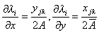&nbsp;&nbsp;</pre>

再结合上式可得出包含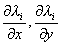的积分公式。

注意，如三边形单元任意一边（例如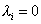）作为线元，则上述含距离坐标的积分公式也成立。

2°&nbsp;&nbsp;&nbsp;
2°&nbsp;&nbsp;&nbsp;&nbsp;
&nbsp;&nbsp;常用的数值积分表

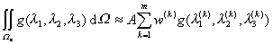

<table class=MsoNormalTable border=1 cellspacing=0 cellpadding=0
 style='border-collapse:collapse;border:none'>
 <tr>
  <td width=142 style='width:106.5pt;border:solid windowtext 1.0pt;border-left:
  none;padding:0mm 5.4pt 0mm 5.4pt'>
  
求积节点个数<i>m</i>

  </td>
  <td width=249 style='width:186.9pt;border:solid windowtext 1.0pt;border-left:
  none;padding:0mm 5.4pt 0mm 5.4pt'>
  
求积节点坐标&nbsp; 

  
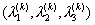

  </td>
  <td width=108 style='width:81.0pt;border:solid windowtext 1.0pt;border-left:
  none;padding:0mm 5.4pt 0mm 5.4pt'>
  
求积系数

  
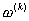

  </td>
  <td width=84 style='width:63.0pt;border-top:solid windowtext 1.0pt;
  border-left:none;border-bottom:solid windowtext 1.0pt;border-right:none;
  padding:0mm 5.4pt 0mm 5.4pt'>
  
代数精确度<i>n</i>

  </td>
 </tr>
 <tr>
  <td width=142 style='width:106.5pt;border-top:none;border-left:none;
  border-bottom:solid windowtext 1.0pt;border-right:solid windowtext 1.0pt;
  padding:0mm 5.4pt 0mm 5.4pt'>
  
1

  </td>
  <td width=249 style='width:186.9pt;border-top:none;border-left:none;
  border-bottom:solid windowtext 1.0pt;border-right:solid windowtext 1.0pt;
  padding:0mm 5.4pt 0mm 5.4pt'>
  
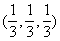

  </td>
  <td width=108 style='width:81.0pt;border-top:none;border-left:none;
  border-bottom:solid windowtext 1.0pt;border-right:solid windowtext 1.0pt;
  padding:0mm 5.4pt 0mm 5.4pt'>
  
1

  </td>
  <td width=84 style='width:63.0pt;border:none;border-bottom:solid windowtext 1.0pt;
  padding:0mm 5.4pt 0mm 5.4pt'>
  
1

  </td>
 </tr>
 <tr>
  <td width=142 style='width:106.5pt;border-top:none;border-left:none;
  border-bottom:solid windowtext 1.0pt;border-right:solid windowtext 1.0pt;
  padding:0mm 5.4pt 0mm 5.4pt'>
  
3

  </td>
  <td width=249 style='width:186.9pt;border-top:none;border-left:none;
  border-bottom:solid windowtext 1.0pt;border-right:solid windowtext 1.0pt;
  padding:0mm 5.4pt 0mm 5.4pt'>
  
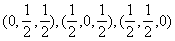

  </td>
  <td width=108 style='width:81.0pt;border-top:none;border-left:none;
  border-bottom:solid windowtext 1.0pt;border-right:solid windowtext 1.0pt;
  padding:0mm 5.4pt 0mm 5.4pt'>
  
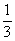

  </td>
  <td width=84 style='width:63.0pt;border:none;border-bottom:solid windowtext 1.0pt;
  padding:0mm 5.4pt 0mm 5.4pt'>
  
2

  </td>
 </tr>
 <tr>
  <td width=142 style='width:106.5pt;border-top:none;border-left:none;
  border-bottom:solid windowtext 1.0pt;border-right:solid windowtext 1.0pt;
  padding:0mm 5.4pt 0mm 5.4pt'>
  
7

  </td>
  <td width=249 style='width:186.9pt;border-top:none;border-left:none;
  border-bottom:solid windowtext 1.0pt;border-right:solid windowtext 1.0pt;
  padding:0mm 5.4pt 0mm 5.4pt'>
  
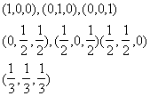

  </td>
  <td width=108 style='width:81.0pt;border-top:none;border-left:none;
  border-bottom:solid windowtext 1.0pt;border-right:solid windowtext 1.0pt;
  padding:0mm 5.4pt 0mm 5.4pt'>
  
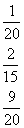

  </td>
  <td width=84 style='width:63.0pt;border:none;border-bottom:solid windowtext 1.0pt;
  padding:0mm 5.4pt 0mm 5.4pt'>
  
3

  </td>
 </tr>
 <tr>
  <td width=142 style='width:106.5pt;border-top:none;border-left:none;
  border-bottom:solid windowtext 1.0pt;border-right:solid windowtext 1.0pt;
  padding:0mm 5.4pt 0mm 5.4pt'>
  
7

  </td>
  <td width=249 style='width:186.9pt;border-top:none;border-left:none;
  border-bottom:solid windowtext 1.0pt;border-right:solid windowtext 1.0pt;
  padding:0mm 5.4pt 0mm 5.4pt'>
  
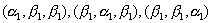

  
其中

  
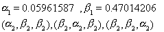

  
其中

  

  </td>
  <td width=108 style='width:81.0pt;border-top:none;border-left:none;
  border-bottom:solid windowtext 1.0pt;border-right:solid windowtext 1.0pt;
  padding:0mm 5.4pt 0mm 5.4pt'>
  
0.13239415

  
0.12593918

  
0.225

  </td>
  <td width=84 style='width:63.0pt;border:none;border-bottom:solid windowtext 1.0pt;
  padding:0mm 5.4pt 0mm 5.4pt'>
  
5

  </td>
 </tr>
</table>

[四面体单元]

1°&nbsp;&nbsp;&nbsp;
1°&nbsp;&nbsp;&nbsp;&nbsp;
&nbsp;&nbsp;含体积坐标的积分公式

<pre>&nbsp;&nbsp;&nbsp;&nbsp;&nbsp;&nbsp;&nbsp;&nbsp;&nbsp;&nbsp;&nbsp;&nbsp;&nbsp;&nbsp;&nbsp;&nbsp;&nbsp;&nbsp;&nbsp;&nbsp;&nbsp;&nbsp;&nbsp;&nbsp; 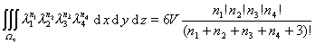</pre>

式中<i>V</i>为单元的体积。公式（2）出现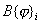，即被积函数包含型函数关于<i>x,y,z</i>的导数，根据坐标变换

<pre>&nbsp;&nbsp;&nbsp;&nbsp;&nbsp;&nbsp;&nbsp;&nbsp;&nbsp;&nbsp;&nbsp;&nbsp;&nbsp;&nbsp;&nbsp;&nbsp;&nbsp;&nbsp;&nbsp;&nbsp;&nbsp;&nbsp; 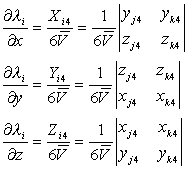&nbsp;&nbsp;&nbsp;&nbsp;&nbsp;&nbsp;&nbsp;&nbsp;&nbsp;&nbsp;&nbsp;&nbsp;&nbsp;&nbsp;&nbsp;&nbsp;&nbsp;&nbsp;&nbsp;&nbsp;&nbsp;&nbsp;&nbsp;&nbsp;&nbsp;&nbsp;&nbsp;&nbsp;&nbsp;(<i>i</i>=1,2,3)</pre>

再结合上式，可得出包含这些偏导数的积分公式

2°&nbsp;&nbsp;&nbsp;
2°&nbsp;&nbsp;&nbsp;&nbsp;
常用的数值积分表

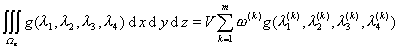

<table class=MsoNormalTable border=1 cellspacing=0 cellpadding=0
 style='border-collapse:collapse;border:none'>
 <tr>
  <td width=142 valign=top style='width:106.5pt;border:solid windowtext 1.0pt;
  border-left:none;padding:0mm 5.4pt 0mm 5.4pt'>
  
求积节点个数<i>m</i>

  </td>
  <td width=177 valign=top style='width:132.9pt;border:solid windowtext 1.0pt;
  border-left:none;padding:0mm 5.4pt 0mm 5.4pt'>
  
求积节点坐标&nbsp;&nbsp;&nbsp;&nbsp;&nbsp;&nbsp;&nbsp;&nbsp;&nbsp;
  

  </td>
  <td width=107 valign=top style='width:80.1pt;border:solid windowtext 1.0pt;
  border-left:none;padding:0mm 5.4pt 0mm 5.4pt'>
  
求积系数

  

  </td>
  <td width=142 valign=top style='width:106.5pt;border-top:solid windowtext 1.0pt;
  border-left:none;border-bottom:solid windowtext 1.0pt;border-right:none;
  padding:0mm 5.4pt 0mm 5.4pt'>
  
代数精确度<i>n</i>

  </td>
 </tr>
 <tr>
  <td width=142 valign=top style='width:106.5pt;border-top:none;border-left:
  none;border-bottom:solid windowtext 1.0pt;border-right:solid windowtext 1.0pt;
  padding:0mm 5.4pt 0mm 5.4pt'>
  
1

  </td>
  <td width=177 valign=top style='width:132.9pt;border-top:none;border-left:
  none;border-bottom:solid windowtext 1.0pt;border-right:solid windowtext 1.0pt;
  padding:0mm 5.4pt 0mm 5.4pt'>
  
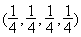

  </td>
  <td width=107 valign=top style='width:80.1pt;border-top:none;border-left:
  none;border-bottom:solid windowtext 1.0pt;border-right:solid windowtext 1.0pt;
  padding:0mm 5.4pt 0mm 5.4pt'>
  
1

  </td>
  <td width=142 valign=top style='width:106.5pt;border:none;border-bottom:solid windowtext 1.0pt;
  padding:0mm 5.4pt 0mm 5.4pt'>
  
1

  </td>
 </tr>
 <tr>
  <td width=142 valign=top style='width:106.5pt;border-top:none;border-left:
  none;border-bottom:solid windowtext 1.0pt;border-right:solid windowtext 1.0pt;
  padding:0mm 5.4pt 0mm 5.4pt'>
  
4

  </td>
  <td width=177 valign=top style='width:132.9pt;border-top:none;border-left:
  none;border-bottom:solid windowtext 1.0pt;border-right:solid windowtext 1.0pt;
  padding:0mm 5.4pt 0mm 5.4pt'>
  
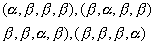其中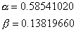

  </td>
  <td width=107 valign=top style='width:80.1pt;border-top:none;border-left:
  none;border-bottom:solid windowtext 1.0pt;border-right:solid windowtext 1.0pt;
  padding:0mm 5.4pt 0mm 5.4pt'>
  

  </td>
  <td width=142 valign=top style='width:106.5pt;border:none;border-bottom:solid windowtext 1.0pt;
  padding:0mm 5.4pt 0mm 5.4pt'>
  
2

  </td>
 </tr>
 <tr>
  <td width=142 valign=top style='width:106.5pt;border-top:none;border-left:
  none;border-bottom:solid windowtext 1.0pt;border-right:solid windowtext 1.0pt;
  padding:0mm 5.4pt 0mm 5.4pt'>
  
5

  </td>
  <td width=177 valign=top style='width:132.9pt;border-top:none;border-left:
  none;border-bottom:solid windowtext 1.0pt;border-right:solid windowtext 1.0pt;
  padding:0mm 5.4pt 0mm 5.4pt'>
  
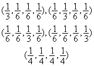

  </td>
  <td width=107 valign=top style='width:80.1pt;border-top:none;border-left:
  none;border-bottom:solid windowtext 1.0pt;border-right:solid windowtext 1.0pt;
  padding:0mm 5.4pt 0mm 5.4pt'>
  
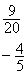

  </td>
  <td width=142 valign=top style='width:106.5pt;border:none;border-bottom:solid windowtext 1.0pt;
  padding:0mm 5.4pt 0mm 5.4pt'>
  
3

  </td>
 </tr>
</table>

 

 

<a href="#None" name="_ftn1" title="">*</a> 表示该求积公式对某<i>n</i>次齐次多项式是精确的

