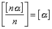
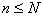
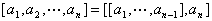

第二十章&nbsp;&nbsp;&nbsp;&nbsp;&nbsp;&nbsp;&nbsp;&nbsp;&nbsp;&nbsp;&nbsp;&nbsp;&nbsp;&nbsp;&nbsp;&nbsp;&nbsp;&nbsp;&nbsp;&nbsp;&nbsp;&nbsp;&nbsp;&nbsp;
<b>第二十章</b><b>&nbsp;&nbsp;&nbsp;&nbsp;&nbsp;&nbsp; </b><b>初等数论</b>

&nbsp;&nbsp;&nbsp; 本章简要地介绍了初等数论的基础知识.共分六节.前五节讨论了整数的性质与辗转相除法,连分数与费波那奇序列,同余式与孙子定理,介绍了几种重要的数论函数和麦比乌斯变换,并列出几类不可约多项式的判别方法.最后一节对代数数等基本概念和性质作了简单的介绍.

<b>§</b><b>1</b>&nbsp;&nbsp;&nbsp; <b>整数</b>

&nbsp;&nbsp;&nbsp; [整数部分与分数部分]&nbsp;
设<i>a</i> 为一实数,不超过<i>a</i> 的最大整数称为<i>α</i><i> </i>的整数部分,记作<i>.</i>而称为<i>a </i>的分数部分.

&nbsp;&nbsp;&nbsp; 例如&nbsp; ,,等等

&nbsp;&nbsp;&nbsp; 整数部分具有下列关系式:

&nbsp;&nbsp;&nbsp;&nbsp;&nbsp;&nbsp;&nbsp;&nbsp;&nbsp;&nbsp;&nbsp;

&nbsp;&nbsp;&nbsp;&nbsp;&nbsp;&nbsp;&nbsp;&nbsp;&nbsp;&nbsp;&nbsp;
,<i>n</i>为自然数

&nbsp;&nbsp;&nbsp;&nbsp;&nbsp;&nbsp;&nbsp;&nbsp;&nbsp;&nbsp;&nbsp;
，<i>n</i>为自然数

&nbsp;&nbsp;&nbsp;&nbsp;&nbsp;&nbsp;&nbsp;&nbsp;&nbsp;&nbsp;&nbsp;

&nbsp;&nbsp;&nbsp;&nbsp;&nbsp;&nbsp;&nbsp;&nbsp;
&nbsp;&nbsp;&nbsp;&nbsp;或 

&nbsp;&nbsp;&nbsp; 注意,在计算机程序中的“取整运算”与这里的“整数部分”意义是有差别的:当时是一致的;当时不一致,例如,但计算机上取整后为.

&nbsp;&nbsp;&nbsp; [整除性]&nbsp; 若有一整数<i>c</i>,使得整数<i>a</i>与<i>b</i>之间适合于

&nbsp;&nbsp;&nbsp; 则称<i>b</i>可整除<i>a</i>,记作。这时<i>a</i>称为<i>b</i>的倍数,<i>b</i>称为<i>a</i>的因数(或约数).

若<i>b</i>不能整除<i>a</i>,则记作<i>b</i><i>a<b>.</b></i>

&nbsp;&nbsp;&nbsp; 整除性具有下列性质(下列各式):

&nbsp;&nbsp;&nbsp; 1°&nbsp; 若,, 则;

&nbsp;&nbsp;&nbsp; 2°&nbsp; 若, 则;

&nbsp;&nbsp;&nbsp; 3°&nbsp; 若,,则对于任意整数<i>m,n</i>有

&nbsp;&nbsp;&nbsp; 4°&nbsp; 若<i>b</i>是<i>a</i>的真因数(即),则

&nbsp;&nbsp;

&nbsp;&nbsp;&nbsp; [素数与爱拉托斯散筛法] 恰有1和本身两个自然数为其因数的大于1的整数称为素数,记作.除<i>2</i>为偶素数外,其余素数都是奇数.

&nbsp;&nbsp;&nbsp; 素数具有性质:

&nbsp;&nbsp;&nbsp; 1°&nbsp; 素数有无限多个. 如果不超过自然数<i>n</i>的素数个数记作 <i>p(n)</i>,则当时,有<a href="#None" name="_ftnref1" title="">*</a>,进一步有

<pre>&nbsp;&nbsp;&nbsp;&nbsp;&nbsp;&nbsp;&nbsp;&nbsp;&nbsp;&nbsp;&nbsp;&nbsp;&nbsp;&nbsp;&nbsp;&nbsp;&nbsp;&nbsp;&nbsp;&nbsp;&nbsp;&nbsp;&nbsp;&nbsp;&nbsp;&nbsp;&nbsp;&nbsp; </pre>

&nbsp;&nbsp;&nbsp; 2°&nbsp; 设<i>p</i>为素数,若,则或.

&nbsp;&nbsp;&nbsp; 3°&nbsp; 中含素数<i>p</i>的方次数等于

<pre>&nbsp;&nbsp;&nbsp;&nbsp;&nbsp;&nbsp;&nbsp;&nbsp;&nbsp;&nbsp;&nbsp;&nbsp;&nbsp;&nbsp;&nbsp;&nbsp;&nbsp;&nbsp;&nbsp;&nbsp;&nbsp;&nbsp;&nbsp; </pre>

&nbsp;&nbsp;&nbsp; 4°&nbsp; 若为正整数,它不能被不超过的所有素数所整除,则<i>n</i>必为素数.这种判别自然数是否为素数的方法称为爱拉托斯散筛法.由此法可建立素数表.

&nbsp;&nbsp;&nbsp; [唯一分解定理]&nbsp; 大于1的自然数都可唯一地分解为素数幂的积.设,为自然数,则<i>n</i>可唯一地表为

&nbsp;&nbsp;&nbsp;&nbsp;&nbsp;&nbsp;&nbsp;&nbsp;&nbsp;&nbsp;&nbsp;&nbsp;&nbsp;&nbsp;

&nbsp;&nbsp;&nbsp;&nbsp;&nbsp;&nbsp;&nbsp;&nbsp;&nbsp;&nbsp;&nbsp;
&nbsp;(为自然数)

&nbsp;&nbsp;&nbsp;&nbsp;&nbsp;&nbsp;&nbsp;&nbsp;&nbsp;&nbsp;&nbsp;&nbsp;&nbsp;
&nbsp;(为素数)

这称为<i>n</i>的标准分解式。<i>n</i>所含不同素因数的个数<i>s</i>不超过.

&nbsp;&nbsp;&nbsp; 显然,任意自然数<i>n</i>可表为

&nbsp;&nbsp;&nbsp;&nbsp;&nbsp;&nbsp;&nbsp;&nbsp;&nbsp;&nbsp;&nbsp;&nbsp;&nbsp;&nbsp;
&nbsp;&nbsp;&nbsp;(<i>k,m</i> 为自然数或零)

这种表达式是唯一的.

&nbsp;&nbsp;&nbsp; [麦森数]&nbsp; 整数

&nbsp;&nbsp;&nbsp;&nbsp;&nbsp;&nbsp;&nbsp;&nbsp;&nbsp;&nbsp;&nbsp;&nbsp;&nbsp;&nbsp;&nbsp;&nbsp;
&nbsp;( <i>p</i>为素数)

为素数者称为麦森数.至今仅发现<i>27</i>个,即

&nbsp;&nbsp;&nbsp; 

是否有无穷个麦森数还未证明.

&nbsp;&nbsp;&nbsp; [费马数]&nbsp; 整数

&nbsp;&nbsp;&nbsp;&nbsp;&nbsp;&nbsp;&nbsp;&nbsp;&nbsp;&nbsp;&nbsp;&nbsp;&nbsp;&nbsp;&nbsp;
&nbsp;&nbsp;&nbsp;&nbsp;(<i>n</i>为自然数)

称为费马数.至今只发现5个费马数为素数,即

&nbsp;&nbsp;&nbsp;&nbsp;&nbsp;&nbsp;&nbsp;&nbsp;&nbsp;&nbsp;&nbsp;&nbsp;

下列46个费马数皆非素数:

&nbsp;&nbsp;&nbsp;&nbsp;&nbsp;&nbsp;&nbsp;&nbsp;

&nbsp;&nbsp;&nbsp; [辗转相除法<a href="#None"
name="_ftnref2" title="">*</a>] 每一个整数<i>a</i>可以唯一地通过正整数<i>b</i>表为

&nbsp;&nbsp;&nbsp;&nbsp;&nbsp;&nbsp;&nbsp;&nbsp;&nbsp;&nbsp;&nbsp;&nbsp;&nbsp;&nbsp;

式中<i>q</i>称为<i>a</i>被<i>b</i>除所得的不完全商,<i>r</i>称为<i>a</i>被<i>b</i>除所得的余数.辗转相除法是指下列一串有限个等式:

&nbsp;&nbsp;&nbsp;&nbsp;&nbsp;&nbsp;&nbsp;&nbsp;&nbsp;&nbsp;&nbsp;
&nbsp;&nbsp;&nbsp;&nbsp;&nbsp;&nbsp;&nbsp;&nbsp;&nbsp;&nbsp;&nbsp;&nbsp;&nbsp;&nbsp;&nbsp;&nbsp;&nbsp;&nbsp;&nbsp;(
1 )

&nbsp;&nbsp;&nbsp; 例1 <b>&nbsp;</b>设<i>a</i>=525 ,<i>b</i>=231 ,根据(1)式可列出下面的算式和草式:

&nbsp;&nbsp;&nbsp;&nbsp;&nbsp;&nbsp;&nbsp;&nbsp;&nbsp;&nbsp;
算&nbsp;&nbsp;&nbsp; 式&nbsp;&nbsp;&nbsp;&nbsp;&nbsp;&nbsp;&nbsp;&nbsp;&nbsp;&nbsp;&nbsp;&nbsp;&nbsp;&nbsp;
草&nbsp;&nbsp;&nbsp; 式

&nbsp;&nbsp;&nbsp;&nbsp;&nbsp;&nbsp;&nbsp;&nbsp;
&nbsp;&nbsp;&nbsp;&nbsp;&nbsp;&nbsp;&nbsp;&nbsp;&nbsp;&nbsp;&nbsp;&nbsp;

&nbsp;&nbsp;&nbsp; [最大公因数与最小公倍数]&nbsp; 设<i>a</i>,<i>b</i>为整数.既能整除<i>a</i>,又能整除<i>b</i>的正整数称为<i>a,b</i>的公因数,其最大者称为<i>a,b</i>的最大公因数*,记作,即

特别当时,称<i>a,b</i>互素.

&nbsp;&nbsp;&nbsp; 设<i>a,b</i>为正整数.<i>a,b</i>都能整除的正整数称为<i>a,b</i>的公倍数,其最小者称为<i>a,b</i>的最小公倍数<a href="#None" name="_ftnref3"
title="">*</a>,记作,即

&nbsp;&nbsp;&nbsp;&nbsp;&nbsp;&nbsp;&nbsp;&nbsp;&nbsp;&nbsp;&nbsp;&nbsp;&nbsp;&nbsp;&nbsp;&nbsp;&nbsp;&nbsp;&nbsp;&nbsp;&nbsp;&nbsp;&nbsp;&nbsp;

&nbsp;&nbsp;&nbsp; 设为<i>n</i>个正整数,用归纳法定义其最大公因数为

&nbsp;&nbsp;&nbsp;&nbsp;&nbsp;&nbsp;&nbsp;&nbsp;&nbsp;&nbsp;&nbsp;&nbsp;&nbsp;&nbsp;&nbsp;&nbsp;&nbsp;&nbsp;&nbsp;&nbsp;

其最小公倍数为

&nbsp;&nbsp;&nbsp;&nbsp;&nbsp;&nbsp;&nbsp;&nbsp;&nbsp;&nbsp;&nbsp;&nbsp;&nbsp;&nbsp;&nbsp;&nbsp;&nbsp;&nbsp;&nbsp;&nbsp;&nbsp;&nbsp;&nbsp;&nbsp;&nbsp;

&nbsp;&nbsp;&nbsp; 最大公因数与最小公倍数具有下列性质:

&nbsp;&nbsp;&nbsp; 1° 存在整数<i>x,y,</i>使得.并可由辗转相除法具体求出<i>x,y.</i>也由辗转相除法的一串等式得到,即

&nbsp;&nbsp;&nbsp;&nbsp;&nbsp;&nbsp;&nbsp;&nbsp;&nbsp;

&nbsp;&nbsp;&nbsp; 例2 <b>&nbsp;</b>由例1得(525,231)=21<i>.</i>因为由例1的算式有

&nbsp;&nbsp;&nbsp;&nbsp;&nbsp;&nbsp;&nbsp;&nbsp;&nbsp;

所以得到 <i>x</i>=4,<i>y</i>=－9<i>.</i>

<i>&nbsp;&nbsp;&nbsp; </i>2° 对任意二整数<i>x,y,</i>必有.

&nbsp;&nbsp;&nbsp; 3° 若,,则.

&nbsp;&nbsp;&nbsp; 4° 若则

&nbsp;&nbsp;&nbsp;&nbsp;&nbsp;&nbsp;
若,则

&nbsp;&nbsp;&nbsp; 5° 若<i>a,b</i>为二正整数,为它们的素因数,且标准分解式分别为

<pre>&nbsp;&nbsp;&nbsp;&nbsp;&nbsp;&nbsp;&nbsp;&nbsp;&nbsp;&nbsp; </pre><pre>&nbsp;&nbsp;&nbsp;&nbsp;&nbsp;&nbsp;&nbsp;&nbsp;&nbsp;&nbsp;&nbsp;&nbsp;&nbsp;&nbsp;&nbsp;&nbsp;&nbsp;&nbsp;&nbsp;&nbsp;&nbsp;&nbsp;&nbsp;&nbsp;&nbsp;</pre>

则

<pre>&nbsp;&nbsp;&nbsp;&nbsp;&nbsp;&nbsp;&nbsp;&nbsp;&nbsp;&nbsp;&nbsp;&nbsp;&nbsp;&nbsp;&nbsp;&nbsp;&nbsp;&nbsp; &nbsp;</pre>

&nbsp;&nbsp;&nbsp; 6° 

&nbsp;&nbsp;&nbsp; 7° 若为互素的正整数,即,则

<pre>&nbsp;&nbsp;&nbsp;&nbsp;&nbsp;&nbsp;&nbsp;&nbsp;&nbsp;&nbsp; &nbsp;&nbsp;&nbsp;</pre>

 

 

<a href="#None" name="_ftn1" title="">*</a> 数论中通常把自然对数记作.

<a href="#None" name="_ftn2" title="">*</a> 我国古代数学家秦九韶于1247年在《数书九章》中讨论过辗转相除法(也称欧几里得算法).

<a href="#None" name="_ftn3" title="">*</a> 国外书刊中，<i>a</i>，<i>b</i>的最大公因数常记作g.c.d.(<i>a</i>，<i>b</i>)，<i>a</i>，<i>b</i>的最小公倍数常记作l.c.m.(<i>a</i>，<i>b</i>)。

