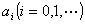
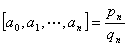
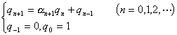
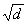
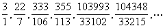
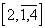
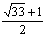
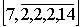
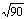

<b>§2</b>&nbsp;&nbsp;&nbsp;&nbsp;&nbsp;&nbsp; <b>连分数</b>

&nbsp;&nbsp;&nbsp; [简单连分数]&nbsp; 设<i>a</i> 为实数(有理数或无理数),则可表成简单连分数

<pre>&nbsp;&nbsp;&nbsp;&nbsp;&nbsp;&nbsp;&nbsp;&nbsp;&nbsp;&nbsp;&nbsp; &nbsp;&nbsp;&nbsp;&nbsp;&nbsp;&nbsp;&nbsp;&nbsp;&nbsp;&nbsp;&nbsp;&nbsp;&nbsp;&nbsp;&nbsp;&nbsp;&nbsp;&nbsp;&nbsp; (2)</pre>

简记为&nbsp;&nbsp;&nbsp;&nbsp;&nbsp;&nbsp; &nbsp;&nbsp;&nbsp;&nbsp;&nbsp;&nbsp;&nbsp;&nbsp;&nbsp;&nbsp;&nbsp;&nbsp;&nbsp;&nbsp;&nbsp;&nbsp;&nbsp;&nbsp;&nbsp;&nbsp;&nbsp;&nbsp; 

或&nbsp;&nbsp;&nbsp;&nbsp;&nbsp;&nbsp;&nbsp;&nbsp;&nbsp;&nbsp; &nbsp;&nbsp;&nbsp;&nbsp;&nbsp;&nbsp;&nbsp;&nbsp;&nbsp;&nbsp;&nbsp;&nbsp;&nbsp;&nbsp;&nbsp;&nbsp;&nbsp;&nbsp;&nbsp;&nbsp;&nbsp;&nbsp;&nbsp;&nbsp;&nbsp;&nbsp; &nbsp;

式中为整数,为正整数.

&nbsp;&nbsp;&nbsp; 若<i>a</i> 为有理数,则必可展成有限连分数

<pre>&nbsp;&nbsp;&nbsp;&nbsp;&nbsp;&nbsp;&nbsp;&nbsp;&nbsp;&nbsp;&nbsp;&nbsp;&nbsp;&nbsp;&nbsp;&nbsp;&nbsp;&nbsp;&nbsp;&nbsp;&nbsp;&nbsp;&nbsp;&nbsp;&nbsp;&nbsp;&nbsp;&nbsp;&nbsp;&nbsp;&nbsp;&nbsp; </pre>

式中是由辗转相除法一列等式(1)所得到的一列不完全商.如果规定最后一个不完全商大于1,即当时,可写成

则表法唯一.

&nbsp;&nbsp;&nbsp; 若<i>a</i> 为无理数,则可展成无限连分数,且表法唯一.

&nbsp;&nbsp;&nbsp; [完全商与不完全商]&nbsp;
简单连分数(2)中称为<i>a</i> 的第<i>i</i>个不完全商.数称为<i>a</i> 的第<i>n</i>个完全商.显然.

&nbsp;&nbsp;&nbsp; 完全商与不完全商的关系:

<pre>&nbsp;&nbsp;&nbsp;&nbsp;&nbsp;&nbsp;&nbsp;&nbsp;&nbsp;&nbsp;&nbsp;&nbsp;&nbsp;&nbsp;&nbsp;&nbsp;&nbsp;&nbsp;&nbsp;&nbsp;&nbsp;&nbsp;&nbsp;&nbsp;&nbsp; </pre><pre>&nbsp;&nbsp;&nbsp;&nbsp;&nbsp;&nbsp;&nbsp;&nbsp;&nbsp;&nbsp;&nbsp;&nbsp;&nbsp;&nbsp;&nbsp;&nbsp;&nbsp;&nbsp;&nbsp;&nbsp;&nbsp;&nbsp;&nbsp;&nbsp;&nbsp;&nbsp; (<i>n</i>=0,1,2,…)</pre>

式中为<i>a</i>的第<i>n</i>个渐近分数的分子和分母(见下).

&nbsp;&nbsp;&nbsp; [渐近分数与最佳渐近分数]&nbsp;
简单连分数(1)中截取

<pre>&nbsp;&nbsp;&nbsp;&nbsp;&nbsp;&nbsp;&nbsp;&nbsp;&nbsp;&nbsp;&nbsp;&nbsp;&nbsp;&nbsp;&nbsp;&nbsp;&nbsp;&nbsp;&nbsp;&nbsp;&nbsp;&nbsp;&nbsp;&nbsp;&nbsp; </pre>

称为<i>a</i> 的第<i>n</i>个渐近分数.渐近分数都为既约分数.

&nbsp;&nbsp;&nbsp; 1°&nbsp; 渐近分数的等式与不等式

<pre>&nbsp;&nbsp;&nbsp;&nbsp;&nbsp;&nbsp;&nbsp;&nbsp;&nbsp;&nbsp;&nbsp;&nbsp; </pre><pre>&nbsp;&nbsp;&nbsp;&nbsp;&nbsp;&nbsp;&nbsp;&nbsp;&nbsp;&nbsp;&nbsp;&nbsp;</pre><pre>&nbsp;&nbsp;&nbsp;&nbsp;&nbsp;&nbsp;&nbsp;&nbsp;&nbsp;&nbsp;&nbsp;&nbsp;&nbsp;</pre><pre>&nbsp;&nbsp;&nbsp;&nbsp;&nbsp;&nbsp;&nbsp;&nbsp;&nbsp;&nbsp;&nbsp;&nbsp;&nbsp;&nbsp;</pre><pre>&nbsp;&nbsp;&nbsp;&nbsp;&nbsp;&nbsp;&nbsp;&nbsp;&nbsp;&nbsp;&nbsp;&nbsp;&nbsp;&nbsp;&nbsp;&nbsp;&nbsp;&nbsp;&nbsp;&nbsp;&nbsp;&nbsp;&nbsp;&nbsp;&nbsp;&nbsp;&nbsp;&nbsp;(当时)</pre><pre>&nbsp;&nbsp;&nbsp;&nbsp;&nbsp;&nbsp;&nbsp;&nbsp;&nbsp;&nbsp;&nbsp;&nbsp;&nbsp; &nbsp;&nbsp;&nbsp;&nbsp;&nbsp;&nbsp;(当a为实二次无理数时)</pre><pre>&nbsp;&nbsp;&nbsp;&nbsp;&nbsp;&nbsp;&nbsp;&nbsp;&nbsp;&nbsp;&nbsp;&nbsp;&nbsp;&nbsp;&nbsp;&nbsp;&nbsp;&nbsp;&nbsp;&nbsp;&nbsp;&nbsp;&nbsp;&nbsp;&nbsp; </pre><pre>&nbsp;&nbsp;&nbsp;&nbsp;&nbsp;&nbsp;&nbsp;&nbsp;&nbsp;&nbsp;&nbsp;&nbsp;&nbsp;&nbsp;&nbsp;&nbsp;&nbsp;&nbsp;</pre>

(式中为<i>n</i>的递减函数。<i>a</i> 为有理数时,此式仅当时成立,)

<pre>&nbsp;&nbsp;&nbsp;&nbsp;&nbsp;&nbsp;&nbsp;&nbsp;&nbsp;&nbsp;&nbsp; &nbsp;&nbsp;&nbsp;&nbsp;&nbsp;&nbsp;&nbsp;&nbsp;&nbsp;&nbsp;&nbsp;&nbsp;&nbsp;&nbsp;</pre>

&nbsp;&nbsp;&nbsp; 2°&nbsp; 设且则

<pre>&nbsp;&nbsp;&nbsp;&nbsp;&nbsp;&nbsp;&nbsp;&nbsp;&nbsp;&nbsp;&nbsp;&nbsp;&nbsp;&nbsp;&nbsp;&nbsp;&nbsp;&nbsp;&nbsp;&nbsp;&nbsp;&nbsp;&nbsp;&nbsp;&nbsp; </pre>

因此在分母不大于的所有分数中,与<i>a</i> 最接近(称为最佳渐近分数).

&nbsp;&nbsp;&nbsp; 3°&nbsp; <i>a</i> 的两个相邻渐近分数中必有一个适合于

<pre>&nbsp;&nbsp;&nbsp;&nbsp;&nbsp;&nbsp;&nbsp;&nbsp;&nbsp;&nbsp;&nbsp;&nbsp;&nbsp;&nbsp;&nbsp;&nbsp;&nbsp;&nbsp;&nbsp;&nbsp; </pre>

&nbsp;&nbsp;&nbsp; 4°&nbsp; <i>a</i> 的三个相邻渐近分数中必有一个适合于

<pre>&nbsp;&nbsp;&nbsp;&nbsp;&nbsp;&nbsp;&nbsp;&nbsp;&nbsp;&nbsp;&nbsp;&nbsp;&nbsp;&nbsp;&nbsp;&nbsp;&nbsp;&nbsp;&nbsp;&nbsp;&nbsp;&nbsp;&nbsp;&nbsp;&nbsp; </pre>

&nbsp;&nbsp;&nbsp; 5°&nbsp; 设<i>a</i> 为实数,为有理数,<i>M</i>为正整数.若<i>a</i> 适合于不等式

<pre>&nbsp;&nbsp;&nbsp;&nbsp;&nbsp;&nbsp;&nbsp;&nbsp;&nbsp;&nbsp;&nbsp;&nbsp;&nbsp;&nbsp;&nbsp;&nbsp;&nbsp;&nbsp;&nbsp;&nbsp;&nbsp;&nbsp;&nbsp;&nbsp;&nbsp; </pre>

则<i>a</i> 展成连分数的不完全商至少有一个大于<i>M</i>－2.

&nbsp;&nbsp;&nbsp; [周期连分数及其充分必要条件]
当时,若,则连分数

<pre>&nbsp;&nbsp;&nbsp;&nbsp;&nbsp;&nbsp;&nbsp;&nbsp;&nbsp;&nbsp;&nbsp;&nbsp;&nbsp;&nbsp;&nbsp;&nbsp;&nbsp;&nbsp;&nbsp;&nbsp;&nbsp;&nbsp;&nbsp;&nbsp;&nbsp; </pre>

称为以<i>k</i>为周期的周期连分数,记做

<pre>&nbsp;&nbsp;&nbsp;&nbsp;&nbsp;&nbsp;&nbsp;&nbsp;&nbsp;&nbsp;&nbsp;&nbsp;&nbsp;&nbsp;&nbsp;&nbsp;&nbsp;&nbsp;&nbsp;&nbsp;&nbsp;&nbsp; &nbsp;&nbsp;&nbsp;&nbsp;&nbsp;&nbsp;&nbsp;&nbsp;&nbsp;&nbsp;&nbsp;&nbsp;&nbsp;&nbsp;&nbsp;&nbsp;&nbsp;&nbsp;&nbsp;&nbsp;&nbsp;&nbsp;&nbsp;&nbsp;&nbsp;&nbsp;&nbsp;&nbsp;&nbsp;&nbsp;&nbsp;&nbsp;&nbsp;&nbsp;&nbsp;&nbsp;(3)</pre>

当<i>l=0</i>时,(3)式称为纯周期连分数,当<i>l</i>=1时,(3)式称为拟纯周期连分数.

&nbsp;&nbsp;&nbsp; 1°&nbsp; 实数<i>a</i> 可展成周期连分数的充分必要条件是:a是一个有理数域上二次不可约多项式的根.

&nbsp;&nbsp;&nbsp; 2°&nbsp; 实二次无理数<i>a</i> 可展成纯周期连分数的充分必要条件是:<i>a </i>&gt;1且,这里<i>a’</i>为<i>a </i>的共轭实数.

&nbsp;&nbsp;&nbsp; 3°&nbsp; 实二次无理数<i>a</i> 可展成拟纯周期连分数的充分必要条件是:<i>a</i>’&lt;[<i>a</i>]-1,这里<i>a’</i>为<i>a</i> 的共轭实数, [<i>a</i> ]为<i>a </i>的整数部分.

&nbsp;&nbsp;&nbsp; [,<i>e</i>与<i>p </i>的连分数]

&nbsp;&nbsp;&nbsp; 1°&nbsp; 设为非完全平方数,则

<pre>&nbsp;&nbsp;&nbsp;&nbsp;&nbsp;&nbsp;&nbsp;&nbsp;&nbsp;&nbsp;&nbsp;&nbsp;&nbsp;&nbsp;&nbsp; &nbsp;&nbsp;&nbsp;&nbsp;</pre>

&nbsp;&nbsp;&nbsp; 2°&nbsp; 设<i>e</i>为自然对数的底,则

<pre>&nbsp;&nbsp;&nbsp;&nbsp;&nbsp;&nbsp;&nbsp;&nbsp;&nbsp;&nbsp;&nbsp;&nbsp;&nbsp;&nbsp;&nbsp;&nbsp;&nbsp;&nbsp;&nbsp;&nbsp;&nbsp; </pre>

式中不完全商的通式为

<pre>&nbsp;&nbsp;&nbsp;&nbsp;&nbsp;&nbsp;&nbsp;&nbsp;&nbsp;&nbsp;&nbsp;&nbsp;&nbsp;&nbsp;&nbsp;&nbsp;&nbsp;&nbsp;&nbsp;&nbsp;&nbsp; </pre>

&nbsp;&nbsp;&nbsp; 3°&nbsp; 设<i>p</i>为圆周率,则

<pre>&nbsp;&nbsp;&nbsp;&nbsp;&nbsp;&nbsp;&nbsp;&nbsp;&nbsp;&nbsp; </pre>

它的渐近分数为

<pre>&nbsp;&nbsp;&nbsp;&nbsp;&nbsp;&nbsp;&nbsp;&nbsp;&nbsp;&nbsp; </pre>

&nbsp;&nbsp;&nbsp; [二次域<b>Q()</b>的整底的连分数表]

<table class=MsoNormalTable border=0 cellspacing=0 cellpadding=0
 style='border-collapse:collapse'>
 <tr>
  <td width=96 valign=top style='width:72.0pt;border:none;border-top:solid windowtext 1.0pt;
  padding:0mm 5.4pt 0mm 5.4pt'>
  
<i>w</i>

  </td>
  <td width=204 valign=top style='width:152.9pt;border-top:solid windowtext 1.0pt;
  border-left:solid windowtext 1.0pt;border-bottom:none;border-right:none;
  padding:0mm 5.4pt 0mm 5.4pt'>
  
连分数表示

  </td>
  <td width=104 valign=top style='width:77.95pt;border-top:solid windowtext 1.0pt;
  border-left:double windowtext 2.25pt;border-bottom:none;border-right:solid windowtext 1.0pt;
  padding:0mm 5.4pt 0mm 5.4pt'>
  
<i>w</i>

  </td>
  <td width=217 valign=top style='width:163.05pt;border:none;border-top:solid windowtext 1.0pt;
  padding:0mm 5.4pt 0mm 5.4pt'>
  
连分数表示

  </td>
 </tr>
 <tr>
  <td width=96 valign=top style='width:72.0pt;border:none;border-top:solid windowtext 1.0pt;
  padding:0mm 5.4pt 0mm 5.4pt'>
  

  </td>
  <td width=204 valign=top style='width:152.9pt;border-top:solid windowtext 1.0pt;
  border-left:solid windowtext 1.0pt;border-bottom:none;border-right:none;
  padding:0mm 5.4pt 0mm 5.4pt'>
  

  </td>
  <td width=104 valign=top style='width:77.95pt;border-top:solid windowtext 1.0pt;
  border-left:double windowtext 2.25pt;border-bottom:none;border-right:solid windowtext 1.0pt;
  padding:0mm 5.4pt 0mm 5.4pt'>
  

  </td>
  <td width=217 valign=top style='width:163.05pt;border:none;border-top:solid windowtext 1.0pt;
  padding:0mm 5.4pt 0mm 5.4pt'>
  

  </td>
 </tr>
 <tr>
  <td width=96 valign=top style='width:72.0pt;padding:0mm 5.4pt 0mm 5.4pt'>
  

  </td>
  <td width=204 valign=top style='width:152.9pt;border:none;border-left:solid windowtext 1.0pt;
  padding:0mm 5.4pt 0mm 5.4pt'>
  
&nbsp;

  </td>
  <td width=104 valign=top style='width:77.95pt;border-top:none;border-left:
  double windowtext 2.25pt;border-bottom:none;border-right:solid windowtext 1.0pt;
  padding:0mm 5.4pt 0mm 5.4pt'>
  

  </td>
  <td width=217 valign=top style='width:163.05pt;padding:0mm 5.4pt 0mm 5.4pt'>
  

  </td>
 </tr>
 <tr>
  <td width=96 valign=top style='width:72.0pt;padding:0mm 5.4pt 0mm 5.4pt'>
  

  </td>
  <td width=204 valign=top style='width:152.9pt;border:none;border-left:solid windowtext 1.0pt;
  padding:0mm 5.4pt 0mm 5.4pt'>
  

  </td>
  <td width=104 valign=top style='width:77.95pt;border-top:none;border-left:
  double windowtext 2.25pt;border-bottom:none;border-right:solid windowtext 1.0pt;
  padding:0mm 5.4pt 0mm 5.4pt'>
  

  </td>
  <td width=217 valign=top style='width:163.05pt;padding:0mm 5.4pt 0mm 5.4pt'>
  

  </td>
 </tr>
 <tr>
  <td width=96 valign=top style='width:72.0pt;padding:0mm 5.4pt 0mm 5.4pt'>
  

  </td>
  <td width=204 valign=top style='width:152.9pt;border:none;border-left:solid windowtext 1.0pt;
  padding:0mm 5.4pt 0mm 5.4pt'>
  

  </td>
  <td width=104 valign=top style='width:77.95pt;border-top:none;border-left:
  double windowtext 2.25pt;border-bottom:none;border-right:solid windowtext 1.0pt;
  padding:0mm 5.4pt 0mm 5.4pt'>
  

  </td>
  <td width=217 valign=top style='width:163.05pt;padding:0mm 5.4pt 0mm 5.4pt'>
  

  </td>
 </tr>
 <tr>
  <td width=96 valign=top style='width:72.0pt;padding:0mm 5.4pt 0mm 5.4pt'>
  

  </td>
  <td width=204 valign=top style='width:152.9pt;border:none;border-left:solid windowtext 1.0pt;
  padding:0mm 5.4pt 0mm 5.4pt'>
  

  </td>
  <td width=104 valign=top style='width:77.95pt;border-top:none;border-left:
  double windowtext 2.25pt;border-bottom:none;border-right:solid windowtext 1.0pt;
  padding:0mm 5.4pt 0mm 5.4pt'>
  

  </td>
  <td width=217 valign=top style='width:163.05pt;padding:0mm 5.4pt 0mm 5.4pt'>
  

  </td>
 </tr>
 <tr>
  <td width=96 valign=top style='width:72.0pt;padding:0mm 5.4pt 0mm 5.4pt'>
  
*

  </td>
  <td width=204 valign=top style='width:152.9pt;border:none;border-left:solid windowtext 1.0pt;
  padding:0mm 5.4pt 0mm 5.4pt'>
  

  </td>
  <td width=104 valign=top style='width:77.95pt;border-top:none;border-left:
  double windowtext 2.25pt;border-bottom:none;border-right:solid windowtext 1.0pt;
  padding:0mm 5.4pt 0mm 5.4pt'>
  

  </td>
  <td width=217 valign=top style='width:163.05pt;padding:0mm 5.4pt 0mm 5.4pt'>
  

  </td>
 </tr>
 <tr>
  <td width=96 valign=top style='width:72.0pt;padding:0mm 5.4pt 0mm 5.4pt'>
  

  </td>
  <td width=204 valign=top style='width:152.9pt;border:none;border-left:solid windowtext 1.0pt;
  padding:0mm 5.4pt 0mm 5.4pt'>
  

  </td>
  <td width=104 valign=top style='width:77.95pt;border-top:none;border-left:
  double windowtext 2.25pt;border-bottom:none;border-right:solid windowtext 1.0pt;
  padding:0mm 5.4pt 0mm 5.4pt'>
  
*

  </td>
  <td width=217 valign=top style='width:163.05pt;padding:0mm 5.4pt 0mm 5.4pt'>
  

  </td>
 </tr>
 <tr>
  <td width=96 valign=top style='width:72.0pt;padding:0mm 5.4pt 0mm 5.4pt'>
  

  </td>
  <td width=204 valign=top style='width:152.9pt;border:none;border-left:solid windowtext 1.0pt;
  padding:0mm 5.4pt 0mm 5.4pt'>
  

  </td>
  <td width=104 valign=top style='width:77.95pt;border-top:none;border-left:
  double windowtext 2.25pt;border-bottom:none;border-right:solid windowtext 1.0pt;
  padding:0mm 5.4pt 0mm 5.4pt'>
  
*

  </td>
  <td width=217 valign=top style='width:163.05pt;padding:0mm 5.4pt 0mm 5.4pt'>
  

  </td>
 </tr>
 <tr>
  <td width=96 valign=top style='width:72.0pt;padding:0mm 5.4pt 0mm 5.4pt'>
  

  </td>
  <td width=204 valign=top style='width:152.9pt;border:none;border-left:solid windowtext 1.0pt;
  padding:0mm 5.4pt 0mm 5.4pt'>
  

  </td>
  <td width=104 valign=top style='width:77.95pt;border-top:none;border-left:
  double windowtext 2.25pt;border-bottom:none;border-right:solid windowtext 1.0pt;
  padding:0mm 5.4pt 0mm 5.4pt'>
  

  </td>
  <td width=217 valign=top style='width:163.05pt;padding:0mm 5.4pt 0mm 5.4pt'>
  

  </td>
 </tr>
 <tr>
  <td width=96 valign=top style='width:72.0pt;padding:0mm 5.4pt 0mm 5.4pt'>
  

  </td>
  <td width=204 valign=top style='width:152.9pt;border:none;border-left:solid windowtext 1.0pt;
  padding:0mm 5.4pt 0mm 5.4pt'>
  

  </td>
  <td width=104 valign=top style='width:77.95pt;border-top:none;border-left:
  double windowtext 2.25pt;border-bottom:none;border-right:solid windowtext 1.0pt;
  padding:0mm 5.4pt 0mm 5.4pt'>
  

  </td>
  <td width=217 valign=top style='width:163.05pt;padding:0mm 5.4pt 0mm 5.4pt'>
  

  </td>
 </tr>
 <tr>
  <td width=96 valign=top style='width:72.0pt;padding:0mm 5.4pt 0mm 5.4pt'>
  

  </td>
  <td width=204 valign=top style='width:152.9pt;border:none;border-left:solid windowtext 1.0pt;
  padding:0mm 5.4pt 0mm 5.4pt'>
  

  </td>
  <td width=104 valign=top style='width:77.95pt;border-top:none;border-left:
  double windowtext 2.25pt;border-bottom:none;border-right:solid windowtext 1.0pt;
  padding:0mm 5.4pt 0mm 5.4pt'>
  

  </td>
  <td width=217 valign=top style='width:163.05pt;padding:0mm 5.4pt 0mm 5.4pt'>
  

  </td>
 </tr>
 <tr>
  <td width=96 valign=top style='width:72.0pt;padding:0mm 5.4pt 0mm 5.4pt'>
  

  </td>
  <td width=204 valign=top style='width:152.9pt;border:none;border-left:solid windowtext 1.0pt;
  padding:0mm 5.4pt 0mm 5.4pt'>
  

  </td>
  <td width=104 valign=top style='width:77.95pt;border-top:none;border-left:
  double windowtext 2.25pt;border-bottom:none;border-right:solid windowtext 1.0pt;
  padding:0mm 5.4pt 0mm 5.4pt'>
  
*

  </td>
  <td width=217 valign=top style='width:163.05pt;padding:0mm 5.4pt 0mm 5.4pt'>
  

  </td>
 </tr>
 <tr>
  <td width=96 valign=top style='width:72.0pt;padding:0mm 5.4pt 0mm 5.4pt'>
  

  </td>
  <td width=204 valign=top style='width:152.9pt;border:none;border-left:solid windowtext 1.0pt;
  padding:0mm 5.4pt 0mm 5.4pt'>
  

  </td>
  <td width=104 valign=top style='width:77.95pt;border-top:none;border-left:
  double windowtext 2.25pt;border-bottom:none;border-right:solid windowtext 1.0pt;
  padding:0mm 5.4pt 0mm 5.4pt'>
  

  </td>
  <td width=217 valign=top style='width:163.05pt;padding:0mm 5.4pt 0mm 5.4pt'>
  

  </td>
 </tr>
 <tr>
  <td width=96 valign=top style='width:72.0pt;padding:0mm 5.4pt 0mm 5.4pt'>
  
*

  </td>
  <td width=204 valign=top style='width:152.9pt;border:none;border-left:solid windowtext 1.0pt;
  padding:0mm 5.4pt 0mm 5.4pt'>
  

  </td>
  <td width=104 valign=top style='width:77.95pt;border-top:none;border-left:
  double windowtext 2.25pt;border-bottom:none;border-right:solid windowtext 1.0pt;
  padding:0mm 5.4pt 0mm 5.4pt'>
  

  </td>
  <td width=217 valign=top style='width:163.05pt;padding:0mm 5.4pt 0mm 5.4pt'>
  

  </td>
 </tr>
 <tr>
  <td width=96 valign=top style='width:72.0pt;border:none;border-bottom:solid windowtext 1.0pt;
  padding:0mm 5.4pt 0mm 5.4pt'>
  

  </td>
  <td width=204 valign=top style='width:152.9pt;border-top:none;border-left:
  solid windowtext 1.0pt;border-bottom:solid windowtext 1.0pt;border-right:
  none;padding:0mm 5.4pt 0mm 5.4pt'>
  

  </td>
  <td width=104 valign=top style='width:77.95pt;border-top:none;border-left:
  double windowtext 2.25pt;border-bottom:solid windowtext 1.0pt;border-right:
  solid windowtext 1.0pt;padding:0mm 5.4pt 0mm 5.4pt'>
  

  </td>
  <td width=217 valign=top style='width:163.05pt;border:none;border-bottom:
  solid windowtext 1.0pt;padding:0mm 5.4pt 0mm 5.4pt'>
  

  </td>
 </tr>
 <tr style='height:21.9pt'>
  <td width=96 valign=top style='width:72.0pt;border:none;padding:0mm 5.4pt 0mm 5.4pt;
  height:21.9pt'>
  

  </td>
  <td width=204 valign=top style='width:152.9pt;border:none;border-left:solid windowtext 1.0pt;
  padding:0mm 5.4pt 0mm 5.4pt;height:21.9pt'>
  

  </td>
  <td width=104 valign=top style='width:77.95pt;border-top:none;border-left:
  double windowtext 2.25pt;border-bottom:none;border-right:solid windowtext 1.0pt;
  padding:0mm 5.4pt 0mm 5.4pt;height:21.9pt'>
  

  </td>
  <td width=217 valign=top style='width:163.05pt;border:none;padding:0mm 5.4pt 0mm 5.4pt;
  height:21.9pt'>
  

  </td>
 </tr>
 <tr>
  <td width=96 valign=top style='width:72.0pt;padding:0mm 5.4pt 0mm 5.4pt'>
  

  </td>
  <td width=204 valign=top style='width:152.9pt;border:none;border-left:solid windowtext 1.0pt;
  padding:0mm 5.4pt 0mm 5.4pt'>
  

  </td>
  <td width=104 valign=top style='width:77.95pt;border-top:none;border-left:
  double windowtext 2.25pt;border-bottom:none;border-right:solid windowtext 1.0pt;
  padding:0mm 5.4pt 0mm 5.4pt'>
  

  </td>
  <td width=217 valign=top style='width:163.05pt;padding:0mm 5.4pt 0mm 5.4pt'>
  

  </td>
 </tr>
 <tr>
  <td width=96 valign=top style='width:72.0pt;padding:0mm 5.4pt 0mm 5.4pt'>
  

  </td>
  <td width=204 valign=top style='width:152.9pt;border:none;border-left:solid windowtext 1.0pt;
  padding:0mm 5.4pt 0mm 5.4pt'>
  

  </td>
  <td width=104 valign=top style='width:77.95pt;border-top:none;border-left:
  double windowtext 2.25pt;border-bottom:none;border-right:solid windowtext 1.0pt;
  padding:0mm 5.4pt 0mm 5.4pt'>
  

  </td>
  <td width=217 valign=top style='width:163.05pt;padding:0mm 5.4pt 0mm 5.4pt'>
  

  </td>
 </tr>
 <tr>
  <td width=96 valign=top style='width:72.0pt;padding:0mm 5.4pt 0mm 5.4pt'>
  
*

  </td>
  <td width=204 valign=top style='width:152.9pt;border:none;border-left:solid windowtext 1.0pt;
  padding:0mm 5.4pt 0mm 5.4pt'>
  

  </td>
  <td width=104 valign=top style='width:77.95pt;border-top:none;border-left:
  double windowtext 2.25pt;border-bottom:none;border-right:solid windowtext 1.0pt;
  padding:0mm 5.4pt 0mm 5.4pt'>
  
*

  </td>
  <td width=217 valign=top style='width:163.05pt;padding:0mm 5.4pt 0mm 5.4pt'>
  

  </td>
 </tr>
 <tr>
  <td width=96 valign=top style='width:72.0pt;padding:0mm 5.4pt 0mm 5.4pt'>
  

  </td>
  <td width=204 valign=top style='width:152.9pt;border:none;border-left:solid windowtext 1.0pt;
  padding:0mm 5.4pt 0mm 5.4pt'>
  

  </td>
  <td width=104 valign=top style='width:77.95pt;border-top:none;border-left:
  double windowtext 2.25pt;border-bottom:none;border-right:solid windowtext 1.0pt;
  padding:0mm 5.4pt 0mm 5.4pt'>
  

  </td>
  <td width=217 valign=top style='width:163.05pt;padding:0mm 5.4pt 0mm 5.4pt'>
  

  </td>
 </tr>
 <tr>
  <td width=96 valign=top style='width:72.0pt;padding:0mm 5.4pt 0mm 5.4pt'>
  

  </td>
  <td width=204 valign=top style='width:152.9pt;border:none;border-left:solid windowtext 1.0pt;
  padding:0mm 5.4pt 0mm 5.4pt'>
  

  </td>
  <td width=104 valign=top style='width:77.95pt;border-top:none;border-left:
  double windowtext 2.25pt;border-bottom:none;border-right:solid windowtext 1.0pt;
  padding:0mm 5.4pt 0mm 5.4pt'>
  

  </td>
  <td width=217 valign=top style='width:163.05pt;padding:0mm 5.4pt 0mm 5.4pt'>
  

  </td>
 </tr>
 <tr>
  <td width=96 valign=top style='width:72.0pt;padding:0mm 5.4pt 0mm 5.4pt'>
  

  </td>
  <td width=204 valign=top style='width:152.9pt;border:none;border-left:solid windowtext 1.0pt;
  padding:0mm 5.4pt 0mm 5.4pt'>
  

  </td>
  <td width=104 valign=top style='width:77.95pt;border-top:none;border-left:
  double windowtext 2.25pt;border-bottom:none;border-right:solid windowtext 1.0pt;
  padding:0mm 5.4pt 0mm 5.4pt'>
  
*

  </td>
  <td width=217 valign=top style='width:163.05pt;padding:0mm 5.4pt 0mm 5.4pt'>
  

  </td>
 </tr>
 <tr>
  <td width=96 valign=top style='width:72.0pt;padding:0mm 5.4pt 0mm 5.4pt'>
  
*

  </td>
  <td width=204 valign=top style='width:152.9pt;border:none;border-left:solid windowtext 1.0pt;
  padding:0mm 5.4pt 0mm 5.4pt'>
  

  </td>
  <td width=104 valign=top style='width:77.95pt;border-top:none;border-left:
  double windowtext 2.25pt;border-bottom:none;border-right:solid windowtext 1.0pt;
  padding:0mm 5.4pt 0mm 5.4pt'>
  
*

  </td>
  <td width=217 valign=top style='width:163.05pt;padding:0mm 5.4pt 0mm 5.4pt'>
  

  </td>
 </tr>
 <tr>
  <td width=96 valign=top style='width:72.0pt;padding:0mm 5.4pt 0mm 5.4pt'>
  
*

  </td>
  <td width=204 valign=top style='width:152.9pt;border:none;border-left:solid windowtext 1.0pt;
  padding:0mm 5.4pt 0mm 5.4pt'>
  

  </td>
  <td width=104 valign=top style='width:77.95pt;border-top:none;border-left:
  double windowtext 2.25pt;border-bottom:none;border-right:solid windowtext 1.0pt;
  padding:0mm 5.4pt 0mm 5.4pt'>
  

  </td>
  <td width=217 valign=top style='width:163.05pt;padding:0mm 5.4pt 0mm 5.4pt'>
  

  </td>
 </tr>
 <tr>
  <td width=96 valign=top style='width:72.0pt;padding:0mm 5.4pt 0mm 5.4pt'>
  

  </td>
  <td width=204 valign=top style='width:152.9pt;border:none;border-left:solid windowtext 1.0pt;
  padding:0mm 5.4pt 0mm 5.4pt'>
  

  </td>
  <td width=104 valign=top style='width:77.95pt;border-top:none;border-left:
  double windowtext 2.25pt;border-bottom:none;border-right:solid windowtext 1.0pt;
  padding:0mm 5.4pt 0mm 5.4pt'>
  

  </td>
  <td width=217 valign=top style='width:163.05pt;padding:0mm 5.4pt 0mm 5.4pt'>
  

  </td>
 </tr>
 <tr>
  <td width=96 valign=top style='width:72.0pt;padding:0mm 5.4pt 0mm 5.4pt'>
  

  </td>
  <td width=204 valign=top style='width:152.9pt;border:none;border-left:solid windowtext 1.0pt;
  padding:0mm 5.4pt 0mm 5.4pt'>
  

  </td>
  <td width=104 valign=top style='width:77.95pt;border-top:none;border-left:
  double windowtext 2.25pt;border-bottom:none;border-right:solid windowtext 1.0pt;
  padding:0mm 5.4pt 0mm 5.4pt'>
  

  </td>
  <td width=217 valign=top style='width:163.05pt;padding:0mm 5.4pt 0mm 5.4pt'>
  

  </td>
 </tr>
 <tr>
  <td width=96 valign=top style='width:72.0pt;padding:0mm 5.4pt 0mm 5.4pt'>
  
*

  </td>
  <td width=204 valign=top style='width:152.9pt;border:none;border-left:solid windowtext 1.0pt;
  padding:0mm 5.4pt 0mm 5.4pt'>
  

  </td>
  <td width=104 valign=top style='width:77.95pt;border-top:none;border-left:
  double windowtext 2.25pt;border-bottom:none;border-right:solid windowtext 1.0pt;
  padding:0mm 5.4pt 0mm 5.4pt'>
  
*

  </td>
  <td width=217 valign=top style='width:163.05pt;padding:0mm 5.4pt 0mm 5.4pt'>
  

  </td>
 </tr>
 <tr>
  <td width=96 valign=top style='width:72.0pt;padding:0mm 5.4pt 0mm 5.4pt'>
  
*

  </td>
  <td width=204 valign=top style='width:152.9pt;border:none;border-left:solid windowtext 1.0pt;
  padding:0mm 5.4pt 0mm 5.4pt'>
  

  </td>
  <td width=104 valign=top style='width:77.95pt;border-top:none;border-left:
  double windowtext 2.25pt;border-bottom:none;border-right:solid windowtext 1.0pt;
  padding:0mm 5.4pt 0mm 5.4pt'>
  

  </td>
  <td width=217 valign=top style='width:163.05pt;padding:0mm 5.4pt 0mm 5.4pt'>
  

  </td>
 </tr>
 <tr>
  <td width=96 valign=top style='width:72.0pt;padding:0mm 5.4pt 0mm 5.4pt'>
  

  </td>
  <td width=204 valign=top style='width:152.9pt;border:none;border-left:solid windowtext 1.0pt;
  padding:0mm 5.4pt 0mm 5.4pt'>
  

  </td>
  <td width=104 valign=top style='width:77.95pt;border-top:none;border-left:
  double windowtext 2.25pt;border-bottom:none;border-right:solid windowtext 1.0pt;
  padding:0mm 5.4pt 0mm 5.4pt'>
  

  </td>
  <td width=217 valign=top style='width:163.05pt;padding:0mm 5.4pt 0mm 5.4pt'>
  

  </td>
 </tr>
 <tr>
  <td width=96 valign=top style='width:72.0pt;padding:0mm 5.4pt 0mm 5.4pt'>
  
*

  </td>
  <td width=204 valign=top style='width:152.9pt;border:none;border-left:solid windowtext 1.0pt;
  padding:0mm 5.4pt 0mm 5.4pt'>
  

  </td>
  <td width=104 valign=top style='width:77.95pt;border-top:none;border-left:
  double windowtext 2.25pt;border-bottom:none;border-right:solid windowtext 1.0pt;
  padding:0mm 5.4pt 0mm 5.4pt'>
  

  </td>
  <td width=217 valign=top style='width:163.05pt;padding:0mm 5.4pt 0mm 5.4pt'>
  

  </td>
 </tr>
 <tr>
  <td width=96 valign=top style='width:72.0pt;padding:0mm 5.4pt 0mm 5.4pt'>
  

  </td>
  <td width=204 valign=top style='width:152.9pt;border:none;border-left:solid windowtext 1.0pt;
  padding:0mm 5.4pt 0mm 5.4pt'>
  
[4,7]

  </td>
  <td width=104 valign=top style='width:77.95pt;border-top:none;border-left:
  double windowtext 2.25pt;border-bottom:none;border-right:solid windowtext 1.0pt;
  padding:0mm 5.4pt 0mm 5.4pt'>
  

  </td>
  <td width=217 valign=top style='width:163.05pt;padding:0mm 5.4pt 0mm 5.4pt'>
  

  </td>
 </tr>
 <tr>
  <td width=96 valign=top style='width:72.0pt;padding:0mm 5.4pt 0mm 5.4pt'>
  

  </td>
  <td width=204 valign=top style='width:152.9pt;border:none;border-left:solid windowtext 1.0pt;
  padding:0mm 5.4pt 0mm 5.4pt'>
  

  </td>
  <td width=104 valign=top style='width:77.95pt;border-top:none;border-left:
  double windowtext 2.25pt;border-bottom:none;border-right:solid windowtext 1.0pt;
  padding:0mm 5.4pt 0mm 5.4pt'>
  

  </td>
  <td width=217 valign=top style='width:163.05pt;padding:0mm 5.4pt 0mm 5.4pt'>
  

  </td>
 </tr>
 <tr>
  <td width=96 valign=top style='width:72.0pt;padding:0mm 5.4pt 0mm 5.4pt'>
  

  </td>
  <td width=204 valign=top style='width:152.9pt;border:none;border-left:solid windowtext 1.0pt;
  padding:0mm 5.4pt 0mm 5.4pt'>
  

  </td>
  <td width=104 valign=top style='width:77.95pt;border-top:none;border-left:
  double windowtext 2.25pt;border-bottom:none;border-right:solid windowtext 1.0pt;
  padding:0mm 5.4pt 0mm 5.4pt'>
  

  </td>
  <td width=217 valign=top style='width:163.05pt;padding:0mm 5.4pt 0mm 5.4pt'>
  

  </td>
 </tr>
 <tr>
  <td width=96 valign=top style='width:72.0pt;padding:0mm 5.4pt 0mm 5.4pt'>
  

  </td>
  <td width=204 valign=top style='width:152.9pt;border:none;border-left:solid windowtext 1.0pt;
  padding:0mm 5.4pt 0mm 5.4pt'>
  

  </td>
  <td width=104 valign=top style='width:77.95pt;border-top:none;border-left:
  double windowtext 2.25pt;border-bottom:none;border-right:solid windowtext 1.0pt;
  padding:0mm 5.4pt 0mm 5.4pt'>
  

  </td>
  <td width=217 valign=top style='width:163.05pt;padding:0mm 5.4pt 0mm 5.4pt'>
  

  </td>
 </tr>
 <tr>
  <td width=96 valign=top style='width:72.0pt;padding:0mm 5.4pt 0mm 5.4pt'>
  

  </td>
  <td width=204 valign=top style='width:152.9pt;border:none;border-left:solid windowtext 1.0pt;
  padding:0mm 5.4pt 0mm 5.4pt'>
  

  </td>
  <td width=104 valign=top style='width:77.95pt;border-top:none;border-left:
  double windowtext 2.25pt;border-bottom:none;border-right:solid windowtext 1.0pt;
  padding:0mm 5.4pt 0mm 5.4pt'>
  

  </td>
  <td width=217 valign=top style='width:163.05pt;padding:0mm 5.4pt 0mm 5.4pt'>
  

  </td>
 </tr>
 <tr>
  <td width=96 valign=top style='width:72.0pt;padding:0mm 5.4pt 0mm 5.4pt'>
  

  </td>
  <td width=204 valign=top style='width:152.9pt;border:none;border-left:solid windowtext 1.0pt;
  padding:0mm 5.4pt 0mm 5.4pt'>
  

  </td>
  <td width=104 valign=top style='width:77.95pt;border-top:none;border-left:
  double windowtext 2.25pt;border-bottom:none;border-right:solid windowtext 1.0pt;
  padding:0mm 5.4pt 0mm 5.4pt'>
  
*

  </td>
  <td width=217 valign=top style='width:163.05pt;padding:0mm 5.4pt 0mm 5.4pt'>
  

  </td>
 </tr>
 <tr>
  <td width=96 valign=top style='width:72.0pt;padding:0mm 5.4pt 0mm 5.4pt'>
  

  </td>
  <td width=204 valign=top style='width:152.9pt;border:none;border-left:solid windowtext 1.0pt;
  padding:0mm 5.4pt 0mm 5.4pt'>
  

  </td>
  <td width=104 valign=top style='width:77.95pt;border-top:none;border-left:
  double windowtext 2.25pt;border-bottom:none;border-right:solid windowtext 1.0pt;
  padding:0mm 5.4pt 0mm 5.4pt'>
  

  </td>
  <td width=217 valign=top style='width:163.05pt;padding:0mm 5.4pt 0mm 5.4pt'>
  
&nbsp;&nbsp; 

  </td>
 </tr>
 <tr>
  <td width=96 valign=top style='width:72.0pt;padding:0mm 5.4pt 0mm 5.4pt'>
  

  </td>
  <td width=204 valign=top style='width:152.9pt;border:none;border-left:solid windowtext 1.0pt;
  padding:0mm 5.4pt 0mm 5.4pt'>
  

  </td>
  <td width=104 valign=top style='width:77.95pt;border-top:none;border-left:
  double windowtext 2.25pt;border-bottom:none;border-right:solid windowtext 1.0pt;
  padding:0mm 5.4pt 0mm 5.4pt'>
  
*

  </td>
  <td width=217 valign=top style='width:163.05pt;padding:0mm 5.4pt 0mm 5.4pt'>
  

  </td>
 </tr>
 <tr>
  <td width=96 valign=top style='width:72.0pt;padding:0mm 5.4pt 0mm 5.4pt'>
  

  </td>
  <td width=204 valign=top style='width:152.9pt;border:none;border-left:solid windowtext 1.0pt;
  padding:0mm 5.4pt 0mm 5.4pt'>
  

  </td>
  <td width=104 valign=top style='width:77.95pt;border-top:none;border-left:
  double windowtext 2.25pt;border-bottom:none;border-right:solid windowtext 1.0pt;
  padding:0mm 5.4pt 0mm 5.4pt'>
  

  </td>
  <td width=217 valign=top style='width:163.05pt;padding:0mm 5.4pt 0mm 5.4pt'>
  

  </td>
 </tr>
 <tr>
  <td width=96 valign=top style='width:72.0pt;padding:0mm 5.4pt 0mm 5.4pt'>
  

  </td>
  <td width=204 valign=top style='width:152.9pt;border:none;border-left:solid windowtext 1.0pt;
  padding:0mm 5.4pt 0mm 5.4pt'>
  

  </td>
  <td width=104 valign=top style='width:77.95pt;border-top:none;border-left:
  double windowtext 2.25pt;border-bottom:none;border-right:solid windowtext 1.0pt;
  padding:0mm 5.4pt 0mm 5.4pt'>
  

  </td>
  <td width=217 valign=top style='width:163.05pt;padding:0mm 5.4pt 0mm 5.4pt'>
  

  </td>
 </tr>
 <tr>
  <td width=96 valign=top style='width:72.0pt;padding:0mm 5.4pt 0mm 5.4pt'>
  

  </td>
  <td width=204 valign=top style='width:152.9pt;border:none;border-left:solid windowtext 1.0pt;
  padding:0mm 5.4pt 0mm 5.4pt'>
  

  </td>
  <td width=104 valign=top style='width:77.95pt;border-top:none;border-left:
  double windowtext 2.25pt;border-bottom:none;border-right:solid windowtext 1.0pt;
  padding:0mm 5.4pt 0mm 5.4pt'>
  

  </td>
  <td width=217 valign=top style='width:163.05pt;padding:0mm 5.4pt 0mm 5.4pt'>
  

  </td>
 </tr>
 <tr>
  <td width=96 valign=top style='width:72.0pt;padding:0mm 5.4pt 0mm 5.4pt'>
  

  </td>
  <td width=204 valign=top style='width:152.9pt;border:none;border-left:solid windowtext 1.0pt;
  padding:0mm 5.4pt 0mm 5.4pt'>
  

  </td>
  <td width=104 valign=top style='width:77.95pt;border-top:none;border-left:
  double windowtext 2.25pt;border-bottom:none;border-right:solid windowtext 1.0pt;
  padding:0mm 5.4pt 0mm 5.4pt'>
  
*

  </td>
  <td width=217 valign=top style='width:163.05pt;padding:0mm 5.4pt 0mm 5.4pt'>
  

  </td>
 </tr>
 <tr>
  <td width=96 valign=top style='width:72.0pt;padding:0mm 5.4pt 0mm 5.4pt'>
  

  </td>
  <td width=204 valign=top style='width:152.9pt;border:none;border-left:solid windowtext 1.0pt;
  padding:0mm 5.4pt 0mm 5.4pt'>
  

  </td>
  <td width=104 valign=top style='width:77.95pt;border-top:none;border-left:
  double windowtext 2.25pt;border-bottom:none;border-right:solid windowtext 1.0pt;
  padding:0mm 5.4pt 0mm 5.4pt'>
  

  </td>
  <td width=217 valign=top style='width:163.05pt;padding:0mm 5.4pt 0mm 5.4pt'>
  

  </td>
 </tr>
 <tr>
  <td width=96 valign=top style='width:72.0pt;border:none;border-bottom:solid windowtext 1.0pt;
  padding:0mm 5.4pt 0mm 5.4pt'>
  

  </td>
  <td width=204 valign=top style='width:152.9pt;border-top:none;border-left:
  solid windowtext 1.0pt;border-bottom:solid windowtext 1.0pt;border-right:
  none;padding:0mm 5.4pt 0mm 5.4pt'>
  

  </td>
  <td width=104 valign=top style='width:77.95pt;border-top:none;border-left:
  double windowtext 2.25pt;border-bottom:solid windowtext 1.0pt;border-right:
  solid windowtext 1.0pt;padding:0mm 5.4pt 0mm 5.4pt'>
  
*

  </td>
  <td width=217 valign=top style='width:163.05pt;border:none;border-bottom:
  solid windowtext 1.0pt;padding:0mm 5.4pt 0mm 5.4pt'>
  

  </td>
 </tr>
 <tr style='height:23.2pt'>
  <td width=96 valign=top style='width:72.0pt;border:none;border-bottom:solid windowtext 1.0pt;
  padding:0mm 5.4pt 0mm 5.4pt;height:23.2pt'>
  
*

  </td>
  <td width=204 valign=top style='width:152.9pt;border-top:none;border-left:
  solid windowtext 1.0pt;border-bottom:solid windowtext 1.0pt;border-right:
  none;padding:0mm 5.4pt 0mm 5.4pt;height:23.2pt'>
  

  </td>
  <td width=104 valign=top style='width:77.95pt;border-top:none;border-left:
  double windowtext 2.25pt;border-bottom:solid windowtext 1.0pt;border-right:
  solid windowtext 1.0pt;padding:0mm 5.4pt 0mm 5.4pt;height:23.2pt'>
  
*

  </td>
  <td width=217 valign=top style='width:163.05pt;border:none;border-bottom:
  solid windowtext 1.0pt;padding:0mm 5.4pt 0mm 5.4pt;height:23.2pt'>
  

  </td>
 </tr>
</table>

&nbsp;&nbsp;&nbsp; [黄金分割与费波那奇序列]

1°&nbsp; 把线段AB分成中外比(即)的分割称为黄金分割.也就是求解代数方程&nbsp;&nbsp;&nbsp;&nbsp;&nbsp;&nbsp;&nbsp;&nbsp;&nbsp;&nbsp;&nbsp;&nbsp;&nbsp;&nbsp;&nbsp;&nbsp;&nbsp;&nbsp;

<table cellspacing=0 cellpadding=0 hspace=0 vspace=0 align=left>
 <tr>
  <td valign=top align=left style='padding-top:0mm;padding-right:9.0pt;
  padding-bottom:0mm;padding-left:9.0pt'>
  

  

  

  </td>
 </tr>
</table>

&nbsp;&nbsp;&nbsp;&nbsp;&nbsp;&nbsp;&nbsp;&nbsp;&nbsp;&nbsp;&nbsp;&nbsp;&nbsp;&nbsp;&nbsp;

的一个根&nbsp;&nbsp;&nbsp;&nbsp;&nbsp;&nbsp;&nbsp;&nbsp;&nbsp;&nbsp;&nbsp;&nbsp;

&nbsp;&nbsp;&nbsp; 黄金分割的几何作图见图20.1(<i>E</i>为<i>AB</i>中点).

&nbsp;&nbsp;&nbsp; 2°&nbsp; 由递推关系

<pre>&nbsp;&nbsp;&nbsp;&nbsp;&nbsp;&nbsp;&nbsp;&nbsp;&nbsp;&nbsp;&nbsp;&nbsp;&nbsp;&nbsp;&nbsp;&nbsp;&nbsp;&nbsp;&nbsp;&nbsp; </pre>

产生的序列

<pre>&nbsp;&nbsp;&nbsp;&nbsp;&nbsp;&nbsp;&nbsp;&nbsp;&nbsp;&nbsp;&nbsp;&nbsp;&nbsp;&nbsp;&nbsp;&nbsp;&nbsp;&nbsp;&nbsp;&nbsp; </pre>

称为费波那奇序列.其通项表达式为

<pre>&nbsp;&nbsp;&nbsp;&nbsp;&nbsp;&nbsp;&nbsp;&nbsp;&nbsp;&nbsp;&nbsp;&nbsp;&nbsp;&nbsp;&nbsp;&nbsp;&nbsp;&nbsp;&nbsp;&nbsp;&nbsp;&nbsp;&nbsp;&nbsp; </pre>

&nbsp;&nbsp;&nbsp; 3°&nbsp; 当时,.

&nbsp;&nbsp;&nbsp; 4°&nbsp; 是的最佳渐近分数,是的最佳渐近分数.

&nbsp;&nbsp;&nbsp; 5°&nbsp; 设<i>a,b</i>为自然数,由递推关系

<pre>&nbsp;&nbsp;&nbsp;&nbsp;&nbsp;&nbsp;&nbsp;&nbsp;&nbsp;&nbsp;&nbsp;&nbsp;&nbsp;&nbsp;&nbsp;&nbsp;&nbsp;&nbsp;&nbsp;&nbsp;&nbsp;&nbsp;&nbsp;&nbsp;&nbsp; </pre>

产生的序列的通项表达式为

<pre>&nbsp;&nbsp;&nbsp;&nbsp;&nbsp;&nbsp;&nbsp;&nbsp;&nbsp;&nbsp;&nbsp;&nbsp;&nbsp;&nbsp;&nbsp;&nbsp;&nbsp;&nbsp; </pre>

并且具有性质: 当时,.

&nbsp;&nbsp;&nbsp; [推广的费波那奇序列] 由递推关系

<pre>&nbsp;&nbsp;&nbsp;&nbsp;&nbsp;&nbsp;&nbsp;&nbsp;&nbsp;&nbsp;&nbsp;&nbsp;&nbsp;&nbsp;&nbsp;&nbsp;&nbsp;&nbsp;&nbsp;&nbsp; </pre>

产生的序列称为<i>m</i>级推广的费波那奇序列.其通项表达式为

<pre>&nbsp;&nbsp;&nbsp;&nbsp;&nbsp;&nbsp;&nbsp;&nbsp;&nbsp;&nbsp;&nbsp;&nbsp;&nbsp;&nbsp;&nbsp;&nbsp;&nbsp;&nbsp;&nbsp;&nbsp; <a href="#None" name="_ftnref1"
title="">*</a></pre>

&nbsp;&nbsp; 设<i>w</i> 为方程

<pre>&nbsp;&nbsp;&nbsp;&nbsp;&nbsp;&nbsp;&nbsp;&nbsp;&nbsp;&nbsp;&nbsp;&nbsp;&nbsp;&nbsp;&nbsp;&nbsp;&nbsp;&nbsp;&nbsp;&nbsp;&nbsp;&nbsp;&nbsp;&nbsp;&nbsp; </pre>

的唯一正实根,则

<pre>&nbsp;&nbsp;&nbsp;&nbsp;&nbsp;&nbsp;&nbsp;&nbsp;&nbsp;&nbsp;&nbsp;&nbsp;&nbsp;&nbsp;&nbsp;&nbsp;&nbsp;&nbsp;&nbsp;&nbsp;&nbsp;&nbsp;&nbsp; <i>w</i>=</pre><pre>&nbsp;&nbsp;&nbsp;&nbsp;&nbsp;&nbsp;&nbsp;&nbsp;&nbsp;&nbsp;&nbsp;&nbsp;&nbsp;&nbsp;&nbsp;&nbsp;&nbsp;&nbsp;&nbsp;&nbsp;&nbsp;&nbsp;&nbsp;&nbsp; </pre>

 

 

<a href="#None" name="_ftn1" title="">*</a> 数论中通常把二项系数记作。

