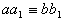
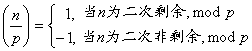
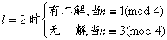
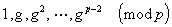

<b>§</b><b>3</b>&nbsp;
<b>同余式</b>

&nbsp;&nbsp;&nbsp; [同余及其性质]&nbsp; 设<i>m</i>为自然数,若整数<i>a</i>与<i>b</i>之差<i>a-b</i>为<i>m</i>的倍数,则称<i>a</i>与<i>b</i>对模<i>m</i>同余,记做

&nbsp;&nbsp;&nbsp; (mod <i>m</i>)

否则记为

&nbsp;&nbsp; (mod <i>m</i>)

表示<i>a</i>与<i>b</i>对模<i>m</i>不同余.

&nbsp;&nbsp;&nbsp; 同余具有下列性质:

&nbsp;&nbsp;&nbsp; 1°&nbsp; (mod <i>m</i>)&nbsp;&nbsp;&nbsp;&nbsp;&nbsp;&nbsp;&nbsp;&nbsp;&nbsp;&nbsp;&nbsp;&nbsp;&nbsp;&nbsp;&nbsp;&nbsp;&nbsp;&nbsp;&nbsp;&nbsp;&nbsp;&nbsp;&nbsp;&nbsp;&nbsp;&nbsp;&nbsp;&nbsp;&nbsp;&nbsp;
(自反性)

&nbsp;&nbsp;&nbsp; 2°&nbsp; 若(mod<i>
m</i>),则(mod<i> m</i>)&nbsp;&nbsp;&nbsp;&nbsp;&nbsp;&nbsp;&nbsp;&nbsp;&nbsp;&nbsp;&nbsp;&nbsp;&nbsp;&nbsp;
(对称性)

&nbsp;&nbsp;&nbsp; 3°&nbsp; 若,(mod<i> m</i>),则(mod<i>
m</i>)&nbsp; &nbsp;&nbsp;&nbsp;&nbsp;&nbsp;&nbsp;&nbsp;&nbsp;(传递性)

&nbsp;&nbsp;&nbsp; 4°&nbsp; 若,(mod<i> m</i>),则

&nbsp;&nbsp;&nbsp;&nbsp;&nbsp;&nbsp;&nbsp;&nbsp;
&nbsp;(mod<i> m</i>)

&nbsp;&nbsp;&nbsp;&nbsp;&nbsp;&nbsp;&nbsp;&nbsp;
&nbsp;(mod<i> m</i>)

&nbsp;&nbsp;&nbsp;&nbsp;&nbsp;&nbsp;&nbsp;&nbsp;&nbsp;&nbsp;
&nbsp;&nbsp;(mod<i> m</i>)

&nbsp;&nbsp;&nbsp; 5°&nbsp; 若,(mod<i> m</i>),且,则(mod<i>
m</i>).

&nbsp;&nbsp;&nbsp; [完全剩余系与缩剩余系]&nbsp;
设以<i>m</i>为模,则由同余性质1°,2°,3°可将全体整数分为<i>m</i>个类,同类的数都同余,不同类的数不同余,称这样的类为同余类,每类中各取一数为代表,例如

构成一个完全剩余系.

&nbsp;&nbsp;&nbsp; 在与<i>m</i>互素的各类中取一代表

构成一缩剩余系(简称缩系),此处<i>j (m)</i>为不超过<i>m</i>且与<i>m</i>互素的数的个数(称为欧拉函数).

&nbsp;&nbsp;&nbsp; 剩余系具有下列性质:

&nbsp;&nbsp;&nbsp; 1°&nbsp; 若, <i>x</i>过<i>m</i>的一完全剩余系,过的一完全剩余系,则过的一完全剩余系.

&nbsp;&nbsp;&nbsp; 2°&nbsp; 若,<i> x</i>过<i>m</i>的一缩系, 过的一缩系,则过的一缩系.

&nbsp;&nbsp;&nbsp; 3°&nbsp; 若为模<i>m</i>的一缩系,且(<i>k,m</i>)=1,则

<pre>&nbsp;&nbsp;&nbsp;&nbsp;&nbsp;&nbsp;&nbsp;&nbsp;&nbsp;&nbsp; </pre>

也为<i>m</i>的一缩系

&nbsp;&nbsp;&nbsp; [欧拉定理]&nbsp; 若(<i>k,m</i>)=1,则

(mod<i> m</i>)

式中<i>j (m)</i>为欧拉函数<i>.</i>

&nbsp;&nbsp;&nbsp; [费马定理]&nbsp; 若<i>p</i>为素数,则对所有整数<i>a</i>, 有

(mod<i> p</i>)

&nbsp;&nbsp;&nbsp; 显然费马定理是欧拉定理的特例.

&nbsp;&nbsp;&nbsp; [一次同余方程可解条件]&nbsp;
同余方程

(mod<i>m</i>)

有解的充分必要条件是:

<pre>&nbsp;&nbsp;&nbsp;&nbsp;&nbsp;&nbsp;&nbsp;&nbsp;&nbsp;&nbsp;&nbsp;&nbsp;&nbsp;&nbsp;&nbsp;&nbsp;&nbsp;&nbsp;&nbsp;&nbsp;&nbsp;&nbsp;&nbsp;&nbsp;&nbsp;&nbsp;&nbsp;&nbsp;&nbsp;&nbsp;&nbsp;&nbsp;&nbsp; </pre>

当满足此条件时,其解数(对模<i>m</i>的不同余者)为

<pre>&nbsp;&nbsp;&nbsp;&nbsp;&nbsp;&nbsp;&nbsp;&nbsp;&nbsp;&nbsp;&nbsp;&nbsp;&nbsp;&nbsp;&nbsp;&nbsp;&nbsp;&nbsp;&nbsp;&nbsp;&nbsp;&nbsp;&nbsp;&nbsp;&nbsp;&nbsp;&nbsp;&nbsp;&nbsp;&nbsp;&nbsp;&nbsp;&nbsp; </pre>

&nbsp;&nbsp;&nbsp; [一元一次同余方程的解法]&nbsp;
一元一次同余方程

<pre style='text-align:right' align=right>&nbsp;&nbsp;&nbsp;&nbsp;&nbsp;&nbsp;&nbsp;&nbsp;&nbsp;&nbsp; (mod<i>m</i>)&nbsp;&nbsp;&nbsp;&nbsp;&nbsp;&nbsp;&nbsp;&nbsp;&nbsp;&nbsp;&nbsp;&nbsp;&nbsp;&nbsp;&nbsp;&nbsp;&nbsp;&nbsp;&nbsp;&nbsp;&nbsp;&nbsp;&nbsp;&nbsp;&nbsp;&nbsp;&nbsp;&nbsp;&nbsp;&nbsp;&nbsp;&nbsp;&nbsp;&nbsp;&nbsp;&nbsp;&nbsp; (1)</pre>

有解的充分必要条件是:,若有解则共有(<i>a</i>,<i>m</i>)个互不同余的解,mod<i>m</i>.解法如下:

&nbsp;&nbsp;&nbsp; 设(<i>a</i>,<i>m</i>)=<i>d</i>,<i></i>,则原方程(1)化为

记作

<pre style='text-align:right' align=right>&nbsp;&nbsp;&nbsp;&nbsp;&nbsp;&nbsp;&nbsp;&nbsp;&nbsp;&nbsp; &nbsp;&nbsp;&nbsp;&nbsp;&nbsp;&nbsp;&nbsp;&nbsp;&nbsp;&nbsp;&nbsp;&nbsp;&nbsp;&nbsp;&nbsp;&nbsp;&nbsp;&nbsp;&nbsp;&nbsp;&nbsp;&nbsp;&nbsp;&nbsp;&nbsp;&nbsp;(2)</pre>

&nbsp;&nbsp;&nbsp;
首先由辗转相除法确定(见§1),使得

则

是同余方程(2)的解,最后得到

<i>x=x’+m’t
, t=</i>

为原方程(1)的解,mod<i> m</i>.即有<i>d</i>个解

对模<i>m</i>不同余.

&nbsp;&nbsp;&nbsp; [孙子定理<a href="#None"
name="_ftnref1" title="">*</a>] 若，<i>i</i>≠<i>j</i>，则同余方程组

<pre style='text-align:right' align=right>&nbsp;&nbsp;&nbsp;&nbsp;&nbsp;&nbsp;&nbsp;&nbsp;&nbsp;&nbsp; &nbsp;&nbsp;&nbsp;&nbsp;&nbsp;&nbsp;&nbsp;&nbsp;&nbsp;&nbsp;&nbsp;&nbsp;&nbsp;&nbsp;&nbsp;&nbsp;&nbsp;&nbsp;&nbsp;&nbsp;&nbsp;&nbsp;&nbsp;&nbsp;&nbsp;&nbsp;&nbsp;&nbsp;&nbsp;&nbsp;(3)</pre>

有唯一解, .

&nbsp;&nbsp;&nbsp; 同余方程组(3)的解法如下:

&nbsp;&nbsp;&nbsp; 因为,所以可由辗转相除法求出,满足

&nbsp;&nbsp;&nbsp; 记

于是

&nbsp;&nbsp;&nbsp; 最后计算

它就是同余方程组(3)的唯一解,.

&nbsp;&nbsp;&nbsp; [二次剩余与二次非剩余]&nbsp;
设<i>m</i>为大于1的整数,(<i>n</i>,<i>m</i>)=1,若

&nbsp; (mod <i>m</i>)

可解,则称<i>n</i>为对模<i>m</i>的二次剩余,或二次剩余,mod <i>m</i>.否则,称<i>n</i>为对模<i>m</i>的二次非剩余.

&nbsp;&nbsp;&nbsp; 两个二次剩余之积仍为二次剩余,mod <i>p.</i>

&nbsp;&nbsp;&nbsp; 两个二次非剩余之积为二次剩余,mod <i>p.</i>

&nbsp;&nbsp;&nbsp; 一个二次剩余与一个二次非剩余之积为一个二次非剩余,mod
<i>p.</i>

&nbsp;&nbsp;&nbsp; 设<i>p</i>为奇素数,则在模<i>p</i>的缩剩余系中,有个二次剩余:

有个二次非剩余, mod <i>p</i>.

&nbsp;&nbsp;&nbsp; [勒让德符号及其性质]&nbsp;
设<i>p</i>为奇素数,<i>p</i><i>n</i>又设

则称为勒让德符号.

&nbsp;&nbsp;&nbsp; 勒让德符号具有下列性质:

&nbsp;&nbsp;&nbsp; 1°&nbsp; 若(mod <i>p</i>),<i> p</i><i>n</i>则

=

&nbsp;&nbsp;&nbsp; 2°&nbsp; 欧拉判别条件: 设<i>p</i>为奇素数,则

&nbsp;(mod <i>p</i>)

<i>&nbsp;&nbsp;&nbsp; </i>3°&nbsp; 若<i>p</i>为奇素数,<i> p</i><i>mn</i> ,则

&nbsp;&nbsp;&nbsp; 4°&nbsp; 若<i>p</i>为奇素数,则

&nbsp;&nbsp;&nbsp; 5°&nbsp; 若<i>p</i>为奇素数,则

&nbsp;&nbsp;&nbsp; 6°&nbsp; 高斯互逆定律: 设<i>p,q</i>为两个不同的奇素数,则

&nbsp;&nbsp;&nbsp; [二次同余式的解数]&nbsp;
设<i>l</i>&gt;0,<i> p</i><i>n</i>,若<i>p</i>为奇素数，则二次同余式

&nbsp; (mod )

的解数为.

&nbsp;&nbsp;&nbsp; 当<i>p</i>=2时,<i>l</i>=1时 有一解.

<pre>&nbsp;&nbsp;&nbsp;&nbsp;&nbsp;&nbsp;&nbsp;&nbsp;&nbsp;&nbsp;&nbsp;&nbsp;&nbsp;&nbsp;&nbsp;&nbsp;&nbsp;&nbsp;&nbsp;&nbsp;&nbsp;&nbsp;&nbsp;&nbsp;&nbsp;&nbsp;&nbsp;&nbsp;&nbsp; &nbsp;&nbsp;&nbsp;&nbsp;</pre>

&nbsp;&nbsp;&nbsp; [对模<i>m</i>的次数]&nbsp; 设<i>h</i>为一整数,(<i>m</i>,<i>h</i>)=1,满足

(mod <i>m</i>)

的最小正整数<i>l</i>称为<i>h</i>对模<i>m</i>的次数,或<i>h</i>的次数,mod <i>m</i>.

&nbsp;&nbsp;&nbsp; 若(mod <i>m</i>),则,这里<i>l</i>为<i>h</i>的次数,mod <i>m</i>

&nbsp;&nbsp;&nbsp; [素数模的原根与指数]&nbsp;
设<i>p</i>为素数,次数为<i>p</i>－1的数称为模<i>p</i>的原根.

&nbsp;&nbsp;&nbsp; 设<i>g</i>为模<i>p</i>的一原根,则

两两互不同余.

&nbsp;&nbsp;&nbsp; 任一整数<i>n</i>(<i> p</i><i>n</i>),必有一数<i>a</i>使得

&nbsp; (mod<i>p</i>)&nbsp; , 

此<i>a</i>称为<i>n</i>的指数,mod <i>p</i>.记作

&nbsp;&nbsp;&nbsp;&nbsp;&nbsp;&nbsp;&nbsp;&nbsp;&nbsp;&nbsp;&nbsp;&nbsp;&nbsp;&nbsp;&nbsp;&nbsp;&nbsp;&nbsp;&nbsp;&nbsp;&nbsp;&nbsp;&nbsp;&nbsp;&nbsp;&nbsp;&nbsp;&nbsp;&nbsp;&nbsp;&nbsp;

在不易混淆时,简记ind<i>n</i>.

&nbsp;&nbsp;&nbsp; 指数具有下列性质:

&nbsp;&nbsp;&nbsp; 1°&nbsp; 若<i>b</i>为满足

&nbsp;&nbsp;&nbsp;&nbsp;&nbsp;&nbsp;&nbsp;&nbsp;&nbsp;&nbsp;&nbsp;&nbsp;&nbsp;&nbsp;&nbsp;&nbsp;&nbsp;&nbsp;&nbsp;&nbsp;&nbsp;&nbsp;&nbsp;&nbsp;&nbsp;&nbsp;&nbsp;&nbsp;&nbsp;&nbsp;
(mod <i>p</i>)

的任一数,则

&nbsp;&nbsp;&nbsp;&nbsp;&nbsp;&nbsp;&nbsp;&nbsp;&nbsp;&nbsp;&nbsp;&nbsp;&nbsp;&nbsp;&nbsp;&nbsp;&nbsp;&nbsp;&nbsp;&nbsp;&nbsp;&nbsp;&nbsp;&nbsp;&nbsp;&nbsp;&nbsp;&nbsp;
(mod <i>p</i>－1)

&nbsp;&nbsp;&nbsp; 2°&nbsp; (mod <i>p</i>－1),<i> p</i><i>ab</i>

&nbsp;&nbsp;&nbsp; 3°&nbsp; (mod <i>p</i>－1),<i> p</i><i>a</i>

&nbsp;&nbsp;&nbsp; 4°&nbsp; 底数互换公式 设,为模<i>p</i>的两个不等的原根,且(mod <i>p</i>),则

(mod <i>p</i>－1)

&nbsp;&nbsp;&nbsp; [模<i>m</i>的原根]&nbsp; 设<i>m</i>为一自然数,若有一数<i>g</i>存在,使得

&nbsp;&nbsp;&nbsp;&nbsp;&nbsp;&nbsp;&nbsp;&nbsp;&nbsp;&nbsp;&nbsp;&nbsp;&nbsp;&nbsp;&nbsp;&nbsp;&nbsp;&nbsp;&nbsp;&nbsp;&nbsp;&nbsp;&nbsp;&nbsp;&nbsp;&nbsp;
(mod <i>m</i>)

两两互不同余,则此<i>g</i>称为对模<i>m</i>的原根, 模<i>m</i>的原根存在的充分必要条件是:

(<i>p</i>为奇素数,<i>l</i>为正整数)

&nbsp;&nbsp;&nbsp; [素数及其最小原根表(5000以内)]&nbsp; 加*者表示10为其原根

<table class=MsoNormalTable border=1 cellspacing=0 cellpadding=0
 style='border-collapse:collapse;border:none'>
 <tr style='height:23.95pt'>
  <td width=68 valign=top style='width:50.9pt;border:solid windowtext 1.0pt;
  border-left:none;padding:0mm 5.4pt 0mm 5.4pt;height:23.95pt'>
  
<i>p</i>

  </td>
  <td width=79 valign=top style='width:59.05pt;border-top:solid windowtext 1.0pt;
  border-left:none;border-bottom:solid windowtext 1.0pt;border-right:double windowtext 1.5pt;
  padding:0mm 5.4pt 0mm 5.4pt;height:23.95pt'>
  
<i>g</i>

  </td>
  <td width=68 valign=top style='width:50.9pt;border:solid windowtext 1.0pt;
  border-left:none;padding:0mm 5.4pt 0mm 5.4pt;height:23.95pt'>
  
<i>p</i>

  </td>
  <td width=77 valign=top style='width:57.55pt;border-top:solid windowtext 1.0pt;
  border-left:none;border-bottom:solid windowtext 1.0pt;border-right:double windowtext 1.5pt;
  padding:0mm 5.4pt 0mm 5.4pt;height:23.95pt'>
  
<i>g</i>

  </td>
  <td width=68 valign=top style='width:50.9pt;border:solid windowtext 1.0pt;
  border-left:none;padding:0mm 5.4pt 0mm 5.4pt;height:23.95pt'>
  
<i>p</i>

  </td>
  <td width=78 valign=top style='width:58.3pt;border-top:solid windowtext 1.0pt;
  border-left:none;border-bottom:solid windowtext 1.0pt;border-right:double windowtext 1.5pt;
  padding:0mm 5.4pt 0mm 5.4pt;height:23.95pt'>
  
<i>g</i>

  </td>
  <td width=68 valign=top style='width:50.9pt;border:solid windowtext 1.0pt;
  border-left:none;padding:0mm 5.4pt 0mm 5.4pt;height:23.95pt'>
  
<i>p</i>

  </td>
  <td width=68 valign=top style='width:50.95pt;border-top:solid windowtext 1.0pt;
  border-left:none;border-bottom:solid windowtext 1.0pt;border-right:none;
  padding:0mm 5.4pt 0mm 5.4pt;height:23.95pt'>
  
<i>g</i>

  </td>
 </tr>
 <tr style='height:108.35pt'>
  <td width=68 valign=top style='width:50.9pt;border-top:none;border-left:none;
  border-bottom:solid windowtext 1.0pt;border-right:solid windowtext 1.0pt;
  padding:0mm 5.4pt 0mm 5.4pt;height:108.35pt'>
  
3

  
5

  
7*

  
11

  
13

  
17*

  
19*

  
23*

  
29*

  
31

  
37

  
41

  
43

  
47*

  
53

  
59*

  
61*

  
67

  
71

  
73

  
79

  
83

  
89

  
97*

  
101

  
103

  
107

  
109*

  
113*

  
127

  
131*

  
137

  
139

  
149*

  
151

  
157

  
163

  
167*

  
173

  
179*

  
181*

  
191

  
193*

  
197

  
199

  
211

  
223*

  
227

  
229*

  
233*

  
239

  
241

  </td>
  <td width=79 valign=top style='width:59.05pt;border-top:none;border-left:
  none;border-bottom:solid windowtext 1.0pt;border-right:double windowtext 1.5pt;
  padding:0mm 5.4pt 0mm 5.4pt;height:108.35pt'>
  
2

  
2

  
3

  
2

  
2

  
3

  
2

  
5

  
2

  
3

  
2

  
6

  
3

  
5

  
2

  
2

  
2

  
2

  
7

  
5

  
3

  
2

  
3

  
5

  
2

  
5

  
2

  
6

  
3

  
3

  
2

  
3

  
2

  
2

  
6

  
5

  
2

  
5

  
2

  
2

  
2

  
19

  
5

  
2

  
3

  
2

  
3

  
2

  
6

  
3

  
7

  
7

  </td>
  <td width=68 valign=top style='width:50.9pt;border-top:none;border-left:none;
  border-bottom:solid windowtext 1.0pt;border-right:solid windowtext 1.0pt;
  padding:0mm 5.4pt 0mm 5.4pt;height:108.35pt'>
  
251

  
257*

  
263*

  
269*

  
271

  
277

  
281

  
283

  
293

  
307

  
311

  
313*

  
317

  
331

  
337*

  
347

  
349

  
353

  
359

  
367*

  
373

  
379*

  
383*

  
389*

  
397

  
401

  
409

  
419*

  
421

  
431

  
433*

  
439

  
443

  
449

  
457

  
461*

  
463

  
467

  
479

  
487*

  
491*

  
499*

  
503*

  
509*

  
521

  
523

  
541*

  
547

  
557

  
563

  
569

  
571*

  </td>
  <td width=77 valign=top style='width:57.55pt;border-top:none;border-left:
  none;border-bottom:solid windowtext 1.0pt;border-right:double windowtext 1.5pt;
  padding:0mm 5.4pt 0mm 5.4pt;height:108.35pt'>
  
6

  
3

  
5

  
2

  
6

  
5

  
3

  
3

  
2

  
5

  
17

  
10

  
2

  
3

  
10

  
2

  
2

  
3

  
7

  
6

  
2

  
2

  
5

  
2

  
5

  
3

  
21

  
2

  
2

  
7

  
5

  
15

  
2

  
3

  
13

  
2

  
3

  
2

  
13

  
3

  
2

  
7

  
5

  
2

  
3

  
2

  
2

  
2

  
2

  
2

  
3

  
3

  </td>
  <td width=68 valign=top style='width:50.9pt;border-top:none;border-left:none;
  border-bottom:solid windowtext 1.0pt;border-right:solid windowtext 1.0pt;
  padding:0mm 5.4pt 0mm 5.4pt;height:108.35pt'>
  
577*

  
587

  
593*

  
599

  
601

  
607

  
613

  
617

  
619*

  
631

  
641

  
643

  
647*

  
653

  
659*

  
661

  
673

  
677

  
683

  
691

  
701*

  
709*

  
719

  
727*

  
733

  
739

  
743*

  
751

  
757

  
761

  
769

  
773

  
787

  
797

  
809

  
811*

  
821*

  
823*

  
827

  
829

  
839

  
853

  
857*

  
859

  
863*

  
877

  
881

  
883

  
887*

  
907

  
911

  
919

  </td>
  <td width=78 valign=top style='width:58.3pt;border-top:none;border-left:none;
  border-bottom:solid windowtext 1.0pt;border-right:double windowtext 1.5pt;
  padding:0mm 5.4pt 0mm 5.4pt;height:108.35pt'>
  
5

  
2

  
3

  
7

  
7

  
3

  
2

  
3

  
2

  
3

  
3

  
11

  
5

  
2

  
2

  
2

  
5

  
2

  
5

  
3

  
2

  
2

  
11

  
5

  
6

  
3

  
5

  
3

  
2

  
6

  
11

  
2

  
2

  
2

  
3

  
3

  
2

  
3

  
2

  
2

  
11

  
2

  
3

  
2

  
5

  
2

  
3

  
2

  
5

  
2

  
17

  
7

  </td>
  <td width=68 valign=top style='width:50.9pt;border-top:none;border-left:none;
  border-bottom:solid windowtext 1.0pt;border-right:solid windowtext 1.0pt;
  padding:0mm 5.4pt 0mm 5.4pt;height:108.35pt'>
  
929

  
937*

  
941*

  
947

  
953*

  
967

  
971*

  
977*

  
983*

  
991

  
997

  
1009

  
1013

  
1019*

  
1021*

  
1031

  
1033*

  
1039

  
1049

  
1051*

  
1061

  
1063*

  
1069*

  
1087*

  
1091*

  
1093

  
1097*

  
1103*

  
1109*

  
1117

  
1123

  
1129

  
1151

  
1153*

  
1163

  
1171*

  
1181*

  
1187

  
1193*

  
1201

  
1213*

  
1217*

  
1223*

  
1229*

  
1231

  
1237

  
1249

  
1259*

  
1277

  
1279

  
1283

  
1289

  </td>
  <td width=68 valign=top style='width:50.95pt;border:none;border-bottom:solid windowtext 1.0pt;
  padding:0mm 5.4pt 0mm 5.4pt;height:108.35pt'>
  
3

  
5

  
2

  
2

  
3

  
5

  
6

  
3

  
5

  
6

  
7

  
11

  
3

  
2

  
10

  
14

  
5

  
3

  
3

  
7

  
2

  
3

  
6

  
3

  
2

  
5

  
3

  
5

  
2

  
2

  
2

  
11

  
17

  
5

  
5

  
2

  
7

  
2

  
3

  
11

  
2

  
3

  
5

  
2

  
3

  
2

  
7

  
2

  
2

  
3

  
2

  
6

  </td>
 </tr>
</table>

&nbsp;

<table class=MsoNormalTable border=1 cellspacing=0 cellpadding=0
 style='border-collapse:collapse;border:none'>
 <tr style='height:18.15pt'>
  <td width=71 valign=top style='width:53.5pt;border:solid windowtext 1.0pt;
  border-left:none;padding:0mm 5.4pt 0mm 5.4pt;height:18.15pt'>
  
<i>p</i>

  </td>
  <td width=71 valign=top style='width:53.5pt;border-top:solid windowtext 1.0pt;
  border-left:none;border-bottom:solid windowtext 1.0pt;border-right:double windowtext 1.5pt;
  padding:0mm 5.4pt 0mm 5.4pt;height:18.15pt'>
  
<i>g</i>

  </td>
  <td width=71 valign=top style='width:53.5pt;border:solid windowtext 1.0pt;
  border-left:none;padding:0mm 5.4pt 0mm 5.4pt;height:18.15pt'>
  
<i>p</i>

  </td>
  <td width=71 valign=top style='width:53.5pt;border-top:solid windowtext 1.0pt;
  border-left:none;border-bottom:solid windowtext 1.0pt;border-right:double windowtext 1.5pt;
  padding:0mm 5.4pt 0mm 5.4pt;height:18.15pt'>
  
<i>g</i>

  </td>
  <td width=71 valign=top style='width:53.5pt;border:solid windowtext 1.0pt;
  border-left:none;padding:0mm 5.4pt 0mm 5.4pt;height:18.15pt'>
  
<i>p</i>

  </td>
  <td width=71 valign=top style='width:53.5pt;border-top:solid windowtext 1.0pt;
  border-left:none;border-bottom:solid windowtext 1.0pt;border-right:double windowtext 1.5pt;
  padding:0mm 5.4pt 0mm 5.4pt;height:18.15pt'>
  
<i>g</i>

  </td>
  <td width=71 valign=top style='width:53.5pt;border:solid windowtext 1.0pt;
  border-left:none;padding:0mm 5.4pt 0mm 5.4pt;height:18.15pt'>
  
<i>p</i>

  </td>
  <td width=71 valign=top style='width:53.55pt;border-top:solid windowtext 1.0pt;
  border-left:none;border-bottom:solid windowtext 1.0pt;border-right:none;
  padding:0mm 5.4pt 0mm 5.4pt;height:18.15pt'>
  
<i>g</i>

  </td>
 </tr>
 <tr style='height:15.9pt'>
  <td width=71 valign=top style='width:53.5pt;border-top:none;border-left:none;
  border-bottom:solid windowtext 1.0pt;border-right:solid windowtext 1.0pt;
  padding:0mm 5.4pt 0mm 5.4pt;height:15.9pt'>
  
1291*

  
1297*

  
1301*

  
1303*

  
1307

  
1319

  
1321

  
1327*

  
1361

  
1367*

  
1373

  
1381*

  
1399

  
1409

  
1423

  
1427

  
1429*

  
1433*

  
1439

  
1447*

  
1451

  
1453

  
1459

  
1471

  
1481

  
1483

  
1487*

  
1489

  
1493

  
1499

  
1511

  
1523

  
1531*

  
1543*

  
1549*

  
1553*

  
1559

  
1567*

  
1571*

  
1579*

  
1583*

  
1597

  
1601

  
1607*

  
1609

  
1613

  
1619*

  
1621*

  
1627

  
1637

  
1657

  
1663*

  
<i>p</i>

  </td>
  <td width=71 valign=top style='width:53.5pt;border-top:none;border-left:none;
  border-bottom:solid windowtext 1.0pt;border-right:double windowtext 1.5pt;
  padding:0mm 5.4pt 0mm 5.4pt;height:15.9pt'>
  
2

  
10

  
2

  
6

  
2

  
13

  
13

  
3

  
3

  
5

  
2

  
2

  
13

  
3

  
3

  
2

  
6

  
3

  
7

  
3

  
2

  
2

  
5

  
6

  
3

  
2

  
5

  
14

  
2

  
2

  
11

  
2

  
2

  
5

  
2

  
3

  
19

  
3

  
2

  
3

  
5

  
11

  
3

  
5

  
7

  
3

  
2

  
2

  
3

  
2

  
11

  
3

  
<i>g</i>

  </td>
  <td width=71 valign=top style='width:53.5pt;border-top:none;border-left:none;
  border-bottom:solid windowtext 1.0pt;border-right:solid windowtext 1.0pt;
  padding:0mm 5.4pt 0mm 5.4pt;height:15.9pt'>
  
1667

  
1669

  
1693

  
1697*

  
1699

  
1709*

  
1721

  
1723

  
1733

  
1741*

  
1747

  
1753

  
1759

  
1777*

  
1783*

  
1787

  
1789*

  
1801

  
1811*

  
1823*

  
1831

  
1847*

  
1861*

  
1867

  
1871

  
1873*

  
1877

  
1879

  
1889

  
1901

  
1907

  
1913*

  
1931

  
1933

  
1949*

  
1951

  
1973

  
1979*

  
1987

  
1993*

  
1997

  
1999

  
2003

  
2011

  
2017*

  
2027

  
2029*

  
2039

  
2053

  
2063*

  
2069*

  
2081

  
<i>p</i>

  </td>
  <td width=71 valign=top style='width:53.5pt;border-top:none;border-left:none;
  border-bottom:solid windowtext 1.0pt;border-right:double windowtext 1.5pt;
  padding:0mm 5.4pt 0mm 5.4pt;height:15.9pt'>
  
2

  
2

  
2

  
3

  
3

  
3

  
3

  
3

  
2

  
2

  
2

  
7

  
6

  
5

  
10

  
2

  
6

  
11

  
6

  
5

  
3

  
5

  
2

  
2

  
14

  
10

  
2

  
6

  
3

  
2

  
2

  
3

  
2

  
5

  
2

  
3

  
2

  
2

  
2

  
5

  
2

  
3

  
5

  
3

  
5

  
2

  
2

  
7

  
2

  
5

  
2

  
3

  
<i>g</i>

  </td>
  <td width=71 valign=top style='width:53.5pt;border-top:none;border-left:none;
  border-bottom:solid windowtext 1.0pt;border-right:solid windowtext 1.0pt;
  padding:0mm 5.4pt 0mm 5.4pt;height:15.9pt'>
  
2083

  
2087

  
2089

  
2099*

  
2111

  
2113*

  
2129

  
2131

  
2137*

  
2141*

  
2143*

  
2153*

  
2161

  
2179*

  
2203

  
2207*

  
2213

  
2221*

  
2237

  
2239

  
2243

  
2251*

  
2267

  
2269*

  
2273*

  
2281

  
2287

  
2293

  
2297*

  
2309*

  
2311

  
2333

  
2339*

  
2341*

  
2347

  
2351

  
2357

  
2371*

  
2377

  
2381

  
2383*

  
2389*

  
2393

  
2399

  
2411*

  
2417*

  
2423*

  
2437*

  
2441

  
2447*

  
2459*

  
2467

  
<i>p</i>

  </td>
  <td width=71 valign=top style='width:53.5pt;border-top:none;border-left:none;
  border-bottom:solid windowtext 1.0pt;border-right:double windowtext 1.5pt;
  padding:0mm 5.4pt 0mm 5.4pt;height:15.9pt'>
  
2

  
5

  
7

  
2

  
7

  
5

  
3

  
2

  
10

  
2

  
3

  
3

  
23

  
7

  
5

  
5

  
2

  
2

  
2

  
3

  
2

  
7

  
2

  
2

  
3

  
7

  
19

  
2

  
5

  
2

  
3

  
2

  
2

  
7

  
3

  
13

  
2

  
2

  
5

  
3

  
5

  
2

  
3

  
11

  
6

  
3

  
5

  
2

  
6

  
5

  
2

  
2

  
<i>g</i>

  </td>
  <td width=71 valign=top style='width:53.5pt;border-top:none;border-left:none;
  border-bottom:solid windowtext 1.0pt;border-right:solid windowtext 1.0pt;
  padding:0mm 5.4pt 0mm 5.4pt;height:15.9pt'>
  
2473*

  
2477

  
2503

  
2521

  
2531

  
2539*

  
2543*

  
2549*

  
2551

  
2557

  
2579*

  
2591

  
2593*

  
2609

  
2617*

  
2621*

  
2633*

  
2647

  
2657*

  
2659

  
2663*

  
2671

  
2677

  
2683

  
2687*

  
2689

  
2693

  
2699*

  
2707

  
2711

  
2713*

  
2719

  
2729*

  
2731

  
2741*

  
2749

  
2753*

  
2767*

  
2777*

  
2789*

  
2791

  
2797

  
2801

  
2803

  
2819*

  
2833*

  
2837

  
2843

  
2851*

  
2857

  
2861*

  
2879

  
<i>p</i>

  </td>
  <td width=71 valign=top style='width:53.55pt;border:none;border-bottom:solid windowtext 1.0pt;
  padding:0mm 5.4pt 0mm 5.4pt;height:15.9pt'>
  
5

  
2

  
3

  
17

  
2

  
2

  
5

  
2

  
6

  
2

  
2

  
7

  
7

  
3

  
5

  
2

  
3

  
3

  
3

  
2

  
5

  
7

  
2

  
2

  
5

  
19

  
2

  
2

  
2

  
7

  
5

  
3

  
3

  
3

  
2

  
6

  
3

  
3

  
3

  
2

  
6

  
2

  
3

  
2

  
2

  
5

  
2

  
2

  
2

  
11

  
2

  
7

  
<i>g</i>

  </td>
 </tr>
 <tr style='height:9.75pt'>
  <td width=71 valign=top style='width:53.5pt;border-top:none;border-left:none;
  border-bottom:solid windowtext 1.0pt;border-right:solid windowtext 1.0pt;
  padding:0mm 5.4pt 0mm 5.4pt;height:9.75pt'>
  
2887

  
2897*

  
2903*

  
2909*

  
2917

  
2927*

  
2939*

  
2953

  
2957

  
2963

  
2969

  
2971*

  
2999

  
3001

  
3011*

  
3019*

  
3023*

  
3037

  
3041

  
3049

  
3061

  
3067

  
3079

  
3083

  
3089

  
3109

  
3119

  
3121

  
3137*

  
3163

  
3167*

  
3169

  
3181

  
3187

  
3191

  
3203

  
3209

  
3217

  
3221*

  
3229

  
3251*

  
3253

  
3257*

  
3259*

  
3271

  
3299*

  
3301*

  
3307

  
3313*

  
3319

  
3323

  
3329

  
3331*

  
<i>p</i>

  </td>
  <td width=71 valign=top style='width:53.5pt;border-top:none;border-left:none;
  border-bottom:solid windowtext 1.0pt;border-right:double windowtext 1.5pt;
  padding:0mm 5.4pt 0mm 5.4pt;height:9.75pt'>
  
5

  
3

  
5

  
2

  
5

  
5

  
2

  
13

  
2

  
2

  
3

  
10

  
17

  
14

  
2

  
2

  
5

  
2

  
3

  
11

  
6

  
2

  
6

  
2

  
3

  
6

  
7

  
7

  
3

  
3

  
5

  
7

  
7

  
2

  
11

  
2

  
3

  
5

  
10

  
6

  
6

  
2

  
3

  
3

  
3

  
2

  
6

  
2

  
10

  
6

  
2

  
3

  
3

  
<i>g</i>

  </td>
  <td width=71 valign=top style='width:53.5pt;border-top:none;border-left:none;
  border-bottom:solid windowtext 1.0pt;border-right:solid windowtext 1.0pt;
  padding:0mm 5.4pt 0mm 5.4pt;height:9.75pt'>
  
3343*

  
3347

  
3359

  
3361

  
3371*

  
3373

  
3389*

  
3391

  
3407*

  
3413

  
3433*

  
3449

  
3457

  
3461*

  
3463*

  
3467

  
3469*

  
3491

  
3499

  
3511

  
3517

  
3527*

  
3529

  
3533

  
3539*

  
3541

  
3547

  
3557

  
3559

  
3571*

  
3581*

  
3583

  
3593*

  
3607*

  
3613

  
3617*

  
3623*

  
3631

  
3637

  
3643

  
3659*

  
3671

  
3673*

  
3677

  
3691

  
3697

  
3701*

  
3709*

  
3719

  
3727*

  
3733

  
3739

  
3761

  
<i>p</i>

  </td>
  <td width=71 valign=top style='width:53.5pt;border-top:none;border-left:none;
  border-bottom:solid windowtext 1.0pt;border-right:double windowtext 1.5pt;
  padding:0mm 5.4pt 0mm 5.4pt;height:9.75pt'>
  
5

  
2

  
11

  
22

  
2

  
5

  
3

  
3

  
5

  
2

  
5

  
3

  
7

  
2

  
3

  
2

  
2

  
2

  
2

  
7

  
2

  
5

  
17

  
2

  
2

  
7

  
2

  
2

  
3

  
2

  
2

  
3

  
3

  
5

  
2

  
3

  
5

  
21

  
2

  
2

  
2

  
13

  
5

  
2

  
2

  
5

  
2

  
2

  
7

  
3

  
2

  
7

  
3

  
<i>g</i>

  </td>
  <td width=71 valign=top style='width:53.5pt;border-top:none;border-left:none;
  border-bottom:solid windowtext 1.0pt;border-right:solid windowtext 1.0pt;
  padding:0mm 5.4pt 0mm 5.4pt;height:9.75pt'>
  
3767

  
3769

  
3779*

  
3793

  
3797

  
3803

  
3821*

  
3823

  
3833*

  
3847*

  
3851*

  
3853

  
3863*

  
3877

  
3881

  
3889

  
3907

  
3911

  
3917

  
3919

  
3923

  
3929

  
3931

  
3943*

  
3947

  
3967*

  
3989*

  
4001

  
4003

  
4007*

  
4013

  
4019*

  
4021

  
4027

  
4049

  
4051*

  
4057*

  
4073*

  
4079

  
4091*

  
4093

  
4099

  
4111

  
4127

  
4129

  
4133

  
4139*

  
4153*

  
4157

  
4159

  
4177*

  
4201

  
4211*

  
<i>p</i>

  </td>
  <td width=71 valign=top style='width:53.5pt;border-top:none;border-left:none;
  border-bottom:solid windowtext 1.0pt;border-right:double windowtext 1.5pt;
  padding:0mm 5.4pt 0mm 5.4pt;height:9.75pt'>
  
5

  
7

  
2

  
5

  
2

  
2

  
3

  
3

  
3

  
5

  
2

  
2

  
5

  
2

  
13

  
11

  
2

  
13

  
2

  
3

  
2

  
3

  
2

  
3

  
2

  
6

  
2

  
3

  
2

  
5

  
2

  
2

  
2

  
3

  
3

  
10

  
5

  
3

  
11

  
2

  
2

  
2

  
17

  
5

  
13

  
2

  
2

  
5

  
2

  
3

  
5

  
11

  
6

  
<i>g</i>

  </td>
  <td width=71 valign=top style='width:53.5pt;border-top:none;border-left:none;
  border-bottom:solid windowtext 1.0pt;border-right:solid windowtext 1.0pt;
  padding:0mm 5.4pt 0mm 5.4pt;height:9.75pt'>
  
4217*

  
4219*

  
4229*

  
4231

  
4241

  
4243

  
4253

  
4259*

  
4261*

  
4271

  
4273

  
4283

  
4289

  
4297

  
4327*

  
4337*

  
4339*

  
4349*

  
4357

  
4363

  
4373

  
4391

  
4397

  
4409

  
4421*

  
4423*

  
4441

  
4447*

  
4451*

  
4457*

  
4463*

  
4481

  
4483

  
4493

  
4507

  
4513

  
4517

  
4519

  
4523

  
4547

  
4549

  
4561

  
4567*

  
4583*

  
4591

  
4597

  
4603

  
4621

  
4637

  
4639

  
4643

  
4649

  
4651*

  
<i>p</i>

  </td>
  <td width=71 valign=top style='width:53.55pt;border:none;border-bottom:solid windowtext 1.0pt;
  padding:0mm 5.4pt 0mm 5.4pt;height:9.75pt'>
  
3

  
2

  
2

  
3

  
3

  
2

  
2

  
2

  
2

  
7

  
5

  
2

  
3

  
5

  
3

  
3

  
10

  
2

  
2

  
2

  
2

  
14

  
2

  
3

  
3

  
3

  
21

  
3

  
2

  
3

  
5

  
3

  
2

  
2

  
2

  
7

  
2

  
3

  
5

  
2

  
6

  
11

  
3

  
5

  
11

  
5

  
2

  
2

  
2

  
3

  
5

  
3

  
3

  
<i>g</i>

  </td>
 </tr>
 <tr style='height:139.55pt'>
  <td width=71 valign=top style='width:53.5pt;border-top:none;border-left:none;
  border-bottom:solid windowtext 1.0pt;border-right:solid windowtext 1.0pt;
  padding:0mm 5.4pt 0mm 5.4pt;height:139.55pt'>
  
4657

  
4663

  
4673*

  
4679

  
4691*

  
4703*

  
4721

  
4723

  
4729

  
4733

  </td>
  <td width=71 valign=top style='width:53.5pt;border-top:none;border-left:none;
  border-bottom:solid windowtext 1.0pt;border-right:double windowtext 1.5pt;
  padding:0mm 5.4pt 0mm 5.4pt;height:139.55pt'>
  
15

  
3

  
3

  
11

  
2

  
5

  
6

  
2

  
17

  
5

  </td>
  <td width=71 valign=top style='width:53.5pt;border-top:none;border-left:none;
  border-bottom:solid windowtext 1.0pt;border-right:solid windowtext 1.0pt;
  padding:0mm 5.4pt 0mm 5.4pt;height:139.55pt'>
  
4751

  
4759

  
4783*

  
4787

  
4789

  
4793*

  
4799

  
4801

  
4813

  
4817*

  </td>
  <td width=71 valign=top style='width:53.5pt;border-top:none;border-left:none;
  border-bottom:solid windowtext 1.0pt;border-right:double windowtext 1.5pt;
  padding:0mm 5.4pt 0mm 5.4pt;height:139.55pt'>
  
19

  
3

  
6

  
2

  
2

  
3

  
7

  
7

  
2

  
3

  </td>
  <td width=71 valign=top style='width:53.5pt;border-top:none;border-left:none;
  border-bottom:solid windowtext 1.0pt;border-right:solid windowtext 1.0pt;
  padding:0mm 5.4pt 0mm 5.4pt;height:139.55pt'>
  
4831

  
4861

  
4871

  
4877

  
4889

  
4903

  
4909

  
4919

  
4931*

  
4933

  </td>
  <td width=71 valign=top style='width:53.5pt;border-top:none;border-left:none;
  border-bottom:solid windowtext 1.0pt;border-right:double windowtext 1.5pt;
  padding:0mm 5.4pt 0mm 5.4pt;height:139.55pt'>
  
3

  
11

  
11

  
2

  
3

  
3

  
6

  
13

  
6

  
2

  </td>
  <td width=71 valign=top style='width:53.5pt;border-top:none;border-left:none;
  border-bottom:solid windowtext 1.0pt;border-right:solid windowtext 1.0pt;
  padding:0mm 5.4pt 0mm 5.4pt;height:139.55pt'>
  
4937*

  
4943*

  
4951

  
4957

  
4967*

  
4969

  
4973

  
4987

  
4993

  
4999

  </td>
  <td width=71 valign=top style='width:53.55pt;border:none;border-bottom:solid windowtext 1.0pt;
  padding:0mm 5.4pt 0mm 5.4pt;height:139.55pt'>
  
3

  
7

  
6

  
2

  
5

  
11

  
2

  
2

  
5

  
3

  </td>
 </tr>
</table>

 

 

<a href="#None" name="_ftn1" title="">*</a> 外国书刊中称孙子定理为中国剩余定理。我国古代在《孙子算经》“物不知其数”一问中对此类问题的解法已作叙述。

