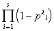
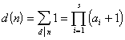

<b>§</b><b>4&nbsp;&nbsp;&nbsp;&nbsp; </b><b>数论函数</b>

&nbsp;&nbsp;&nbsp; 对任一正整数<i>n</i>有确定值的函数<i>f</i>(<i>n</i>)称为数论函数.

&nbsp;&nbsp;&nbsp; [积性函数与完全积性函数]&nbsp;
若(<i>m,n</i>)<i>=</i>1,有<i>f</i>(<i>mn</i>)<i>=f</i>(<i>m</i>)<i>f</i>(<i>n</i>),则称数论函数<i>f</i>(<i>n</i>)为积性函数.若对任意正整数<i>m,n</i>都有<i>f</i>(<i>mn</i>)<i>=f</i>(<i>m</i>)<i>f</i>(<i>n</i>),则称<i>f</i>(<i>n</i>)为完全积性函数.

&nbsp;&nbsp;&nbsp; 积性函数具有下列性质:

&nbsp;&nbsp;&nbsp; 1°&nbsp; 若<i>f</i>(<i>n</i>)为非零积性函数,则<i>f</i>(1)=1<i>.</i>

&nbsp;&nbsp;&nbsp; 2°&nbsp; 若<i>g</i>(<i>n</i>)<i>,h</i>(<i>n</i>)都为积性函数,则<i>g</i>(<i>n</i>)<i>h</i>(<i>n</i>)仍为积性函数.且

也为积性函数,这里<b>&aring;</b>是对<i>n</i>的所有不同因数<i>d</i>求和.

&nbsp;&nbsp;&nbsp; 3°&nbsp; 若<i>g</i>(<i>n</i>)为非零积性函数,且,则

也为积性函数. 

&nbsp;&nbsp;&nbsp; 4°&nbsp; 若<i>f</i>(<i>n</i>)为积性函数,则

<i>f</i>([<i>m,n</i>])<i>f</i>((<i>m,n</i>))=<i>f</i>(<i>m</i>)<i>f</i>(<i>n</i>)

式中(<i>m,n</i>)为<i>m,n</i>的最大公因数,[<i>m,n</i>]为<i>m,n</i>的最小公倍数.

&nbsp;&nbsp;&nbsp; [麦比乌斯函数]&nbsp; 函数

称为麦比乌斯函数.

&nbsp; 麦比乌斯函数具有下列性质:

&nbsp;&nbsp;&nbsp; 1°&nbsp; 

&nbsp;&nbsp;&nbsp; 2°&nbsp; <i>μ</i>(<i>n</i>)为积性函数,但非完全积性函数.

&nbsp;&nbsp;&nbsp; 3°&nbsp; 设,若<i>f</i>(<i>n</i>)为积性函数,则

<pre>也为积性函数.例如</pre><pre>&nbsp;&nbsp;&nbsp;&nbsp;&nbsp;&nbsp;&nbsp;&nbsp;&nbsp;&nbsp;&nbsp;&nbsp;&nbsp;&nbsp;&nbsp;&nbsp;&nbsp;&nbsp;&nbsp;&nbsp;&nbsp;&nbsp;&nbsp;&nbsp;&nbsp;&nbsp;&nbsp;&nbsp;&nbsp;&nbsp;&nbsp;&nbsp;&nbsp;&nbsp; </pre><pre>&nbsp;&nbsp;&nbsp;&nbsp;&nbsp;&nbsp;&nbsp;&nbsp;&nbsp;&nbsp;&nbsp;&nbsp;&nbsp;&nbsp;&nbsp;&nbsp;&nbsp;&nbsp;&nbsp;&nbsp;&nbsp;&nbsp;&nbsp;&nbsp;&nbsp;&nbsp;&nbsp;&nbsp;&nbsp;&nbsp;&nbsp;&nbsp;&nbsp;&nbsp;</pre><pre>&nbsp;&nbsp;&nbsp;&nbsp;&nbsp;&nbsp;&nbsp;&nbsp;&nbsp;&nbsp;&nbsp;&nbsp;&nbsp;&nbsp;&nbsp;&nbsp;&nbsp;&nbsp;&nbsp;&nbsp;&nbsp;&nbsp;&nbsp;&nbsp;&nbsp;&nbsp;&nbsp;&nbsp;&nbsp;&nbsp;&nbsp;&nbsp;&nbsp;&nbsp;&nbsp;</pre>

&nbsp;&nbsp;&nbsp; [欧拉函数]&nbsp; 设<i>n</i>为自然数,(<i>n</i>)为不超过<i>n</i>且与<i>n</i>互素的正整数的个数,称为欧拉函数.

&nbsp;&nbsp;&nbsp; 欧拉函数具有下列性质:

&nbsp;&nbsp;&nbsp; 1°&nbsp; &nbsp;(<i>n</i>)为积性函数,但非完全积性函数.

&nbsp;&nbsp;&nbsp; 2°&nbsp; 若,则

特别,当<i>p</i>为素数时,

&nbsp;&nbsp;&nbsp; 3°&nbsp; 

&nbsp;&nbsp;&nbsp; 4°&nbsp; 

&nbsp;&nbsp;&nbsp; [除数函数]&nbsp; 自然数<i>n</i>的全部因数的个数称为除数函数,记作<i>d</i>(<i>n</i>).除数函数具有下列性质:

&nbsp;&nbsp;&nbsp; 1°&nbsp; <i>d</i>(<i>n</i>)
为积性函数,但非完全积性函数,对任意自然数<i>m,n</i>,常有

&nbsp;&nbsp;&nbsp; 2°&nbsp; 若,则

&nbsp;&nbsp;&nbsp; [冯·曼哥特函数]&nbsp;
函数

<i>L </i>(<i>n</i>)

称为冯·曼哥特函数.<i>L</i> (<i>n</i>)非积性函数.

&nbsp;&nbsp;&nbsp; [麦比乌斯反转公式与麦比乌斯变换]

&nbsp;&nbsp;&nbsp; 1°&nbsp; 反转公式一&nbsp; 设,又设<i>h</i>(<i>k</i>)为一非零完全积性函数.若对所有适合于的<i>h</i>常有

则对上述<i>h</i>也常有

反之也真.

&nbsp;&nbsp;&nbsp; 2°&nbsp; 反转公式二&nbsp; 设,又设<i>H</i>(<i>k</i>)为一非零完全积性函数.若对所有适合于的<i>x</i> 常有

则对上述<i>x</i> 也常有

反之也真.

&nbsp;&nbsp;&nbsp; 3°&nbsp; 反转公式三&nbsp; 设为一正整数, 又设<i>h</i>(<i>k</i>)为一非零完全积性函数.若对所有常有

则对上述<i>n</i>也常有

反之也真.

&nbsp;&nbsp;&nbsp; 4°&nbsp; 麦比乌斯变换&nbsp; 设<i>n</i>为正整数,若

则

<i>g</i>(<i>n</i>)称为<i>f</i>(<i>n</i>)的麦比乌斯变换,<i>f</i>(<i>n</i>)称为<i>g</i>(<i>n</i>)的麦比乌斯逆变换.

&nbsp;&nbsp;&nbsp; 5°&nbsp; 乘积麦比乌斯变换&nbsp;
设<i>n</i>为正整数,若

则

<i>g</i>(<i>n</i>)称为<i>f</i>(<i>n</i>)的乘积麦比乌斯变换,<i>f</i>(<i>n</i>)称为<i>g</i>(<i>n</i>)的乘积麦比乌斯逆变换.

&nbsp;&nbsp;&nbsp; [麦比乌斯变换表]

&nbsp;&nbsp;&nbsp;&nbsp;&nbsp;&nbsp;&nbsp;&nbsp;
&nbsp;&nbsp;&nbsp;&nbsp;&nbsp;&nbsp;&nbsp;&nbsp;&nbsp;&nbsp;&nbsp;&nbsp;&nbsp;&nbsp;&nbsp;&nbsp;&nbsp;&nbsp; &nbsp;&nbsp;&nbsp;&nbsp;&nbsp;&nbsp;&nbsp;&nbsp;&nbsp;&nbsp;&nbsp;&nbsp;&nbsp;&nbsp;&nbsp;&nbsp;&nbsp;&nbsp;&nbsp;&nbsp;&nbsp;&nbsp;&nbsp; &nbsp;&nbsp;&nbsp;&nbsp;&nbsp;&nbsp;

<table class=MsoNormalTable border=0 cellspacing=0 cellpadding=0
 style='border-collapse:collapse'>
 <tr style='height:22.2pt'>
  <td width=302 valign=top style='width:80.0mm;border:solid windowtext 1.0pt;
  border-left:none;padding:0mm 5.4pt 0mm 5.4pt;height:22.2pt'>
  
<i>g</i>(<i>n</i>)

  </td>
  <td width=340 valign=top style='width:90.0mm;border-top:solid windowtext 1.0pt;
  border-left:none;border-bottom:solid windowtext 1.0pt;border-right:none;
  padding:0mm 5.4pt 0mm 5.4pt;height:22.2pt'>
  
<i>f</i>(<i>n</i>)

  </td>
 </tr>
 <tr>
  <td width=302 valign=top style='width:80.0mm;border:none;border-right:solid windowtext 1.0pt;
  padding:0mm 5.4pt 0mm 5.4pt'>
  

  </td>
  <td width=340 valign=top style='width:90.0mm;padding:0mm 5.4pt 0mm 5.4pt'>
  
<i>d</i>(<i>n</i>)

  </td>
 </tr>
 <tr>
  <td width=302 valign=top style='width:80.0mm;border:none;border-right:solid windowtext 1.0pt;
  padding:0mm 5.4pt 0mm 5.4pt'>
  

  </td>
  <td width=340 style='width:90.0mm;padding:0mm 5.4pt 0mm 5.4pt'>
  

  </td>
 </tr>
 <tr>
  <td width=302 style='width:80.0mm;border:none;border-right:solid windowtext 1.0pt;
  padding:0mm 5.4pt 0mm 5.4pt'>
  
&nbsp;&nbsp;&nbsp;&nbsp;&nbsp;&nbsp;&nbsp;&nbsp;&nbsp;&nbsp;&nbsp;&nbsp;&nbsp;&nbsp;&nbsp;
  1

  </td>
  <td width=340 valign=top style='width:90.0mm;padding:0mm 5.4pt 0mm 5.4pt'>
  

  </td>
 </tr>
 <tr>
  <td width=302 valign=top style='width:80.0mm;border:none;border-right:solid windowtext 1.0pt;
  padding:0mm 5.4pt 0mm 5.4pt'>
  
<i>d</i>(<i>n</i>)

  </td>
  <td width=340 valign=top style='width:90.0mm;padding:0mm 5.4pt 0mm 5.4pt'>
  
1

  </td>
 </tr>
 <tr>
  <td width=302 style='width:80.0mm;border:none;border-right:solid windowtext 1.0pt;
  padding:0mm 5.4pt 0mm 5.4pt'>
  

  </td>
  <td width=340 valign=top style='width:90.0mm;padding:0mm 5.4pt 0mm 5.4pt'>
  

  </td>
 </tr>
 <tr>
  <td width=302 valign=top style='width:80.0mm;border:none;border-right:solid windowtext 1.0pt;
  padding:0mm 5.4pt 0mm 5.4pt'>
  
<i>n</i>

  </td>
  <td width=340 valign=top style='width:90.0mm;padding:0mm 5.4pt 0mm 5.4pt'>
  

  </td>
 </tr>
 <tr>
  <td width=302 style='width:80.0mm;border:none;border-right:solid windowtext 1.0pt;
  padding:0mm 5.4pt 0mm 5.4pt'>
  

  </td>
  <td width=340 valign=top style='width:90.0mm;padding:0mm 5.4pt 0mm 5.4pt'>
  

  </td>
 </tr>
 <tr>
  <td width=302 valign=top style='width:80.0mm;border:none;border-right:solid windowtext 1.0pt;
  padding:0mm 5.4pt 0mm 5.4pt'>
  

  </td>
  <td width=340 style='width:90.0mm;padding:0mm 5.4pt 0mm 5.4pt'>
  
<i>n</i>

  </td>
 </tr>
 <tr>
  <td width=302 valign=top style='width:80.0mm;border:none;border-right:solid windowtext 1.0pt;
  padding:0mm 5.4pt 0mm 5.4pt'>
  

  </td>
  <td width=340 style='width:90.0mm;padding:0mm 5.4pt 0mm 5.4pt'>
  

  </td>
 </tr>
 <tr>
  <td width=302 valign=top style='width:80.0mm;border:none;border-right:solid windowtext 1.0pt;
  padding:0mm 5.4pt 0mm 5.4pt'>
  

  </td>
  <td width=340 valign=top style='width:90.0mm;padding:0mm 5.4pt 0mm 5.4pt'>
  

  </td>
 </tr>
 <tr>
  <td width=302 valign=top style='width:80.0mm;border:none;border-right:solid windowtext 1.0pt;
  padding:0mm 5.4pt 0mm 5.4pt'>
  
<i>L</i> (<i>n</i>)

  </td>
  <td width=340 valign=top style='width:90.0mm;padding:0mm 5.4pt 0mm 5.4pt'>
  
<i>-</i>log<i>n</i>

  </td>
 </tr>
 <tr>
  <td width=302 valign=top style='width:80.0mm;border-top:none;border-left:
  none;border-bottom:solid windowtext 1.0pt;border-right:solid windowtext 1.0pt;
  padding:0mm 5.4pt 0mm 5.4pt'>
  
log<i>n</i>

  </td>
  <td width=340 valign=top style='width:90.0mm;border:none;border-bottom:solid windowtext 1.0pt;
  padding:0mm 5.4pt 0mm 5.4pt'>
  
<i>L</i> (<i>n</i>)

  </td>
 </tr>
</table>

&nbsp;

