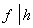
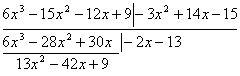

<b>§</b><b>5&nbsp; </b><b>多项式</b>

&nbsp;&nbsp;&nbsp; [整值多项式]&nbsp; 当变数<i>x</i>为整数时,一多项式<i>f</i>(<i>x</i>)的值常为整数，则这种多项式称为整值多项式。

&nbsp;&nbsp;&nbsp; 整系数多项式是整值多项式一特例。

&nbsp;&nbsp;&nbsp; 整值多项式表达式：

&nbsp;&nbsp;&nbsp; 1°&nbsp; 凡<i>n</i>次整值多项式必可表为

式中为整数，

&nbsp;&nbsp;&nbsp; 2°&nbsp; 整值奇多项式(满足<i>f</i>(－<i>x</i>)<i>=</i>－<i>f</i>(<i>x</i>))必可表为

式中为整数.

&nbsp;&nbsp;&nbsp; 3°&nbsp; 整值偶多项式(满足<i>f</i>(－<i>x</i>)<i>=f</i>(<i>x</i>)) 必可表为

式中为整数.

&nbsp;&nbsp;&nbsp; [可约多项式与不可约多项式]&nbsp;
设<i>f</i>(<i>x</i>)为一有理系数多项式,若有非常数的有理系数多项式<i>g</i>(<i>x</i>)和<i>h</i>(<i>x</i>),使得

<i>f</i>(<i>x</i>)<i>=g</i>(<i>x</i>)<i>h</i>(<i>x</i>)

则称<i>f</i>(<i>x</i>)为在有理数域上可约(或可化),否则称<i>f</i>(<i>x</i>)为有理数域上的不可约多项式(简称不可约多项式).

&nbsp;&nbsp;&nbsp; [高斯定理]&nbsp; 设<i>f</i>(<i>x</i>)为一整系数多项式,在有理数域上可约,则必有二整系数多项式<i>g</i>(<i>x</i>)和<i>h</i>(<i>x</i>),使得

<i>f</i>(<i>x</i>)<i>=g</i>(<i>x</i>)<i>h</i>(<i>x</i>)

&nbsp;&nbsp;&nbsp; [爱森斯坦判别法]

&nbsp;&nbsp;&nbsp; 1°&nbsp; 设为一整系数多项式.若有素数<i>p</i>,使得

但&nbsp; 

则<i>f</i>(<i>x</i>)为不可约多项式.

&nbsp;&nbsp;&nbsp; 2°&nbsp; 设为<i>2n+</i>1次整系数多项式,若有素数<i>p</i>,使得

&nbsp;&nbsp;&nbsp;&nbsp;&nbsp;&nbsp; 但&nbsp; &nbsp;&nbsp;&nbsp;&nbsp;&nbsp;&nbsp;&nbsp;&nbsp;&nbsp;&nbsp;&nbsp;&nbsp;&nbsp;&nbsp;&nbsp;&nbsp;&nbsp;&nbsp;&nbsp;&nbsp;&nbsp;&nbsp;&nbsp;&nbsp;&nbsp;&nbsp;&nbsp;&nbsp;&nbsp;&nbsp;&nbsp;&nbsp;&nbsp;&nbsp;&nbsp;&nbsp;&nbsp;&nbsp;&nbsp;&nbsp;&nbsp;&nbsp; 

则<i>f</i>(<i>x</i>)为不可约多项式.

&nbsp;&nbsp;&nbsp; [派朗判别法]

&nbsp;&nbsp;&nbsp; 1°&nbsp; 设

为一首项系数为1的<i>n</i>次整系数多项式,满足条件:

(i)&nbsp;&nbsp;&nbsp;&nbsp;&nbsp;&nbsp;&nbsp;&nbsp;&nbsp;&nbsp;&nbsp;&nbsp;&nbsp;&nbsp;&nbsp;&nbsp;&nbsp;&nbsp;&nbsp;&nbsp;&nbsp;&nbsp;&nbsp;&nbsp;&nbsp;&nbsp;&nbsp;&nbsp;&nbsp;&nbsp;&nbsp;&nbsp;&nbsp;&nbsp;&nbsp;&nbsp;&nbsp;&nbsp;&nbsp;&nbsp;&nbsp;
(i)&nbsp;&nbsp;&nbsp;&nbsp;&nbsp;&nbsp;&nbsp;&nbsp;&nbsp;&nbsp;&nbsp;&nbsp;&nbsp;&nbsp;&nbsp;&nbsp;&nbsp;

(ii)&nbsp;&nbsp;&nbsp;&nbsp;&nbsp;&nbsp;&nbsp;&nbsp;&nbsp;&nbsp;&nbsp;&nbsp;&nbsp;&nbsp;&nbsp;&nbsp;&nbsp;&nbsp;&nbsp;&nbsp;&nbsp;&nbsp;&nbsp;&nbsp;&nbsp;&nbsp;&nbsp;&nbsp;&nbsp;&nbsp;&nbsp;&nbsp;&nbsp;&nbsp;&nbsp;&nbsp;&nbsp;&nbsp;&nbsp;
(ii)&nbsp;&nbsp;&nbsp;&nbsp;&nbsp;&nbsp;&nbsp;&nbsp;&nbsp;&nbsp;&nbsp;&nbsp;&nbsp;&nbsp;&nbsp;

&nbsp;&nbsp;&nbsp;&nbsp;&nbsp; (iii) 实数)

则<i>f</i>(<i>x</i>)为不可约多项式.

&nbsp;&nbsp;&nbsp; 2°&nbsp; 设

<pre>&nbsp;&nbsp;&nbsp;&nbsp;&nbsp;&nbsp;&nbsp;&nbsp;&nbsp;&nbsp;&nbsp;&nbsp;&nbsp; </pre>

为一首项系数为1的<i>n</i>次整系数多项式,满足条件:

&nbsp; (i)&nbsp; 

&nbsp; (ii)&nbsp; 

则<i>f</i>(<i>x</i>)为不可约多项式.

&nbsp;&nbsp;&nbsp; 3°&nbsp; 设

为一首项系数为1的<i>n</i>次整系数多项式,满足条件:

<pre>&nbsp;&nbsp;&nbsp;&nbsp;&nbsp;&nbsp;&nbsp;&nbsp;&nbsp;&nbsp;&nbsp;&nbsp;&nbsp;&nbsp;&nbsp;&nbsp;&nbsp;&nbsp;&nbsp;&nbsp;&nbsp;&nbsp;&nbsp;&nbsp;&nbsp;&nbsp;&nbsp;&nbsp;&nbsp;&nbsp; </pre>

则<i>f</i>(<i>x</i>)为不可约多项式.

&nbsp;&nbsp;&nbsp; 4°&nbsp; 设

为一首项系数为1的<i>n</i>次整系数多项式,满足条件:

则<i>f</i>(<i>x</i>)为不可约多项式.

&nbsp;&nbsp;&nbsp; 5°&nbsp; 设

为一首项系数为1,常数项不为零的<i>n</i>次整系数多项式,满足条件:

则<i>f</i>(<i>x</i>)为不可约多项式.

&nbsp;&nbsp;&nbsp; [多项式的整除性]&nbsp;
设<i>f</i>(<i>x</i>)和<i>g</i>(<i>x</i>)为二有理系数多项式,<i>g</i>(<i>x</i>)不恒为零,若有一多项式<i>h</i>(<i>x</i>),使得

<i>f</i>(<i>x</i>)<i>=g</i>(<i>x</i>)<i>h</i>(<i>x</i>)

则称<i>g</i>(<i>x</i>)可整除<i>f</i>(<i>x</i>),记作

或 

这时<i>g</i>(<i>x</i>)称为<i>f</i>(<i>x</i>)的因式,<i>f</i>(<i>x</i>)称为<i>g</i>(<i>x</i>)的倍式.否则,<i>g</i>(<i>x</i>)不能整除<i>f</i>(<i>x</i>),记作.

&nbsp;&nbsp;&nbsp; 以下&para;°<i>f</i>表示多项式<i>f</i>(<i>x</i>)的次数.

&nbsp;&nbsp;&nbsp; 多项式的整除性具有下列性质:

&nbsp;&nbsp;&nbsp; 1°&nbsp; 

&nbsp;&nbsp;&nbsp; 2°&nbsp; 若且,则<i>f</i>与<i>g</i>仅相差一常数因子.

&nbsp;&nbsp;&nbsp; 3°&nbsp; 若,则

&nbsp;&nbsp;&nbsp; 4°&nbsp; 若,则&para;°<i>f</i>&para;°<i>g</i>

&nbsp;&nbsp;&nbsp;&nbsp;&nbsp;&nbsp;&nbsp; 若,而,则<i>f</i>称为<i>g</i>的真因式,显然&para;°<i>f&lt;</i>&para;°<i>g.</i>

&nbsp;&nbsp;&nbsp; 5°&nbsp; 若<i>p</i>(<i>x</i>)为一不可约多项式,且,则或.

&nbsp;&nbsp;&nbsp; 6°&nbsp; 若<i>p</i>(<i>x</i>)为一不可约多项式,且

<i>f</i>(<i>x</i>)<i>=</i>0,<i>p</i>(<i>x</i>)<i>=</i>0

有公共根,则必有.

&nbsp;&nbsp;&nbsp; [多项式的带余除法]&nbsp;
设<i>f</i>(<i>x</i>)<i>,g</i>(<i>x</i>)为任意多项式,<i>g</i>(<i>x</i>)不恒为零,则必有两个多项式<i>q</i>(<i>x</i>)和<i>r</i>(<i>x</i>)<i>,</i>使得

<i>f</i>(<i>x</i>)<i>=g</i>(<i>x</i>)<i>q</i>(<i>x</i>)<i>+r</i>(<i>x</i>)

式中<i>r</i>(<i>x</i>)<i>=</i>0或&para;°<i>r&lt;</i>&para;°<i>g.</i>这称为多项式的带余除法.

&nbsp;&nbsp;&nbsp; [多项式的辗转相除法]&nbsp;
多项式的辗转相除法与整数的辗转相除法的定义,公式完全类似,只须把本章§1(1)式中的文字符号看作多项式就行了.

&nbsp;&nbsp;&nbsp; 同样,多项式的唯一分解定理,最高公因式和最低公倍式,多项式互素等概念和公式与整数一节完全类似,只须把相应公式中的符号看作多项式就行了.

&nbsp;&nbsp;&nbsp; 例&nbsp;&nbsp; 求多项式

&nbsp;&nbsp;&nbsp;&nbsp;&nbsp;&nbsp;&nbsp;&nbsp;&nbsp;&nbsp;
&nbsp;&nbsp;与

的最高公因式.

&nbsp;&nbsp;&nbsp; 解&nbsp;&nbsp; 为了避免分数,先用2乘<i>f</i>(<i>x</i>),然后再用<i>g</i>(<i>x</i>)去除2<i>f</i>(<i>x</i>):

<pre>&nbsp;&nbsp;&nbsp;&nbsp;&nbsp;&nbsp;&nbsp;&nbsp;&nbsp;&nbsp;&nbsp;&nbsp;&nbsp;&nbsp;&nbsp;&nbsp;&nbsp;&nbsp;&nbsp;&nbsp;&nbsp;&nbsp;&nbsp;&nbsp;&nbsp;&nbsp;&nbsp; &nbsp;&nbsp;&nbsp;&nbsp;&nbsp;&nbsp;&nbsp;&nbsp;&nbsp;&nbsp;</pre>

&nbsp;&nbsp;&nbsp; 在计算过程中,用2乘第一个差,因而商式变了样,但余式只获得一个数因子2,这不关紧要.用3乘<i>g</i>(<i>x</i>),除以:

可取

所以所求的公因式为.

&nbsp;&nbsp;&nbsp; [同余式]

&nbsp;&nbsp;&nbsp; 1°&nbsp; 多项式模同余式&nbsp; 设<i>m</i>(<i>x</i>)为一多项式,若

则称<i>f</i>(<i>x</i>)与<i>g</i>(<i>x</i>)对模<i>m</i>(<i>x</i>)同余,记作

&nbsp;&nbsp;&nbsp; 2°&nbsp; 素数模同余式&nbsp; 设<i>p</i>为素数,<i>f</i>(<i>x</i>)与<i>g</i>(<i>x</i>)为整系数多项式,若各项对应系数都对模<i>p</i>同余,则称此二多项式对模<i>p</i>同余,记作

&nbsp;&nbsp;&nbsp; 3°&nbsp; 重模同余式&nbsp; 设<i>p</i>为素数,(<i>x</i>)为多项式,若<i>f</i>(<i>x</i>)－<i>g</i>(<i>x</i>)为(<i>x</i>)的倍式,mod <i>p,</i>则称<i>f</i>(<i>x</i>)与<i>g</i>(<i>x</i>)对重模<i>p,</i> (<i>x</i>)同余,记作

<i>f</i>(<i>x</i>)<i>g</i>(<i>x</i>)&nbsp; 

&nbsp;&nbsp;&nbsp; [费马定理的推广]&nbsp;
设<i>p</i>为素数,<i> </i>(<i>x</i>)为<i>n</i>次不可约多项式,mod <i>p,</i>则对任一非(<i>x</i>)的倍式的多项式<i>f</i>(<i>x</i>),mod <i>p,</i>恒有

1 

对任一多项式常有

&nbsp;<i>f</i>(<i>x</i>) 

特别

<i>x</i> 

