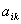
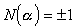
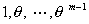

<b>§</b><b>6&nbsp; </b><b>代数数</b>

&nbsp;&nbsp;&nbsp;
[代数数]&nbsp; 若<i>q</i> 为一系数为有理数的代数方程

的根,则<i>q</i> 称为代数数.通分后,<i>q</i>满足一有理整<a href="#None" name="_ftnref1"
title="">*</a>系数的代数方程,因此代数数也可定义为“有理整系数的代数方程的根”.

&nbsp;&nbsp;&nbsp; 若<i>f</i>(<i>x</i>)为有理数域上不可约多项式,且,则<i>q</i> 称为<i>n</i>次代数数.显然,一次代数数为有理数.

&nbsp;&nbsp;&nbsp; 代数数具有下列性质:

&nbsp;&nbsp;&nbsp; 1°&nbsp; 两个代数数的和、差、积、商(除数非零)仍为代数数.

&nbsp;&nbsp;&nbsp; 2°&nbsp; 系数为代数数的代数方程的根仍为代数数.

&nbsp;&nbsp;&nbsp; [代数整数]&nbsp; 若<i>q</i> 为一首项系数为1,其他系数为有理整数的<i>n</i>次不可约代数方程的根,则<i>q</i> 称为<i>n</i>次代数整数.

&nbsp;&nbsp;&nbsp; 代数整数具有下列性质:

&nbsp;&nbsp;&nbsp; 1°&nbsp; 代数整数为有理数的(即一次代数整数)必为有理整数.

&nbsp;&nbsp;&nbsp; 2°&nbsp; 两个代数整数的和、差、积仍为代数整数.

&nbsp;&nbsp;&nbsp; 3°&nbsp; 首项系数为1,其他系数为代数整数的代数方程的根仍为代数整数.

&nbsp;&nbsp;&nbsp; 4°&nbsp; 若<i>q</i> 为代数数,即满足有理整系数方程

则 为代数整数.

&nbsp;&nbsp;&nbsp; 5°&nbsp; 若<i>q</i> 为<i>n</i>次代数整数,则<i>q</i> 的幂可表为

式中<i>i</i>为非负整数<i>,</i>都为有理整数.

&nbsp;&nbsp;&nbsp; 6°&nbsp; 若<i>q</i> 为<i>n</i>次代数数,则<i>q</i> 的幂满足等式

式中<i>i</i>为非负整数<i>,</i>为有理整数.

&nbsp;&nbsp;&nbsp; [单位数]&nbsp; 若<i>q</i> 与都为代数整数,则<i>q</i> 称为单位数.

&nbsp;&nbsp;&nbsp; 单位数具有下列性质:

&nbsp;&nbsp;&nbsp; 1°&nbsp; <i>q</i> 为单位数的充分必要条件是:<i>q</i> 为首项系数为1,常数项为的有理整系数代数方程的根.

&nbsp;&nbsp;&nbsp; 2°&nbsp; 首项系数和常数项都为单位数,其他系数为代数整数的代数方程的根为单位数.

&nbsp;&nbsp;&nbsp; [代数扩域]

&nbsp;&nbsp;&nbsp; 1°&nbsp; 单扩域&nbsp; 设<i>q</i> 为<i>n</i>次代数数,则形为

&nbsp;(系数为有理数)

的数的全体构成一个域.称为在有理数域<b>Q</b>上添加<i>q</i>所得的<i>n</i>次单扩域,记作<b>Q</b>(<i>q </i>).若,则<b>Q</b>(<i>q</i> )为由代数数<i>q</i> 经加、减、乘、除(除数非零)所生成的数的最大集合.

&nbsp;&nbsp;&nbsp; 2°&nbsp; 有限扩域&nbsp; 由有限多个代数数经加、减、乘、除(除数非零)所生成的域,称为<b>Q</b>上的有限扩域,记作

<b>K</b>=<b>Q</b>()

&nbsp;&nbsp;&nbsp; 有限扩域必为单扩域,即存在代数数<i>q </i>,使得

<b>Q</b>()=<b>Q</b>(<i>q</i> )

<i>q</i>的次数称为有限扩域<b>Q</b>()的次数.

&nbsp;&nbsp;&nbsp; [共轭数]&nbsp; 设<i>q</i> 为<i>n</i>次代数数,<i>q</i>满足有理数域上<i>n</i>次不可约多项式&nbsp;&nbsp;

记,又设为该多项式的另外<i>n</i>－1个根,则称为<i>q</i>的共轭根.

&nbsp;&nbsp;&nbsp; 任意代数数<i>a</i><i> </i><b>Q</b>(<i>q</i> ),则<i>a</i>可唯一地表为

<pre style='text-align:right' align=right>&nbsp;&nbsp;&nbsp;&nbsp;&nbsp;&nbsp;&nbsp;&nbsp; &nbsp;&nbsp;&nbsp;&nbsp;&nbsp;&nbsp;&nbsp;&nbsp;&nbsp;&nbsp;&nbsp;&nbsp;&nbsp;&nbsp;&nbsp;&nbsp;&nbsp;&nbsp;&nbsp;&nbsp;&nbsp; &nbsp;&nbsp;(1)</pre>

式中为有理数.记,则

&nbsp;&nbsp;&nbsp;&nbsp;&nbsp;&nbsp;&nbsp;&nbsp;&nbsp;&nbsp;

称为<i>a </i>的共轭数.

&nbsp;&nbsp;&nbsp; [代数数的迹与矩]&nbsp;
设<i>a </i><b>K</b>=<b>Q</b>(<i>q</i> ),记,设是<i>a</i> 的共轭数,则分别称

为代数数<i>a</i><i> </i>的迹与矩,式中如(1)式定义.

&nbsp;&nbsp;&nbsp; 注意,这里的迹与矩是对域<b>K</b>而言的,矩又称为范数.它们的另一个定义是：设<i>a </i>的极小多项式(以<i>a</i> 为根的最低次不可约多次式)为&nbsp;&nbsp;&nbsp;&nbsp;&nbsp;&nbsp;

&nbsp;&nbsp;&nbsp; 令,则

&nbsp;&nbsp;&nbsp; 迹与矩具有下列性质:

&nbsp;&nbsp;&nbsp; 1°&nbsp; 若<i>a</i> 为代数数,则<i>a</i>的迹与矩均为有理数.

&nbsp;&nbsp;&nbsp; 2° 若<i>a </i>为代数整数, 则<i>a </i>的迹与矩为有理整数.若<i>a</i> 为非零代数整数,则.

&nbsp;&nbsp;&nbsp; 3°&nbsp; 代数整数<i>a</i> 为单位数的充分必要条件是:.

&nbsp;&nbsp;&nbsp; 4°&nbsp; <i>&nbsp;&nbsp;&nbsp;&nbsp;&nbsp;&nbsp;&nbsp;&nbsp;&nbsp;&nbsp;&nbsp;&nbsp;&nbsp;&nbsp;&nbsp;&nbsp;&nbsp; &nbsp;&nbsp;S</i>(<i>a+</i><i>b</i> )<i>=S</i>(<i>a </i>)<i>+S</i>(<i>b</i> )

<i>&nbsp;&nbsp;&nbsp;&nbsp;&nbsp;&nbsp; &nbsp;&nbsp;&nbsp;&nbsp;&nbsp;&nbsp;&nbsp;&nbsp;&nbsp;&nbsp;&nbsp;&nbsp;&nbsp;&nbsp;&nbsp;&nbsp;&nbsp;&nbsp;&nbsp;&nbsp;&nbsp;&nbsp;&nbsp;&nbsp;&nbsp;&nbsp;&nbsp; &nbsp;&nbsp;N</i>(<i>a</i><i>b</i> ) <i>=N</i>(<i>a </i>)<i>N</i>(<i>b</i> )

&nbsp;&nbsp;&nbsp; [代数数域的基底与整底] 

&nbsp;&nbsp;&nbsp; 1°&nbsp; 基底&nbsp; 设<b>K</b>为<i>n</i>次代数扩域,为<b>K</b>中一组代数数,若<b>K</b>中任意代数数<i>g</i>都可唯一地表为

式中为有理数,则称为<b>K</b>的一组基底.显然在有理数域上线性无关.

&nbsp;&nbsp;&nbsp; 是域<b>K</b>的一组基底的充分必要条件是:

式中是的共轭数, <i>j=</i>.

&nbsp;&nbsp;&nbsp; 若<b>K=Q</b>(<i>q</i> ),则为<b>K</b>的一组基底.

&nbsp;&nbsp;&nbsp; 2°&nbsp; 整底&nbsp; 设<b>K</b>为<i>n</i>次代数扩域,为<b>K</b>中一组代数整数,若<b>K</b>中任意代数整数<i>g</i> 都可唯一地表为

式中为有理整数,则称为<b>K</b>的一组整底.

&nbsp;&nbsp;&nbsp; 若为一组使

为最小的代数整数,则这组为一组整底.

&nbsp;&nbsp;&nbsp; [二次域]&nbsp; 设<i>D</i>为一无平方因子的有理整数.则<b>Q</b>()为二次域.<b>Q</b>()中的任意代数数都可表为

式中<i>a</i>和<i>b</i>都为有理数.

&nbsp;&nbsp;&nbsp; 设<i>D</i>为一无平方因子的有理整数.

则1,<i>w </i>为二次域<b>Q</b>()的一组整底.

&nbsp;&nbsp;&nbsp; 一般<i>n</i>次域<b>Q</b>不一定能找到代数整数<i>w</i>,使

构成<b>Q</b>(<i>q </i>)的一组整底.

&nbsp;&nbsp;&nbsp; [高斯域]&nbsp; 设,则<b>Q</b>(<i>i</i>)称为高斯域,它是二次域.

&nbsp;&nbsp;&nbsp; 高斯域中的任意数可表为

式中<i>a,b</i>都为有理数.当<i>a,b</i>都为有理整数时,<i>a+bi</i>称为高斯整数.

&nbsp;&nbsp;&nbsp; 高斯域有四个单位数:,它们的矩都为1.

&nbsp;&nbsp;&nbsp; [分圆域]&nbsp; 设<i>m</i>为正整数,把多项式的所有根添加到<b>Q</b>上所构成的域<b><i>S</i></b>称为<b>Q</b>上的<i>m</i>次单位根的分圆域.

&nbsp;&nbsp;&nbsp; <b><i>S</i></b>中存在一个<i>m</i>次本原单位根<i>q</i> (<i>q</i> 是的根,但不是的根(<i>n&lt;m</i>),称<i>q</i>为<i>m</i>次本原单位根),使得<b><i>S</i>=Q</b>(<i>q</i> ),而构成<b><i>S</i></b>的一组整底.

&nbsp;&nbsp;&nbsp; 如果<i>q</i>是<i>m</i>次本原单位根,使也是<i>m</i>次本原单位根,共有(<i>m</i>)个,这里(<i>m</i>)为欧拉函数.

&nbsp;&nbsp;&nbsp; [分解定理]

&nbsp;&nbsp;&nbsp; 1°&nbsp; 整除性&nbsp; 若<i>a ,</i><i>b </i>为二代数整数,当仍为代数整数时,则称<i>b</i> 可整除<i>a </i>,记作.这时称<i>a</i> 是<i>b </i>的倍数,<i>b</i> 是<i>a </i>的因数.

&nbsp;&nbsp;&nbsp; 2°&nbsp; 结合性&nbsp; 若二代数整数<i>a ,</i><i>b </i>仅相差一单位数因子,则称<i>a </i>与<i>b</i> 是相结合的.

&nbsp;&nbsp;&nbsp; 显然有:&nbsp; (i)&nbsp; <i>a</i> 与<i>a</i> 相结合;
(ii)&nbsp; 若<i>a</i> 与<i>b</i> 相结合,则<i>b </i>与<i>a</i> 相结合;
(iii)&nbsp; 若<i>a</i> 与<i>b</i> 相结合,<i>b</i> 与<i>g</i> 相结合,则<i>a</i> 与<i>g</i> 相结合.

&nbsp;&nbsp;&nbsp; 3°&nbsp; 不可分解&nbsp; 若<b>K</b>中的代数整数<i>a </i>,有另外两个代数整数<i>b ,</i><i>g </i><b><i>K</i></b>,且都不是单位数,使

<i>a =</i><i>b</i><i>g</i>

则称<i>a</i> 在域<b>K</b>中可分解,否则称为不可分解.

&nbsp;&nbsp;&nbsp; 4°&nbsp; 分解定理&nbsp; 在<b>K</b>中的任意一代数整数可以分解为不可分解的代数整数的乘积.

&nbsp;&nbsp;&nbsp; 如果不计次序和结合性,这种分解是唯一的,则称为唯一分解.

&nbsp;&nbsp;&nbsp; 高斯域的唯一分解定理成立.

&nbsp;&nbsp;&nbsp; 二次域中唯一分解定理成立的,现已知道有

<b>Q</b>(),&nbsp; <i>D</i>=2,3,5,6,7,13,17,21,29等.

&nbsp;&nbsp; 不是所有的二次域唯一分解定理都成立,例如<b>Q</b>()唯一分解定理不成立:

 

 

<a href="#None" name="_ftn1" title="">*</a> 有理整数即通常意义下的整数,这里是为了与代数整数相区别.

