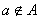
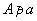
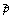

<b>第二十一章 集论与一般拓扑学</b>

集是近代数学最基本的概念.本章首先介绍集论的公理系统.不过这个系统近来已被证明是不完备的,所以对这里所采取的出发点做了必要的说明(见§1,一的最后).其次介绍集论本身的主要内容─序数与基数理论.

本章另一主要内容是一般拓扑学.这里重点介绍对数学分析特别重要的几种特殊拓扑空间和点集——尺度空间(附一致性结构)、紧致集、联结集，还结合前两者讨论了变换族的点点收敛拓扑、一致收敛拓扑、紧致——开拓扑.最后，介绍流形和微分流形的概念和几个基本的存在定理.代数拓扑的知识不在本章介绍之列（唯一例外是在§6里谈到“单联”的概念），此外，在介绍微分流形的时候没有牵涉到微分几何结构（如切空间）.

<b>§</b><b>1</b><b> </b><b>集</b><b>(</b><b>集合</b><b>)</b>

一、&nbsp; 一、&nbsp; 集的定义

&nbsp;&nbsp;&nbsp;
1.集的古典定义

[集与元素]&nbsp; 一些事物的全体叫做一个集,这些事物中的每一个,都称为这个集的(或这个集里的)元素.

如果某种事物只有一个,这个事物假定记做<i>a</i>,那末称这种事物的全体是集{<i>a</i>},<i>a</i>是{<i>a</i>}的唯一的元素.

如果某种事物不存在,就称这种事物的全体是空集.规定任何空集都只是同一个集,记作<i>φ</i>.任何事物都不是<i>φ</i>的元素.

每一个集都是一个事物.

[属于与包含]&nbsp; 假定<i>a</i>是集<i>A</i>的元素,记作

<i>a</i><i>A</i>或<i>Aa</i>

“”读作“属于”，“”读作“包含”.假定<i>a</i>不是<i>A</i>的元素，记作

或

“”读作“不属于”，“”读作“不包含”.

&nbsp;&nbsp;&nbsp;
[定义的注释]

1°&nbsp;&nbsp;&nbsp;&nbsp;&nbsp;&nbsp;
1°&nbsp; {<i>a</i>}和<i>a</i>一般是不同的概念,比如{<i>φ</i>}有一个唯一的元素<i>φ</i>,但是<i>φ</i>没有元素. 

2°&nbsp;&nbsp;&nbsp;&nbsp;&nbsp;&nbsp;
2°&nbsp; 和在逻辑上是彼此相否定(非)的,换句话说,假定<i>a</i>是一个事物,<i>A</i>是一个集,那末

<i>a</i><i>A</i>和<i>a</i><i>A</i>

不能都成立,也不能都不成立.

3°&nbsp;&nbsp;&nbsp;&nbsp;&nbsp;&nbsp;
3°&nbsp; 假定<i>A</i>和<i>B</i>都是集,如果任何一个事物属于<i>A</i>也一定属于<i>B</i>,属于<i>B</i>也一定属于<i>A</i>,那末<i>A</i>和<i>B</i>是同一个集,或称两个集<i>A</i>和<i>B</i>相等,记作<i>A</i>=<i>B</i>.

&nbsp;&nbsp;&nbsp;
[集的例子] 假定有一些事物,全部写出来是<i>a</i>,<i>b</i>,<i>c</i>,…,那末由定义,它们的全体是一个集,这个集可以记成{<i>a</i>,<i>b</i>,<i>c</i>,…}.元素符号的次序和重复都无关实质,比如{<i>a</i>,<i>b</i>}={<i>b</i>,<i>a</i>}={<i>a</i>,<i>b</i>,<i>a</i>}.

&nbsp;&nbsp;&nbsp;
由定义,<i> </i><i>φ</i>是一个集,而集是一个事物,所以下列的事物都是集:

&nbsp;&nbsp;&nbsp;&nbsp;&nbsp;&nbsp;&nbsp;&nbsp;&nbsp;&nbsp;&nbsp;&nbsp;&nbsp;&nbsp;&nbsp;&nbsp;&nbsp;
{<i>φ</i>},{{<i>φ</i>},<i>φ</i>},{{,{<i>φ</i>}},{<i>φ</i>}}

又例如,零和正整数可以定义如下:

<pre align=center>&nbsp;&nbsp;&nbsp;&nbsp;&nbsp;&nbsp;&nbsp;&nbsp;&nbsp;&nbsp;&nbsp;&nbsp;&nbsp;&nbsp;&nbsp;&nbsp;&nbsp;&nbsp;&nbsp;&nbsp;&nbsp;&nbsp;&nbsp;&nbsp;&nbsp;&nbsp;&nbsp; 0 =<i>φ</i></pre><pre align=center>&nbsp;&nbsp;&nbsp;&nbsp;&nbsp;&nbsp;&nbsp;&nbsp;&nbsp;&nbsp;&nbsp;&nbsp;&nbsp;&nbsp;&nbsp;&nbsp;&nbsp;&nbsp;&nbsp;&nbsp;&nbsp;&nbsp;&nbsp;&nbsp;&nbsp;&nbsp;&nbsp; 1 ={0} = {<i>φ</i>}</pre><pre align=center>&nbsp;&nbsp;&nbsp;&nbsp;&nbsp;&nbsp;&nbsp;&nbsp;&nbsp;&nbsp;&nbsp;&nbsp;&nbsp;&nbsp;&nbsp;&nbsp;&nbsp;&nbsp;&nbsp;&nbsp;&nbsp;&nbsp;&nbsp;&nbsp;&nbsp;&nbsp;&nbsp; 2 = {0,1}= {<i>φ</i>,{<i>φ</i>}}</pre><pre align=center>&nbsp;&nbsp;&nbsp;&nbsp;&nbsp;&nbsp;&nbsp;&nbsp;&nbsp;&nbsp;&nbsp;&nbsp;&nbsp;&nbsp;&nbsp;&nbsp;&nbsp;&nbsp;&nbsp;&nbsp;&nbsp;&nbsp;&nbsp;&nbsp;&nbsp;&nbsp;&nbsp; 3 = {0,1,2} = {<i>φ</i>,{<i>φ</i>},{<i>φ</i>,{<i>φ</i>}}}</pre><pre align=center>&nbsp;&nbsp;&nbsp;&nbsp;&nbsp;&nbsp;&nbsp;&nbsp;&nbsp;&nbsp;&nbsp;&nbsp;&nbsp;&nbsp;&nbsp;&nbsp;&nbsp;&nbsp;&nbsp;&nbsp;&nbsp;&nbsp;&nbsp;&nbsp;&nbsp;&nbsp;&nbsp; 4 = {0,1,2,3}</pre><pre align=center>&nbsp;&nbsp;&nbsp;&nbsp;&nbsp;&nbsp;&nbsp;&nbsp;&nbsp;&nbsp;&nbsp;&nbsp;&nbsp;&nbsp;&nbsp;&nbsp;&nbsp;&nbsp;&nbsp;&nbsp;&nbsp;&nbsp;&nbsp;&nbsp;&nbsp;&nbsp;&nbsp; ……………</pre>

&nbsp;&nbsp;&nbsp; [族]&nbsp; 族是集的同义词.在某些情况,比如一个集<i>A</i>的元素都是集的时候,为了避免混淆,也把<i>A</i>叫做一个族或者一个集族.

&nbsp;&nbsp;&nbsp;
虽然在近代集论模型中,任何一个集的元素都是集(因为不考虑非集的“事物”)，但是有时使用“族”这个称呼可以表达得更清楚.

&nbsp;&nbsp;&nbsp;
族有时也当作量词用.例如把属于一个集族的全部集说成“一族集”.

