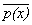
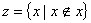
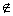
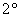

2. 罗素怪异

&nbsp;&nbsp;&nbsp;
上面已经用例子说明怎样用列举元素的办法来表示一个集.但是当一个集的全部元素无法列举的时候,这个集应该怎样表示呢?在集论发展的初期,流行的习惯是把一个集说成是“所有满足某条件的事物的全体”.如果把“某个事物<i>x</i>满足某条件”这句话表示成一个逻辑公式<i>p</i>(<i>x</i>),那末按照所说的这种习惯表示法,一个集可以记作{<i>x</i>|<i>p</i>(<i>x</i>)}或{<i>x</i>:<i>p</i>(<i>x</i>)}(所有使<i>p</i>(<i>x</i>)成立的<i>x</i>的全体).一般往往认为只要所说的条件是明确的,也就是对任何<i>x</i>,<i>p</i>(<i>x</i>)和<i></i>(非<i>p</i>(<i>x</i>),就是<i>p</i>(<i>x</i>)的否定)有一个且只有一个成立,那末这种表示法是没有问题的.可是实际上并不如此.下面举著名的罗素怪异当例子:

&nbsp;&nbsp;&nbsp;
设<i></i>.如果<i>z</i>是集,那末<i>z</i>也是事物,因此<i>z</i><i>z</i>和<i>z</i><i>z</i>不能都成立.假定<i>z</i><i>z</i>,那末<i>z</i>应该满足所说的条件<i>x</i><i>x</i>,因此<i>z</i><i>z</i>,自相矛盾.假定<i>z</i><i>z</i>,那末<i>z</i>已经满足所说的条件<i>x</i><i>x</i>,因此<i>z</i><i>z</i>,又自相矛盾.这就叫罗素怪异.

&nbsp;&nbsp;&nbsp;
根据定义的注释,<i>z</i>不是集.因此罗素怪异实际上是错误地假设“<i>z</i>是集”引起的.除了这个形式逻辑上的理由外，对罗素怪异还可做更深入的解释，但是有个根本的问题不好解决，既然{<i>x|x</i><i>x</i>}不是集，那末别的{<i>x|p</i>(<i>x</i>)}可以算作集吗?

&nbsp;&nbsp;&nbsp;
为了回答这个问题,集的概念必须进一步精密化,因此下面介绍公理系统.

