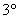

3.&nbsp; ZFC公理系统与BNG公理系统

&nbsp;&nbsp;&nbsp;
目前集论公理系统有两种形式,一种是策莫洛-弗兰克尔-柯很形式,简称ZFC;另一种是贝尔内斯-诺伊曼-葛德尔形式,简称BNG.这里采用ZFC公理系统.

&nbsp;&nbsp;&nbsp; ZFC包括九个公理(有三个显然包含在前面集的定义和定义的注释中),它们是

&nbsp;&nbsp;&nbsp; [外延公理] 即定义的注释.

&nbsp;&nbsp;&nbsp; [空集公理] 存在一个不包含任何元素的集.

&nbsp;&nbsp;&nbsp; [无序对公理] 对任何事物<i>x</i>和<i>y</i>,存在一个集{<i>x</i>,<i>y</i>},{<i>x</i>,<i>y</i>}的仅有的元素是<i>x</i>和<i>y</i>.

&nbsp;&nbsp;&nbsp; [正则公理] 任何一个不空的集<i>A</i>一定包含一个元素<i>a</i>,<i>A</i>的任何一个元素都不是<i>a</i>的元素.

&nbsp;&nbsp;&nbsp;
由正则公理可以知道,对任何集<i>a</i>来说,<i>a</i>和{<i>a</i>}是不同的.这是因为如果<i>a</i> ={<i>a</i>},那末{<i>a</i>}就不符合正则公理.

&nbsp;&nbsp;&nbsp; ZFC的其余五个公理是替换公理(本节,二),方幂集公理,和集公理(本节,三),无限公理(§2,三),选择公理(§2,四).它们分别在各有关节里详细说明.总的说来,这些公理用比较精密的形式规定了集有哪些.但这个公理系统不能证明自己不矛盾,同时它也没有把集论所必需的所有的集都规定在内(§2,六).因此这个系统未能成功地取代集的古典定义.后面将采用如下的出发点:(i)假设这五个公理所规定的集是符合前面集的古典定义和定义的注释的.(ii)除了元素可以全部列举的集以外,只考虑上述公理所规定的集.

