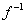

二、&nbsp; 二、&nbsp; 变换&shy;&shy;&shy;·集的一般表示法·标号集

&nbsp;&nbsp;&nbsp; [有序对] 假定<i>x</i>和<i>y</i>都是事物,那末

&lt;<i>x</i>,<i>y&gt;</i> = {{<i>x</i>,1},{<i>y</i>,2}}

称为由<i>x</i>和<i>y</i>结成的有序对,<i>x</i>和<i>y</i>分别称为&lt;<i>x</i>,<i>y</i>&gt;的第一坐标和第二坐标.

&nbsp;&nbsp;&nbsp;
有序对是针对无序对说的.可以看到&lt;<i>x',y'&gt;</i>=&lt;<i>x,y&gt;</i>的充分必要条件是:<i>x'</i>=<i>x</i>且<i>y'</i>=<i>y</i>,而无序对跟元素先后次序无关.

&nbsp;&nbsp;&nbsp; [替换公理] 假定<i>X</i>是一个集,如果对每个<i>x</i><i>X</i>作为第一坐标,都有一个且只有一个<i>y</i>与<i>x</i>结成有序对&lt;<i>x</i>,<i>y&gt;</i>,那末所有这种有序对的第二坐标<i>y</i>的全体是一个集<i>Y</i>.

&nbsp;&nbsp;&nbsp;
把每个&lt;<i>x</i>,<i>y&gt;</i>看作有序对&lt;<i>x</i>,&lt;<i>x</i>,<i>y&gt;&gt;</i>的第二坐标,再一次应用替换公理,就可看到所有这种有序对&lt;<i>x</i>,<i>y&gt;</i>的全体也是一个集.

&nbsp;&nbsp;&nbsp; [变换(映射)·象源(原象)·象] 假定<i>X</i>是一个集,如果对每个<i>x</i><i>X</i>作为第一坐标,都有一个且只有一个<i>y</i>和<i>x</i>结成有序对&lt;<i>x</i>,<i>y&gt;</i>,其第二坐标<i>y</i>的全体记作<i>Y</i>(是一个集),那末所有这种有序对<i>&lt;x,y&gt;</i>的全体是一个集<i>f</i>,这时称<i>f</i>为把<i>X</i>变到<i>Y</i>上的变换(映射),简称<i>f</i>是变上的(映上的),<i>X</i>称为在变换<i>f</i>下<i>Y</i>的象源(原象),<i>Y</i>称为在变换<i>f</i>下<i>X</i>的象,记作<i>Y</i>=<i>f</i>(<i>X</i>).

&nbsp;&nbsp;&nbsp;
一般,假定&lt;<i>x</i>,<i>y&gt;</i><i>f</i>,那末记作

<i>y</i> = <i>f</i>(<i>x</i>)

<i>x</i>称为在变换<i>f</i>下<i>y</i>的象源,<i>y</i>称为在变换<i>f</i>下<i>x</i>的象.

&nbsp;&nbsp;&nbsp; [一对一变换与逆变换] 由定义,一个变换的每个象源都只有一个象(单值性),但是一个象不一定只有一个象源.如果特别每个象也都只有一个象源,那末称<i>f</i>是一对一的变换.在一个一对一变换<i>f</i>下,可以得到一个把<i>Y</i>变上<i>X</i>的变换,称为<i>f</i>的逆变换.如果<i>f</i>(<i>x</i>) = <i>y</i>,那末(<i>y</i>) = <i>x</i>.

&nbsp;&nbsp;&nbsp; [集的一般表示法与标号集] 假定有一个一对一的变换把一个集<i>H</i>变上<i>X</i>,那末<i>X</i>是一个集,如果把每个象源<i>h</i>(<i>H</i>)的象记作<i>xh</i>(<i>X</i>),把<i>X</i>记作

<i>X</i> ={<i> xh </i>|<i>h</i><i>H</i>}&nbsp;&nbsp;&nbsp;&nbsp;&nbsp;&nbsp;&nbsp;&nbsp;&nbsp;&nbsp;&nbsp;&nbsp;&nbsp;&nbsp;&nbsp;&nbsp;&nbsp;&nbsp;&nbsp;&nbsp;&nbsp;&nbsp;&nbsp;&nbsp;&nbsp;&nbsp;&nbsp;&nbsp;&nbsp;&nbsp;&nbsp;
(1)

那末<i>H</i>称为<i>X</i>的标号集,每个<i>h</i>称为<i>xh
</i>的标号.

&nbsp;&nbsp;&nbsp;
反过来,一个集总有标号集的.因为至少它自己就可以看作自己的标号集.因此(1)式这种表示法是普遍适用的.以后应用这种记号的时候不一定再说明<i>H</i>是标号集,只要规定这种记号里写在<i>H</i>位置上的必定是标号集.

