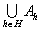

三、&nbsp;&nbsp;&nbsp;&nbsp;&nbsp;&nbsp;&nbsp;
三、&nbsp; 公理系统规定的集

&nbsp;&nbsp;&nbsp; [子集] 假定<i>A</i>和<i>B</i>都是集,<i>B</i>的每个元素都是<i>A</i>的元素,那末称<i>B</i>为<i>A</i>的一个子集,记作<i>B</i><i>A</i>或<i>AB</i>.“”读作“包含于”或“被掩于”，“”读作“包含”或“掩盖”.

&nbsp;&nbsp;&nbsp;
对于任何的集<i>A</i>,<i>B</i>和<i>C</i>有

1°&nbsp;&nbsp;&nbsp;&nbsp;&nbsp;&nbsp;
1°&nbsp; <i>A</i><i>A</i>&nbsp;&nbsp;&nbsp;&nbsp;&nbsp;&nbsp;&nbsp;&nbsp;&nbsp;&nbsp;&nbsp;&nbsp;&nbsp;&nbsp;&nbsp;&nbsp;&nbsp;&nbsp;&nbsp;&nbsp;&nbsp;&nbsp;&nbsp;
(自反律)

2°&nbsp;&nbsp;&nbsp;&nbsp;&nbsp;&nbsp;
2°&nbsp; 从<i>A</i><i>B</i>,<i>B</i><i>A</i>,可推出<i>A=B</i>&nbsp;&nbsp;
(反对称律)

3°&nbsp;&nbsp;&nbsp;&nbsp;&nbsp;&nbsp;
3°&nbsp; 若<i>A</i><i>B</i>,<i>B</i><i>C</i>,则<i>A</i><i>C</i>&nbsp;&nbsp;&nbsp;&nbsp;&nbsp;&nbsp;&nbsp;
(传递律)

&nbsp;&nbsp;&nbsp;
假定<i>B</i><i>A</i>但是<i>BA</i>(<i>B</i>=<i>A</i>不成立),那末称<i>B</i>为<i>A</i>的一个真子集,记作(<i>BA</i>).

&nbsp;&nbsp;&nbsp;
规定空集是任何集的子集.

&nbsp;&nbsp;&nbsp; [变进的变换] 假定一个变换<i>f</i>把一个集<i>X</i>变上集<i>Y</i>的一个子集,那末称<i>f</i>为把<i>X</i>变进<i>Y</i>的变换,简称<i>f</i>是变进的(映入的).变上是变进的特殊情况.

&nbsp;&nbsp;&nbsp; [划分公理与特征函数] 假定有一个变换<i>f</i>把一个集<i>X</i>变进{0,1},那末1的所有象源的全体是<i>X</i>的一个子集<i>X'</i>,<i>f</i>称为<i>X'</i>的特征函数.

&nbsp;&nbsp;&nbsp;
划分公理是替换公理的结论,因为如果1的象源全体是<i>φ</i>,那末<i>φ</i>当然是<i>X</i>的子集,否则1至少有一个象源<i>x0</i><i>X</i>,造一个变换

&nbsp;

<pre>&nbsp;&nbsp;&nbsp;&nbsp;&nbsp;&nbsp;&nbsp;&nbsp;&nbsp;&nbsp;&nbsp;&nbsp;&nbsp;&nbsp;&nbsp;&nbsp;&nbsp;&nbsp;&nbsp;&nbsp;&nbsp;&nbsp;&nbsp;&nbsp;&nbsp;&nbsp; </pre>

那末<i>g</i>(<i>X</i>)=<i>X'</i>,所以<i>X</i>是集.

&nbsp;&nbsp;&nbsp;
推论&nbsp; 假定<i>X</i>是集,对每个<i>x</i><i>X</i>,论点<i>p</i>(<i>x</i>)和<i>&shy;</i>(<i>p</i>(<i>x</i>)的否定)一定有一个且只有一个成立,那末{<i>x</i>|<i>x</i><i>X</i>且<i>p</i>(<i>x</i>)}是一个集.

&nbsp;&nbsp;&nbsp; [差集与余集] 假定<i>A</i>和<i>B</i>都是集,那末所有属于<i>A</i>但不属于<i>B</i>的元素的全体是一个集(由划分公理的推论),称为<i>A</i>和<i>B</i>的差集记作<i>A</i>\<i>B</i>.

&nbsp;&nbsp;&nbsp;
特别,当<i>B</i><i>A</i>的时候,<i>A</i>\<i>B</i>称为<i>B</i>在<i>A</i>中的余集.

&nbsp;&nbsp;&nbsp; [方幂集公理] 一个集<i>A</i>的所有子集的全体是一个集,记作,称为<i>A</i>方幂集.

&nbsp;&nbsp;&nbsp;
可以把一对一地变上“所有把<i>A</i>变进2 = {0，1}的变换的全体”去，所以后者也是一个集，这个集和<i>A</i>方幂集可以互相作为彼此的标号集.今后,往往把它们看作同一个集,也就是把<i>A</i>的一个子集跟它的一个特征函数混同起来.

&nbsp;&nbsp;&nbsp; [和集(并)与和集公理] 假定{<i>Ah</i>|<i>h</i><i>H</i>}是一个集族,那末{<i>x</i>|存在一个<i>Ahx</i>}是一个集,它称为这族集的和集(并),记作.

&nbsp;&nbsp;&nbsp;
当一个集族的全部集是<i>A</i>,<i>B</i>,<i>C</i>,…时,这族集的和集可写成

<i>&nbsp;&nbsp;&nbsp;&nbsp;&nbsp;&nbsp;&nbsp;&nbsp;&nbsp;&nbsp;&nbsp;&nbsp;&nbsp;&nbsp;&nbsp;&nbsp;&nbsp;&nbsp;&nbsp;&nbsp;&nbsp;&nbsp;&nbsp;&nbsp;&nbsp;&nbsp;&nbsp;&nbsp;
A</i>∪<i>B</i>∪<i>C</i>∪ …

&nbsp;&nbsp;&nbsp;
例&nbsp;&nbsp;&nbsp;&nbsp; {1,2,3}∪{0,2,4}∪{2,1}={0,1,2,3,4}

&nbsp;&nbsp;&nbsp; [通集(交)] 假定{<i>Ah</i>|<i>h</i><i>H</i>}是一个集族,那末{<i>x</i>|所有的<i>Ahx</i>}是一个集,它称为这族集的通集(交),记作.通集存在是划分公理的结论.

&nbsp;&nbsp;&nbsp;
当一个集族的全部集是<i>A</i>,<i>B</i>,<i>C</i>,…时,这族集的通集可写成

&nbsp;&nbsp;&nbsp;&nbsp;&nbsp;&nbsp;&nbsp;&nbsp;&nbsp;&nbsp;&nbsp;&nbsp;&nbsp;&nbsp;&nbsp;&nbsp;&nbsp;&nbsp;&nbsp;&nbsp;&nbsp;&nbsp;&nbsp;&nbsp;
<i>A</i>∩<i>B</i>∩<i>C</i>∩…

&nbsp;&nbsp;&nbsp;
例<b> </b>&nbsp;&nbsp;&nbsp;&nbsp;{1,2,3}∩{0,2,4}∩{2,1}={2}

&nbsp;&nbsp;&nbsp; [直接积(笛卡儿积)] 假定<i>A</i>={<i>xh</i>|<i>h</i><i>H</i>},<i>B</i>={<i>yk</i>|<i>k</i><i>K</i>},那末

&nbsp;&nbsp;&nbsp;&nbsp;&nbsp;&nbsp;&nbsp;&nbsp;&nbsp;&nbsp;&nbsp;&nbsp;&nbsp;&nbsp;&nbsp;&nbsp;&nbsp;&nbsp;&nbsp;&nbsp;
{&lt;<i>xh</i>,<i>yk&gt;</i>|<i>xh</i><i>A</i>且<i>yk</i><i>B</i>}

是一个集,它称为<i>A</i>和<i>B</i>的直接积,记作<i>AB</i>.

&nbsp;&nbsp;&nbsp;
直接积存在是替换公理与和集公理的结论.因为对任何<i>h</i><i>H</i>与<i>k</i><i>K</i>,{&lt;<i>xh</i>,<i>yk&gt;</i>}是一个集,由替换公理,{{&lt;<i>xh</i>,<i>yk&gt;</i>}|<i>h</i><i>H</i>}是一个集族,因此存在和集.{<i>Ck</i>|<i>k</i><i>K</i>}又是一个集族,所以又存在和集,这就是<i>AB</i>.

&nbsp;&nbsp;&nbsp;
假定{<i>Ah</i>|<i>hH </i>}是一个集族,其中每个<i>Ah</i> &sup1;<i>φ</i>那末由选择公理(§2,一)对每个<i>h</i><i>H</i>可以得到一个<i>xh</i><i>Ah</i>,并且由替换公理得到一个集

&lt;<i>xh</i>|<i>h</i><i>H&gt;=</i>{{<i> xh
,h</i>}|<i>h</i><i>H</i>}

称为由一个选择变换(§2,四)得到的有序组.

&nbsp;&nbsp;&nbsp;
把每个<i>xh</i><i>Ah </i>换为一个<i>x'h</i><i> Ah </i>,那末由替换公理得到另一个集

&lt;<i>x'h</i>|<i>h</i><i>H&gt;=</i>{{<i> x'h
,h</i>}|<i>h</i><i>H</i>}

这同样可以看作由一个选择变换得到的有序组.

&nbsp;&nbsp;&nbsp;
所有这种有序组的全体是一个集，它称为一族集<i>Ah</i>(<i>h</i><i>H</i>)的直接积,记作<i>.</i>

<i>&nbsp;&nbsp;&nbsp; H</i>=2时,就是<i>AB.</i>

&nbsp;&nbsp;&nbsp; [叠集] 假定<i>A</i>和<i>B</i>都是集,那末由变换的定义,每个把<i>A</i>变进<i>B</i>的变换<i>f</i>都是<i>AB</i>的子集,因此<i>f</i><i></i>.由划分公理,所有把<i>A</i>变进<i>B</i>的变换<i>f</i>的全体{<i>f</i>|<i>f</i><i></i>且<i>f</i>把<i>A</i>变进<i>B</i>}是一个集,称为把<i>A</i>叠在<i>B</i>上的叠集,记作<i>AB</i>.

&nbsp;&nbsp;&nbsp;
显然,<i> AB</i><i></i>.另一方面,特别当<i>B</i>=2={0,1}时,<i>A</i>2既是方幂集又是叠集.

&nbsp;&nbsp;&nbsp; [集的运算规律] 设<i>A</i>,<i>B</i>,<i>C</i>都是集,则

&nbsp;&nbsp;&nbsp;
交换律&nbsp;&nbsp;&nbsp;&nbsp;&nbsp;&nbsp;&nbsp;
<i>A</i>∪<i>B</i>=<i>B</i>∪<i>A</i>,<i>A</i>∩<i>B</i>=<i>B</i>∩<i>A</i>

&nbsp;&nbsp;&nbsp;
结合律&nbsp;&nbsp;&nbsp;&nbsp;&nbsp;&nbsp;&nbsp;
<i>A</i>∪(<i>B</i>∪<i>C</i>)=(<i>Α</i>∪<i>B</i>)∪<i>C</i>

<i>A</i>∩(<i>Β</i>∩<i>C</i>)=(<i>Α</i>∩<i>B</i>)∩<i>C</i>

&nbsp;&nbsp;&nbsp;
分配律&nbsp;&nbsp;&nbsp;&nbsp;&nbsp;&nbsp;&nbsp;
<i>A</i>∩(<i>B</i>∪<i>C</i>)=(<i>A</i>∩<i>B</i>)∪(<i>A</i>∩<i>C</i>)

<i>A</i>∪(<i>B</i>∩<i>C</i>)=(<i>A</i>∪<i>B</i>)∩(<i>A</i>∪<i>C</i>)

&nbsp;&nbsp;&nbsp;
德×摩根(De Morgan)律

<i>&nbsp;&nbsp;&nbsp;&nbsp;&nbsp;&nbsp;&nbsp;&nbsp;&nbsp;&nbsp;&nbsp;&nbsp;&nbsp;
C</i>\(<i>A</i>∪<i>B</i>)=(<i>C</i>\<i>A</i>)∩(<i>C</i>\<i>B</i>)

<i>&nbsp;&nbsp;&nbsp;&nbsp;&nbsp;&nbsp;&nbsp;&nbsp;&nbsp;&nbsp;&nbsp;&nbsp;&nbsp;
C</i>\(<i>A</i>∩<i>B</i>)=(<i>C</i>\<i>A</i>)∪(<i>C</i>\<i>B</i>)

