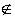

<b>§2&nbsp; </b><b>序数与基数</b>

&nbsp;&nbsp;&nbsp;
集论除了为数学各分支提供共同的形式基础以外,它本身的主要成果是序数和基数的理论.序数和基数都是正整数的推广.在§1里介绍了与集有关的基本概念,但是没有接触到有限、无限、正整数的一般定义等等，这些都将在本节作严密的说明.

一、&nbsp; 一、&nbsp; 排队（良序）集

&nbsp;&nbsp;&nbsp; [关系]&nbsp; 假定<i>A</i>是一个集，<i>G</i><i>AA</i>，那末<i>G</i>称为<i>A</i>里的一个关系.如果&lt;<i>x</i>，<i>y&gt;</i><i>G</i>，那末称<i>x</i>与<i>y</i>有<i>G</i>这种关系.

&nbsp;&nbsp;&nbsp; [大小关系与分行(偏序)集]&nbsp; 假定<i>G</i>是集<i>A</i>里的一个关系，由&lt;<i>x</i>，<i>y&gt;</i><i>G</i>和&lt;<i>y,z&gt;</i><i>G</i>，必有&lt;<i>x</i>，<i>z&gt;</i><i>G</i>，并且对任何<i>x</i><i>A,&lt;x,x&gt;G</i>,那末称<i>G</i>为<i>A</i>里的一个大小关系.假定<i>&lt;x,y&gt;</i><i>G</i>，记作<i>x</i>&lt;<i>y</i>.如果<i>A</i>里有一个大小关系,那末称<i>A</i>为一个分行(偏序)集.

&nbsp;&nbsp;&nbsp; [次序与单行集]&nbsp; 假定集<i>A</i>里有一个大小关系(&lt;)满足条件:

&nbsp;&nbsp;&nbsp; (i) 对任何<i>x</i><i>A</i>和<i>y</i><i>A</i>,下列各式

<i>&nbsp;&nbsp;&nbsp;&nbsp;&nbsp;&nbsp;&nbsp;&nbsp;&nbsp;&nbsp;&nbsp;&nbsp;&nbsp;&nbsp;&nbsp;&nbsp;&nbsp;&nbsp;&nbsp;&nbsp;&nbsp;&nbsp;&nbsp;&nbsp;
x</i>&lt;<i>y</i>,<i>x</i>=<i>y</i>,<i>y</i>&lt;<i>x</i>

一定有一个且只有一个成立，这里<i>x=y</i>表示<i>x</i>和<i>y</i>相同.

&nbsp;&nbsp;&nbsp; (ii) 对任何<i>x</i><i>A</i>,<i>y</i><i>A</i>和<i>z</i><i>A</i>,如果<i>x</i>&lt;<i>y</i>和<i>y</i>&lt;<i>z</i>都成立,那末<i>x</i>&lt;<i>z</i>成立.

&nbsp;&nbsp;&nbsp;
那末称这关系是<i>A</i>里的一个次序,称<i>A</i>依这次序是单行集.

&nbsp;&nbsp;&nbsp; [排队集]&nbsp; 假定按照集<i>A</i>里的一个次序,<i>A</i>的任何一个非空子集都有最小的元素,那末称<i>A</i>按照这个次序排队,称<i>A</i>为排队(良序)集.如果<i>A</i>按照某个次序排队,那末<i>A</i>的任何一个子集也都按照这个次序排队.

&nbsp;&nbsp;&nbsp; [小头]&nbsp; 假定<i>B</i>是排队集<i>A</i>的一个子集,<i>B</i>的任何一个元素都比<i>A</i>\<i>B</i>的任何一个元素小,那末称<i>B</i>是<i>A</i>的一个小头(注意,<i>A</i>自己也是<i>A</i>的一个小头,因为<i>A</i>\<i>A</i>=<i>φ</i>,上面的假设自然成立).如果<i>A</i>\<i>B</i>&sup1;,那末称<i>B</i>为<i>A</i>的真小头.

&nbsp;&nbsp;&nbsp; [保持次序的变换]&nbsp; 假定一个变换把一个单行集(不一定是排队集)<i>A</i>一对一地变进一个单行集<i>B</i>,并且象源小的象也小,那末称这变换保持次序.可以证明,假定<i>A</i>和<i>B</i>都是不空的排队集,那末其中一定有一个集可以保持次序地变上另一个集的一个小头,并且这种变换是唯一的.

