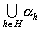
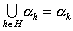

二、&nbsp;&nbsp;&nbsp;&nbsp;&nbsp;&nbsp;&nbsp;
二、&nbsp;&nbsp;&nbsp; 序数

&nbsp;&nbsp;&nbsp; [序数]&nbsp; 如果集<i>α</i>满足条件:

&nbsp;&nbsp;&nbsp;&nbsp;&nbsp;&nbsp;&nbsp;&nbsp;&nbsp;&nbsp;&nbsp;
&nbsp;(i) <i>α</i>的每个元素都是集;

&nbsp;&nbsp;&nbsp;
(ii) 如果<i>x</i><i></i><i>α</i>,<i>y</i><i>x</i>,那末<i>y</i><i></i><i>α</i>;

&nbsp;&nbsp;&nbsp;&nbsp;&nbsp;&nbsp;&nbsp;&nbsp;&nbsp;&nbsp;&nbsp;
<i>&nbsp;</i>(iii)<i>α</i>可以用当作次序(就是把<i>x</i>&lt;<i>y</i>理解为<i>x</i><i>y</i>)排队.

&nbsp;&nbsp;&nbsp;
那末称集<i>α</i>为序数.

&nbsp;&nbsp;&nbsp;
序数是存在的,§1,一,集的例子中所述的0和1,2,3,4等正整数就都是序数,例如2={<i>φ</i>,{<i>φ</i>}}显然具备(i),(ii),(iii)这三个条件.

&nbsp;&nbsp;&nbsp; [后继序数]&nbsp; 假定<i>α</i>为序数,那末比<i>α</i>大的最小的序数称为<i>α</i>的后继序数.

&nbsp;&nbsp;&nbsp; [极限序数] &nbsp;假定<i>α</i>为序数,如果<i>α</i>没有最大的元素,那末比<i>α</i>的所有元素都大的最小的序数称为极限序数.

&nbsp;&nbsp;&nbsp; [序数的性质]

1°&nbsp;&nbsp;&nbsp;&nbsp;&nbsp;&nbsp;
1°&nbsp; 对任何序数<i>α</i>和<i>β</i>,式子

<i>&nbsp;&nbsp;&nbsp;&nbsp;&nbsp;&nbsp;&nbsp;&nbsp;&nbsp;&nbsp;&nbsp;&nbsp;&nbsp;&nbsp;&nbsp;&nbsp;&nbsp;&nbsp;&nbsp;&nbsp;&nbsp;&nbsp;&nbsp;
</i><i>α</i><i>β</i>,<i>α</i>=<i>β</i>,<i>β</i><i>α</i>

一定有一个且只有一个成立.

2°&nbsp;&nbsp;&nbsp;&nbsp;&nbsp;&nbsp;
2°&nbsp; 若<i>α</i>,<i>β</i>,<i>γ</i>都是序数,并且<i>α</i><i>β</i><i>,</i><i>β</i><i></i><i>γ</i>,则<i>α</i><i>γ</i>.

3°&nbsp;&nbsp;&nbsp;&nbsp;&nbsp;&nbsp;
3°&nbsp; 若<i>α</i>和<i>β</i>都是序数,并且<i>α</i><i>β</i>,则<i>α</i>等于<i>β</i>的一个小头.

&nbsp;&nbsp;&nbsp;
上述性质说明如果把看作&lt;,任何序数<i>α</i>和<i>β</i>可以比较大小,而且小的序数既是大的序数的一个元素，又是大的序数的一个小头.

4°&nbsp;&nbsp;&nbsp;&nbsp;&nbsp;&nbsp;
4°&nbsp; <i>φ</i>是最小的序数.

5°&nbsp;&nbsp;&nbsp;&nbsp;&nbsp;&nbsp;
5° 任何一个序数<i>α</i>都有唯一的后继序数，如果把这个后继序数记作<i>α</i>+1，那末

<i>α</i>+1=<i>α</i>∪{<i>α</i>}

6°&nbsp;&nbsp;&nbsp;&nbsp;&nbsp;&nbsp;
6° 一个序数<i>α</i>是所有比<i>α</i>小的序数的全体.如果<i>α</i>有最大的元素<i>γ</i>，那末<i>α </i>就是<i>γ</i>的后继序数，不妨把<i>γ</i>记作<i>α</i>&shy;&shy;-1.如果<i>α</i>没有最大的元素，那末<i>α</i>不是任何序数的后继，这时<i>α</i>为极限序数.

7°&nbsp;&nbsp;&nbsp;&nbsp;&nbsp;&nbsp;
7° 对任何一个序数集{<i>α</i><i>h</i>|<i>h</i><i>H</i>}，存在比所有<i>α</i><i>h</i>都大的序数，当这个序数集没有最大的元素时，<i>α</i>=就是比所有<i>αh</i>都大的最小的序数，<i>α</i>是一个极限序数；当这个序数集有最大的元素<i>α</i><i>k</i>时，，而比所有<i>αh</i>都大的最小序数是<i>α</i>=<i>α</i><i>k </i>∪{<i>α</i><i>k</i> }=()∪{<i>α</i><i>k</i>}.

&nbsp;&nbsp;&nbsp; [布拉里-弗蒂怪异] 假定“所有序数的全体”是一个集，那末由性质7°，存在一个序数比这个集里所有序数都大，也就是有一个序数比所有序数都大，这个自相矛盾的结论就叫布拉里-弗蒂怪异.这是集论史上罗素怪异以外又一个著名的怪异.

&nbsp;&nbsp;&nbsp;
从公理化集论来看，这无非说明“所有序数的全体”不是集.因此要避免牵涉到这个概念，至多只说“小于某个序数<i>α</i>的所有序数的全体”.

