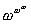
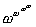
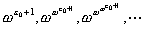
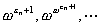
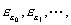
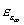
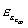
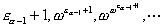
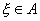
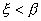

三、&nbsp;&nbsp;&nbsp;&nbsp;&nbsp;&nbsp;&nbsp;
三、&nbsp;&nbsp;&nbsp; 正整数×超限序数×超限归纳法

&nbsp;&nbsp;&nbsp; [正整数]&nbsp; 假定<i>n</i>是一个后继序数，比<i>n</i>小的所有序数是零（<i>φ</i>）或后继序数，那末说<i>n</i>是一个正整数.

&nbsp;&nbsp;&nbsp; [有限序数与超限序数]&nbsp; 零或正整数称为有限序数.一个序数如果不是有限的，那末这种序数称为超限序数.

<i>φ</i>当作序数时，记作0.

&nbsp;&nbsp;&nbsp; [无限公理]&nbsp; 至少存在一个集<i>A</i>有下面的性质:(i)<i>φ</i><i>A</i>;(ii)<i>x</i><i>A</i>必有<i>x</i>∪{<i>x</i>}<i>A</i>.

定理 所有有限序数的全体是一个集<i>ω</i>,<i>ω</i>是最小的超限序数.所有正整数全体也是一个集.

事实上,每个有限序数必定属于无限公理所说的那种集<i>A</i>.所以由划分公理得到定理的结论.

&nbsp;&nbsp;&nbsp;
由这个定理知道,无限公理可以用下面的论点代替:“所有正整数全体是一个集”或者“所有有限序数的全体是一个集.”

&nbsp;&nbsp; &nbsp;[超限序数的例子]

<i>&nbsp;&nbsp;&nbsp;&nbsp;&nbsp;&nbsp;&nbsp;&nbsp;&nbsp;&nbsp;&nbsp;&nbsp;&nbsp;&nbsp;&nbsp;&nbsp;&nbsp;&nbsp;&nbsp;&nbsp;&nbsp;
</i><i>ω</i><i>,</i><i>ω</i>+1,<i>ω</i>+2,<i>ω</i>+3,×××

所有这些序数的全体显然是一个用<i>ω</i>当作标号集的集{<i>xn</i>|<i>n</i><i></i><i>ω</i>}，这里<i>xn=</i><i>ω</i>+<i>n</i>，<i>ω</i>是所有有限序数的全体.因此存在一个比它们都大的最小的序数，这是一个极限序数，记作<i>ω</i>2.同样由序数集{<i>ω</i>2+<i>n</i>|<i>n</i><i></i><i>ω</i>}得到一个比所有<i>ω</i>2+<i>n</i>都大的极限序数<i>ω</i>3.于是得到下列序数：

0,<i>ω</i>,<i>ω</i>2,<i>ω</i>3,×××

比<i>ω</i><i>n</i>这些序数都大的最小序数记作<i>ω</i>2=<i>ωω</i><i>.</i>同样还得到<i>ω</i>n.比所有<i>ω</i>n（<i>n</i><i></i><i>ω</i>）都大的最小序数记作<i>ωω</i>.

&nbsp;&nbsp;&nbsp;
同样道理，由<i>ω</i>,<i>ωω</i><i>,,,</i><i>×××</i><i> </i>得到一个比它们都大的最小的序数，记作<i>e</i>0.

&nbsp;&nbsp;&nbsp;
还可以把比

<i>e</i> 0<i>,</i><i>e</i> 0+1,

这些序数都大的最小的序数记作<i>e</i>1.对任何正整数<i>n</i>+1，用<i>en</i>+1表示比<i>en</i>+1,都大的最小的序数.然后又把比<i>e</i> 0,<i>e</i> 1,<i>e</i> 2,···都大的最小的序数记作<i>e</i><i>ω</i>.

&nbsp;&nbsp;&nbsp;
用类似办法还可得到因此得到序数.当然还可得到等等序数，不再多说.

&nbsp;&nbsp;&nbsp;
上面是专门利用那些用<i>ω</i>当作标号集的序数族得到新的序数.其实，还可利用那些用任何序数<i>α</i>当作标号集的序数集来得到新的序数；当<i>α</i>是极限序数的时候，从序数族{<i>e</i><i>β</i>|<i>β</i>&lt;<i>α</i>}可以得到一个比所有<i>e</i><i>β</i>(<i>β</i>&lt;<i>α</i>)都大的最小的序数，这序数就可记作<i>e</i><i>α</i>；当<i>α</i>是后继序数的时候，把<i>e</i><i>α</i>定义为比下列这个用<i>ω</i>当标号集的序数族

&nbsp;&nbsp;&nbsp;&nbsp;&nbsp;&nbsp;&nbsp;&nbsp;&nbsp;&nbsp;&nbsp;&nbsp;&nbsp;&nbsp;&nbsp;&nbsp;&nbsp;&nbsp;&nbsp;&nbsp;&nbsp;&nbsp;&nbsp;&nbsp;
{}

的每个序数都大的最小的序数.

&nbsp;&nbsp;&nbsp; [数学归纳法] 假定<i>ω</i>是所有有限序数的全体，<i>A</i><i></i><i>ω</i>.如果<i>φ</i><i>A</i>并且由<i>n</i><i>A</i>可以推出<i>n</i>+1<i>A</i>，那末<i>A</i>=<i>ω</i>.

&nbsp;&nbsp;&nbsp;
在实用上，<i>A</i>是当作使某个论点成立的所有有限序数的全体的.如果<i>A</i>满足上述数学归纳法的假设的话，那末<i>A</i>就是所有有限序数全体,所以，所有有限序数都使那个论点成立.

&nbsp;&nbsp;&nbsp;
数学归纳法只针对特殊的序数<i>ω</i>.实际上对一般序数（特别是超限序数）<i>α</i>，类似的结论也是成立的，这就是超限归纳法.

&nbsp;&nbsp;&nbsp; [超限归纳法] 假定<i>α</i>是一个序数，<i>A</i><i>a</i>，如果<i>φ</i><i>A</i>，并且对任何一个<i>β</i><i>α</i>，由所有比<i>β</i>小的序数<i>γ</i><i>A</i>可以推出<i>β</i><i>A</i>，那末<i>A</i>=<i>a</i>.

&nbsp;&nbsp;&nbsp;
超限归纳法显然可以用下面推论的形式表达，有时候应用这种形式比较方便：

&nbsp;&nbsp;&nbsp;
推论&nbsp; 假定<i>α</i>是一个序数，<i>φ</i><i>A</i>&Igrave;<i>α</i>，那末存在序数<i>β</i>使对所有的成立，但是<i>β</i><i>A</i>.

