

六、&nbsp;&nbsp;&nbsp;&nbsp;&nbsp;&nbsp;&nbsp;
六、&nbsp;&nbsp;&nbsp; 基数

&nbsp;&nbsp;&nbsp; [基数]&nbsp; 假定集<i>A</i>可以一对一地变上集<i>B</i>，那末记成

&nbsp;&nbsp;&nbsp;&nbsp;&nbsp;&nbsp;&nbsp;&nbsp;&nbsp;&nbsp;&nbsp;&nbsp;&nbsp;&nbsp;&nbsp;&nbsp;&nbsp;&nbsp;&nbsp;&nbsp;&nbsp;
card(<i>A</i>)=card(<i>B</i>)

“card(<i>A</i>)”读作“<i>A</i>的基数”或势.

&nbsp;&nbsp;&nbsp;
为了符合习惯，进一步把card(<i>A</i>)定义作“可以一对一地变上<i>A</i>的最小的序数”.这里不妨采用这个定义，不过要注意：1°&nbsp; 基数跟序数的算术不一样，所以尽管这样定义，但一般不用那个序数的记号来表示所说的基数，例如card（<i>ω</i>）不记作<i>ω</i>或其它的序数；2° 虽然由选择公理知道可以一对一变上集<i>A</i>的最小的序数存在并且唯一，但是并非所有关于基数的基本原理都跟选择公理有关系，下面的定理就是例子.

&nbsp;&nbsp;&nbsp;
假定集<i>A</i>可以一对一地变进集<i>B</i>，那末记成

&nbsp;&nbsp;&nbsp;&nbsp;&nbsp;&nbsp;&nbsp;&nbsp;&nbsp;&nbsp;&nbsp;&nbsp;&nbsp;&nbsp;&nbsp;&nbsp;&nbsp;&nbsp;&nbsp;&nbsp;
card(<i>A</i>)≤card(<i>B</i>)

特别，当card(<i>A</i>)≤card(<i>B</i>)而card(<i>A</i>)≠card(<i>B</i>)时，记作

&nbsp;&nbsp;&nbsp;&nbsp;&nbsp;&nbsp;&nbsp;&nbsp;&nbsp;&nbsp;&nbsp;&nbsp;&nbsp;&nbsp;&nbsp;&nbsp;&nbsp;&nbsp;&nbsp;&nbsp;&nbsp;&nbsp;&nbsp;&nbsp;
card(<i>A</i>)&lt;card(<i>B</i>)

&nbsp;&nbsp;&nbsp;
上面规定了基数间的大小如何比较，但这只是表面的，要等建立了下面的定理以后才能说明这样规定是合理的.

&nbsp;&nbsp;&nbsp; [康托-伯恩斯坦定理] &nbsp;假定card(<i>A</i>)≤card(<i>B</i>) ,card(<i>B</i>)≤card(<i>A</i>)

那末

card(<i>A</i>)=card(<i>B</i>)

&nbsp;&nbsp;&nbsp;
推论

1°&nbsp;&nbsp;&nbsp;&nbsp;&nbsp;&nbsp;
1°&nbsp; 对任何集<i>A</i>和集<i>B</i>，下列式子

&nbsp;&nbsp;&nbsp;&nbsp;&nbsp;&nbsp;&nbsp;&nbsp;&nbsp;&nbsp;&nbsp;&nbsp;&nbsp;&nbsp;&nbsp;&nbsp;&nbsp;&nbsp;
card(<i>A</i>)&lt;card(<i>B</i>),card(<i>A</i>)=card(<i>B</i>)

&nbsp;&nbsp;&nbsp;&nbsp;&nbsp;&nbsp;&nbsp;&nbsp;&nbsp;&nbsp;&nbsp;&nbsp;&nbsp;&nbsp;&nbsp;&nbsp;&nbsp;&nbsp;&nbsp;&nbsp;&nbsp;&nbsp;&nbsp;&nbsp;&nbsp;
card(<i>B</i>)&lt;card(<i>A</i>)

一定有一个且只有一个成立.

2°&nbsp;&nbsp;&nbsp;&nbsp;&nbsp;&nbsp;
2°&nbsp; 假定
card(<i>A</i>)&lt;card(<i>B</i>),card(<i>B</i>)&lt;card(<i>C</i>),那末

&nbsp;&nbsp;&nbsp;&nbsp;&nbsp;&nbsp;&nbsp;&nbsp;&nbsp;&nbsp;&nbsp;&nbsp;&nbsp;&nbsp;&nbsp;&nbsp;&nbsp;
&nbsp;&nbsp;&nbsp;&nbsp;&nbsp;&nbsp;&nbsp;card(<i>A</i>)&lt;card(<i>C</i>)

&nbsp;&nbsp;&nbsp; [康托定理] &nbsp;假定<i>A</i>不是空集，那末

&nbsp;&nbsp;&nbsp;&nbsp;&nbsp;&nbsp;&nbsp;&nbsp;&nbsp;&nbsp;&nbsp;&nbsp;&nbsp;&nbsp;&nbsp;&nbsp;&nbsp;&nbsp;&nbsp;&nbsp;&nbsp;&nbsp;&nbsp;&nbsp;&nbsp;&nbsp;&nbsp;
card(<i>A</i>)&lt;card(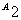)

&nbsp;&nbsp;&nbsp; [有限基数与有限集] &nbsp;一个有限序数的基数称为有限基数.如果card（<i>A</i>）是有限基数，那末称<i>A</i>为有限集.

&nbsp;&nbsp;&nbsp;
定理&nbsp; 假定<i>h</i>和<i>k</i>是有限序数，<i>h</i>&lt;<i>k</i>，那末

&nbsp;&nbsp;&nbsp;&nbsp;&nbsp;&nbsp;&nbsp;&nbsp;&nbsp;&nbsp;&nbsp;&nbsp;&nbsp;&nbsp;&nbsp;&nbsp;&nbsp;&nbsp;&nbsp;&nbsp;&nbsp;&nbsp;&nbsp;
card(<i>h</i>)&lt;card(<i>k</i>)

&nbsp;&nbsp;&nbsp;
由这个定理看到，所有有限基数的全体可以保持次序地变上所有有限序数的全体<i>ω</i>.由于这个缘故，假定<i>n</i>是一个有限序数，那末可以用<i>n</i>来代表card（<i>n</i>），也就是记成

&nbsp;&nbsp;&nbsp;&nbsp;&nbsp;&nbsp;&nbsp;&nbsp;&nbsp;&nbsp;&nbsp;&nbsp;&nbsp;&nbsp;&nbsp;&nbsp;&nbsp;&nbsp;&nbsp;&nbsp;&nbsp;&nbsp;&nbsp;
card（<i>n</i>）=<i>n</i>

这样一来，正整数和零不仅是有限序数，而且是有限基数，并且当作基数来看，它们之间大小关系仍旧保持.

&nbsp;&nbsp;&nbsp; [超限基数]&nbsp; 任何一个基数总是某个序数的基数.有限序数的基数是有限基数，超限序数的基数一定不是有限基数，称为超限基数.

&nbsp;&nbsp;&nbsp;
大的基数必定是大的序数的基数.因此超限基数的全体是一个排队集.所以可以把比某个超限基数小的所有超限基数用序数当作下标从小到大排队：

&nbsp;&nbsp;&nbsp;&nbsp;&nbsp;&nbsp;&nbsp;&nbsp;&nbsp;&nbsp;&nbsp;&nbsp;&nbsp;&nbsp;&nbsp;&nbsp;&nbsp;&nbsp;&nbsp;&nbsp;&nbsp;&nbsp;
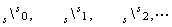

其中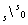就是最小的超限基数card（<i>ω</i>）.“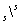”读作“阿勒夫”.

&nbsp;&nbsp;&nbsp;
由上面说明知道，任何一个基数都可以表示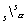，这里<i>α</i>是某个序数，并且是比所有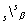(<i>β</i>&lt;<i>α</i>)大的最小的基数.反过来，对任何序数<i>α</i>，这样的都存在.因为假定存在，那末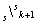一定存在，因为总有基数比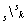大，于是由排队集的性质知道存在比大的最小的基数，于是由数学归纳法知道，对任何正整数<i>n</i>，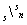存在.

&nbsp;&nbsp;&nbsp;
对一般序数<i>α</i>可以用超限归纳法证明，因为假定对于比序数<i>β</i>小的每个序数<i>δ</i>，存在，那末存在序数<i>γδ</i>，使card(<i>γδ</i>)= 比所有这些<i>γδ</i>都大的序数存在，随便取一个记作<i>γ</i>，那末card(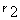)&gt;card(<i>γ</i>)≥card(<i>γδ</i>)= 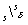.所以比所有的都大的基数存在.因此由排队集的性质知道存在比所有的都大的最小的基数，这个最小的基数就是.因此由超限归纳法知道，对任何序数<i>α</i>, 存在.

&nbsp;&nbsp;&nbsp; [可数集与不可数集] &nbsp;称为可数无限集的基数，因为=card（<i>ω</i>），凡是当基数的集一定可以一对一地变上<i>ω</i>（也就是零和所有正整数全体）.有限集和可数无限集都称为可数集.

&nbsp;&nbsp;&nbsp;
由康托定理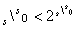（非空集的所有子集的全体的集的基数），所以基数等于的集是不可数的. 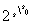正好是所有实数全体（连续域）的基数，这是因为实数全体就是二进位小数全体.但是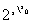究竟是那一个超限基数呢？康托猜测是最小的不可数的基数，这就是下面著名的

&nbsp;&nbsp;&nbsp; [连续域假设]&nbsp; 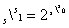

&nbsp;&nbsp;&nbsp; [广义连续域假设] &nbsp;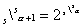对任何序数<i>α</i>成立.

&nbsp;&nbsp;&nbsp;
连续域假设对不对？这问题曾经长期得不到答案，三十年代末发现了意外的结果：如果集论的公理系统本身没有矛盾，那末连续域假设跟这个公理系统是不矛盾的.以后又进一步证明连续域假设的否定（非）（就是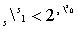）跟这个公理系统也是不矛盾的.这就是说，连续域假设对不对是不可解的（从现有公理系统来看）.由于实数在数学中的重要意义，这个问题不可解说明集论公理不完备.

