

七、&nbsp;&nbsp;&nbsp;&nbsp;&nbsp;&nbsp;&nbsp;
七、&nbsp;&nbsp;&nbsp; 基数算术

&nbsp;&nbsp;&nbsp; [公式]&nbsp; 假定<i>A</i>和<i>B</i>是集，<i>A</i>∩<i>B</i>≠<i>φ</i>，那末规定

card(<i>A</i>)+card(<i>B</i>)=card(<i>Α</i>∪<i>B</i>)

card(<i>A</i>)card(<i>B</i>)=card(<i>A</i><i>B</i>)

card(<i>B</i>)card(<i>Α</i>)=card(<i>AB</i>)

&nbsp;&nbsp;&nbsp;
基数的加法和乘法都是可以交换的.

&nbsp;&nbsp;&nbsp;
定理

&nbsp;&nbsp;&nbsp;&nbsp;&nbsp;&nbsp;&nbsp;&nbsp;&nbsp;&nbsp;&nbsp;&nbsp;&nbsp;&nbsp;&nbsp;&nbsp;&nbsp;&nbsp;&nbsp;&nbsp;&nbsp;&nbsp;&nbsp;&nbsp;&nbsp;&nbsp;
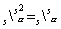

&nbsp;&nbsp;&nbsp;
推论

1°&nbsp;&nbsp;&nbsp;&nbsp;&nbsp;&nbsp;
1°&nbsp; 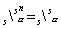&nbsp;&nbsp;&nbsp;&nbsp;&nbsp;&nbsp;（<i>n</i>为正整数）

2°&nbsp;&nbsp;&nbsp;&nbsp;&nbsp;&nbsp;
2°&nbsp; 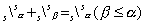

3°&nbsp;&nbsp;&nbsp;&nbsp;&nbsp;&nbsp;
3°&nbsp; 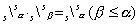

&nbsp;&nbsp;&nbsp; [几个特殊数集*的基数计算]

1°&nbsp;&nbsp;&nbsp;&nbsp;&nbsp;&nbsp;
1°&nbsp; 所有整数全体的基数等于.这是因为

card（所有整数全体）=card（所有正整数全体）

+card（所有负整数全体）+card（{0}）

<pre>&nbsp;&nbsp;&nbsp;&nbsp;&nbsp;&nbsp;&nbsp;&nbsp;&nbsp;&nbsp;&nbsp;&nbsp;&nbsp;&nbsp;&nbsp;&nbsp;&nbsp;&nbsp;&nbsp;&nbsp;&nbsp;&nbsp;&nbsp;&nbsp;&nbsp;&nbsp;&nbsp;&nbsp; =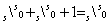</pre>

2°&nbsp; 2°&nbsp;
所有有理数全体的基数等于.因为每个有理数是一对整数的商，所以所有有理数全体的基数不超过所有整数对全体的基数，所以所有有理数全体的基数不超过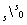.但是整数可以看作有理数的特例，这基数又不小于.所以所有有理数全体的基数等于.

3°&nbsp;&nbsp;&nbsp;&nbsp;&nbsp;&nbsp;
3°&nbsp; 所有无理数全体的基数等于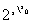.否则所有实数全体的基数不会等于.

4°&nbsp;&nbsp;&nbsp;&nbsp;&nbsp;&nbsp;
4°&nbsp; 所有实代数数（整系数代数方程的根）全体的基数等于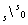.这是因为只有可数无限多个不同的整系数代数方程，而每个方程只有有限个根.

5°&nbsp;&nbsp;&nbsp;&nbsp;&nbsp;&nbsp;
5°&nbsp; 所有实超越数（不是代数数的实数）全体的基数等于.

6°&nbsp;&nbsp;&nbsp;&nbsp;&nbsp;&nbsp;
6°&nbsp; 复数全体的基数等于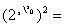.这是因为一个复数是一个实数对.

&nbsp;&nbsp;&nbsp; [康托三分集] &nbsp;把闭区间[0，1]里的所有实数表示成三进位无限小数*.各位数字都不是1的那些三进位无限小数全体记作<i>T</i>，那末<i>T</i>称为康托三分集.从几何上看，把<i>T</i>0=[0，1]等分成三段，去掉中间一段，剩下的部分[0，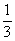]∪[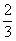，1]记作<i>T</i>1.又把[0，]和[，1]各等分为三段，去掉中间一段，剩下的部分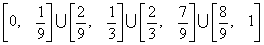记作<i>T</i>2.继续下去得到一个集族{<i> Tn</i>|<i>n</i><i></i><i>ω</i>}，这族集的通集就是<i>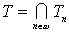</i>.

&nbsp;&nbsp;&nbsp;
把<i>T</i>里每个数用2除，就得二进位无限小数全体，因此card（<i>T</i>）=.

7°&nbsp;&nbsp;&nbsp;&nbsp;&nbsp;&nbsp;
&nbsp;

<table class=MsoNormalTable border=0 cellspacing=0 cellpadding=0 align=left>
 <tr>
  <td width=10 style='width:7.2pt;padding:0mm 0mm 0mm 0mm'>
  
&nbsp;

  </td>
 </tr>
 <tr>
  <td style='padding:0mm 0mm 0mm 0mm'>
  
&nbsp;

  </td>
  <td style='padding:0mm 0mm 0mm 0mm'>
  

  </td>
 </tr>
</table>

&nbsp; 

&nbsp;* 这段中的数集的数都是按通常意义下定义的，见第一章，§1，一.

&nbsp;

