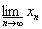

<h1 align=center style='text-align:center'>第五章 微 分 学</h1>

微积分学的研究方法是极限方法，研究的对象是函数（特别是初等函数），微积分学的主要内容是微分法、积分法和它们的应用.本章主要介绍极限方法以及微分法和它的应用（隐函数理论、函数展开为幂级数、函数的极值和作图），还介绍了函数连续性的概念和性质，以及数项级数、二重级数、函数项级数和无穷乘积的收敛概念和判别法.同时考虑到函数的一致连续性、函数项级数的一致收敛性以及函数的可微性的概念在理论和实际上的重要性，本章着重介绍了这些概念，并举例说明这些概念的实质.另外收集了一些常见的初等函数的幂级数展开式，列表备查.

<h2 align=center style='text-align:center'>§1 序列与函数的极限 </h2>
<h3>一、序列的极限 </h3>

1．基本概念

[有穷极限] 假定对于任意小的<i>ε</i>&gt;0,都存在正整数<i>N</i>=<i>N</i>(<i>ε</i>),使得对于一切的<i>n</i>&gt;<i>N</i>，不等式

|<i>xn</i>-<i>a</i>|&lt;<i>ε </i>(<i>a</i>为有限数)

成立，就称序列<i>x</i>1,<i>x</i>2,(简记为{<i>xn</i>})以<i>a</i>为极限(或称序列收敛于<i>a</i>）,记作

否则序列称为发散的.

[无穷极限] 假定对于任意大的<i>E</i>&gt;0，都存在正整数<i>N</i>=<i>N</i>(<i>E</i>)，使得对于一切的<i>n</i>&gt;<i>N</i>,不等式

|<i>xn</i>|&gt;<i>E</i>

成立，就称序列<i>x</i>1,<i>x</i>2,的极限是∞（或称序列发散于∞），记作

[部分极限(聚点)] 在已知序列<i>x</i>1,<i>x</i>2,的元素中，保持原来次序自左至右任意选取无穷多个元素，如

这种序列称为已知序列的子序列.如果

就称数<i>ξ</i>（或符号∞）为已知序列{<i>xn</i>}的部分极限(或聚点).

任何序列{<i>xn</i>},不论是有界的或无界的，都有部分极限存在.

[上极限与下极限] 序列{<i>xn</i>}的最大的部分极限（有穷或无穷）称为序列{<i>xn</i>}的上极限，记作

<h2 align=center style='text-align:center'></h2>

而它的最小的部分极限（有穷或无穷）称为序列{<i>xn</i>}的下极限，记作

所以，一个序列{<i>xn</i>}如果有两个子序列不收敛于同一极限，这个序列{<i>xn</i>}就不收敛.如果

，即序列{<i>xn</i>}收敛于<i>a</i>，那末{<i>xn</i>}的任一子序列{}都收敛于<i>a</i>.

