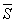
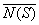
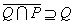

二、&nbsp;&nbsp;&nbsp;&nbsp;&nbsp;&nbsp;&nbsp;
二、&nbsp;&nbsp;&nbsp; 点集的基本拓扑概念

&nbsp;&nbsp;&nbsp; [内部·外部·边界·包] &nbsp;假定<i>S</i>是拓扑空间<i>X</i>=&lt;<i>D</i>,<i>τ</i>&gt;里的一个点集，也就是<i>S</i><i>D</i>，那末相对于<i>S</i>可以把<i>X</i>里的点分为三类： 

1°&nbsp;&nbsp;&nbsp;&nbsp;&nbsp;&nbsp;
1°&nbsp; 内点与内部.如果对一点<i>x</i>存在一个开集<i>V</i>，使<i>x</i><i>V</i><i>S</i>，那末称<i>x</i>为<i>S</i>的内点.

<i>&nbsp;&nbsp;&nbsp; S</i>的所有内点的全体，称为<i>S</i>的内部，记作<i>N</i>（<i>S</i>），<i>S</i>的内部是<i>S</i>的子集.

2°&nbsp;&nbsp;&nbsp;&nbsp;&nbsp;&nbsp;
2°&nbsp; 外点与外部.<i>S</i>的余集<i>D</i>\<i>S</i>的内点称为<i>S</i>的外点.

<i>&nbsp;&nbsp;&nbsp; S</i>的所有外点的全体称为<i>S</i>的外部，<i>S</i>的外部是<i>S</i>的余集的子集.

&nbsp;&nbsp; &nbsp;3o&nbsp; 边界点与边界.既不是<i>S</i>的内点也不是<i>S</i>的外点的点称为<i>S</i>的边界点.

<i>&nbsp;&nbsp;&nbsp; S</i>的边界点的全体称为<i>S</i>的边界，记作<i>B</i>（<i>S</i>）.

<i>&nbsp;&nbsp;&nbsp; S</i>∪<i>B</i>(<i>S</i>)称为<i>S</i>的包，记作<i></i>=<i>S</i>∪<i>B</i>（<i>S</i>）.

&nbsp;&nbsp;&nbsp;
它们之间的基本关系如下：

&nbsp;&nbsp;&nbsp;
点集<i>S</i>的边界同时也是<i>S</i>的余集的边界.

&nbsp;&nbsp;&nbsp;
点集<i>S</i>的包的余集就是<i>S</i>的外部；<i>S</i>的余集的包的余集就是<i>S</i>的内部.

&nbsp;&nbsp;&nbsp;
点集<i>S</i>的包就是<i>S</i>的内部和<i>S</i>的边界的和集，也就是说<i></i>=<i>S</i>∪<i>B</i>（<i>S</i>）=<i>N</i>（<i>S</i>）∪<i>B</i>（<i>S</i>）；注意，一般<i></i>和不一定相等，也就是<i></i>=<i>N</i>(<i>S</i>)∪<i>B</i>（<i>N</i>(<i>S</i>)）不一定成立.

&nbsp;&nbsp;&nbsp; [处处稠密与无一处稠密]&nbsp; 假定<i>P</i>和<i>Q</i>是一个拓扑空间里的点集，，那末称<i>P</i>在<i>Q</i>里处处稠密.假定<i>P</i>的外部在<i>Q</i>里处处稠密，那末称<i>P</i>在<i>Q</i>里无一处稠密.注意，这里“<i>P</i>的外部”不能换成“<i>P</i>的余集”.

&nbsp;&nbsp;&nbsp;
例如，有理数全体在一维实数空间<i>R</i>1里处处稠密.无理数全体在<i>R</i>1里也是处处稠密.整数全体在<i>R</i>1里无一处稠密.一个不空区间（<i>a</i>，<i>b</i>）在<i>R</i>1里既不处处稠密也不无一处稠密.

&nbsp;&nbsp;&nbsp; [开集与闭集]&nbsp; 一个拓扑空间&lt;<i>D</i>,<i>τ</i>&gt;里的开集的概念是基本的（本节，一），一个开集的余集称为闭集.

1°&nbsp;&nbsp;&nbsp;&nbsp;&nbsp;&nbsp;
1°&nbsp; 点集<i>S</i>为开集的充分必要条件是：<i>S</i>等于它的内部，或者说<i>S</i>的每个边界点都不属于<i>S</i>.

2°&nbsp;&nbsp;&nbsp;&nbsp;&nbsp;&nbsp;
2°&nbsp; 点集<i>S</i>为闭集的充分必要条件是：<i>S</i>等于它的包，或者说<i>S</i>的每个边界点都属于<i>S</i>.

3°&nbsp;&nbsp;&nbsp;&nbsp;&nbsp;&nbsp;
3°&nbsp; 点集<i>S</i>既是开集又是闭集的充分必要条件是：<i>S</i>的边界是空集.例如<i>φ</i>和<i>D</i>都是既开又闭的.

4°&nbsp;&nbsp;&nbsp;&nbsp;&nbsp;&nbsp;
4°&nbsp; 点集<i>S</i>不是开集也不是闭集的充分必要条件是：<i>B</i>（<i>S</i>）∩<i>S</i>&sup1;<i>φ</i>并且<i>B</i>（<i>S</i>）∩<i>S</i>&sup1;<i>B</i>（<i>S</i>）.

&nbsp;&nbsp;&nbsp;
例如在<i>R</i>1里，不空的区间（<i>a</i>，<i>b</i>）开而不闭，半闭区间（<i>a</i>，<i>b</i>]不开不闭，闭区间[<i>a</i>，<i>b</i>]闭而不开，有理数全体不开不闭，无理数全体不开不闭，整数全体闭而不开，<i>R</i>1既开又闭.

&nbsp;&nbsp;&nbsp;
此外，由闭集的定义得到三个跟开集相对偶的性质：

1°&nbsp;&nbsp;&nbsp;&nbsp;&nbsp;&nbsp;
1°&nbsp; <i>φ</i>是闭集，<i>D</i>是闭集；

2°&nbsp;&nbsp;&nbsp;&nbsp;&nbsp;&nbsp;
2°&nbsp; 任何一族闭集的通集是闭集；

3°&nbsp;&nbsp;&nbsp;&nbsp;&nbsp;&nbsp;
3°&nbsp; 任何有限个闭集的和集是闭集.

&nbsp;&nbsp;&nbsp; [孤立点、聚点与导集]假定<i>S</i>是拓扑空间里的一个点集，一点<i>x</i><i>S</i>并且<i>x</i>有一个邻域<i>G</i>使<i>G</i>∩<i>S</i>={<i>x</i>}，那末称<i>x</i>为<i>S</i>的孤立点.

&nbsp;&nbsp;&nbsp;
假定<i>y</i><i></i>（<i></i>表示<i>S</i>的包），但<i>y</i>不是<i>S</i>的孤立点，那末称<i>y</i>为<i>S</i>的聚点.

&nbsp;&nbsp;&nbsp;
一点<i>y</i>是点集<i>S</i>的聚点的充分必要条件是：对<i>y</i>的任何一个邻域<i>L</i>，（<i>L</i>\{<i>y</i>}）∩<i>S</i>&sup1;<i>φ</i>.

&nbsp;&nbsp;&nbsp;
由定义知道，一个点集<i>S</i>的任何一个孤立点一定是<i>S</i>的边界点，而一个点集的任何一个内点一定是<i>S</i>的聚点，但是倒过来说显然不行.

<i>&nbsp;&nbsp;&nbsp; S</i>的聚点的全体也称为<i>S</i>的导集，记作<i>S'</i>.<i>S</i>的包<i></i>可以表示为：

<i>&nbsp;&nbsp;&nbsp;&nbsp;&nbsp;&nbsp;&nbsp;&nbsp;&nbsp;&nbsp;&nbsp;&nbsp;&nbsp;&nbsp;&nbsp;&nbsp;&nbsp;
</i>=<i>S</i>∪<i>S'</i>=（<i>S</i>的孤立点的全体）∪<i>S'</i>

&nbsp;&nbsp;&nbsp; [孤立点集、自密集与完全集]&nbsp; 对一个拓扑空间里的任何一个点集<i>S</i>，这空间里的全部点可以分为三类：<i>S</i>的外点，<i>S</i>的孤立点，还有<i>S</i>的聚点.聚点包括<i>S</i>的内点和不孤立的边界点.

&nbsp;&nbsp;&nbsp;
没有聚点的点集称为孤立点集（分散点集），因为它的诱导拓扑一定是分散拓扑.

&nbsp;&nbsp;&nbsp;
没有孤立点的点集<i>S</i>（就是<i>S</i><i>S'</i>）称为自密集.特别如果<i>S</i>自密并且闭，那末<i>S</i>称为完全集.因为<i>S</i>为闭集的充分必要条件是：<i>S'</i><i>S</i>，所以<i>S</i>是完全集的充分必要条件是：<i>S</i>=<i>S</i>'.

