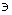
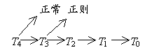

三、&nbsp;&nbsp;&nbsp;&nbsp;&nbsp;&nbsp;&nbsp;
三、&nbsp;&nbsp;&nbsp; 拓扑空间的分离程度·可数公理

1.&nbsp;&nbsp;&nbsp;&nbsp;&nbsp;&nbsp;&nbsp;
1.&nbsp;&nbsp;&nbsp;&nbsp;&nbsp; 不同分离程度的拓扑空间

&nbsp;&nbsp;&nbsp; [<i>T</i>0空间] &nbsp;如果拓扑空间<i>X</i>里任何不同的两点中至少有一点有一个邻域不包含另一点，那末称<i>X</i>为<i>T</i>0空间.

&nbsp;&nbsp;&nbsp; [<i>T</i>1空间]&nbsp; 如果拓扑空间<i>X</i>里任何不同的两点一定各有邻域不包含另一点，那末称<i>X</i>为<i>T</i>1空间.

<i>&nbsp;&nbsp;&nbsp; X</i>是<i>T</i>1空间的充分必要条件是：<i>X</i>里任何一个只包含一点<i>x</i>的集{<i>x</i>}是闭集.

&nbsp;&nbsp;&nbsp; [<i>T</i>2空间——豪斯道夫空间] &nbsp;如果拓扑空间<i>X</i>里任何不同的两点一定各有邻域彼此没有公共点，那末称<i>X</i>为<i>T</i>2空间，也称分离空间.

&nbsp;&nbsp;&nbsp; [正则空间] &nbsp;假定对拓扑空间<i>X</i>里任何一个闭集<i>S</i>和任何一点<i>x</i>&Iuml;<i>S</i>，一定有两个开集<i>U</i>和<i>V</i>，使<i>U</i>&Ecirc;<i>S</i>，<i>Vx</i>且<i>U</i>∩<i>V</i>&sup1;<i>φ</i>，那末称<i>X</i>为正则空间.

&nbsp;&nbsp;&nbsp; [<i>T</i>3的空间]&nbsp; 正则的<i>T</i>1空间称为<i>T</i>3空间.

&nbsp;&nbsp;&nbsp; [正常空间] &nbsp;假定对拓扑空间<i>X</i>里任何两个没有公共点的闭集<i>A</i>和<i>B</i>一定有两个开集<i>U</i>和<i>V</i>使<i>U</i>&Ecirc;<i>A</i>,<i>V</i>&Ecirc;<i>B</i>且<i>U</i>∩<i>V</i>=<i>φ</i>，那末称<i>X</i>为正常空间.

&nbsp;&nbsp;&nbsp; [<i>T</i>4空间] &nbsp;正常的<i>T</i>1空间称为<i>T</i>4空间.

&nbsp;&nbsp;&nbsp;
例如<i>n</i>维实数空间就是<i>T</i>4空间.

&nbsp;&nbsp;&nbsp;
定义所说的分离程度强弱次序如下：

<pre align=center>&nbsp;&nbsp;&nbsp;&nbsp;&nbsp;&nbsp;&nbsp;&nbsp;&nbsp;&nbsp;&nbsp;&nbsp;&nbsp;&nbsp;&nbsp;&nbsp;&nbsp;&nbsp;&nbsp;&nbsp;&nbsp;&nbsp;&nbsp; &nbsp;&nbsp;&nbsp;&nbsp;</pre>

&nbsp;&nbsp;&nbsp;
箭头表示“必是”.如<i>T</i>4空间必是<i>T</i>3空间，又必是正常空间.至于正常和正则是不能比较分离强弱程度的，它们跟<i>T</i>2<i>
</i>,<i>T</i>1与<i>T</i>0也是不能比较的.

