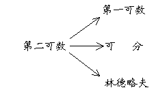
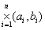

2．&nbsp;&nbsp;&nbsp; 2．可数性

&nbsp;&nbsp;&nbsp; [邻域基] &nbsp;假定<i>s</i> 是拓扑空间里一点<i>x</i>的一个邻域族，对<i>x</i>的任何一个邻域<i>U</i>，一定存在<i>V</i><i></i><i>s </i>使<i>V</i><i>U</i>成立，那末称<i>s</i> 为<i>x</i>的一个邻域基.

&nbsp;&nbsp;&nbsp; [合盖族]&nbsp; 假定一族点集的和集掩盖一个集<i>S</i>，那末称这族点集的全体是<i>S</i>的一个合盖族.

&nbsp;&nbsp;&nbsp; [第一可数空间] &nbsp;假定拓扑空间<i>X</i>里任何一点有可数的邻域基，那末称这个空间为第一可数空间（“满足第一可数公理”的空间）.

&nbsp;&nbsp;&nbsp; [林德略夫空间]&nbsp; 假定一个拓扑空间里任何一个点集的任何一个合盖开集族有可数的子合盖族，那末称这个空间为林德略夫空间.

&nbsp;&nbsp;&nbsp; [可分空间] &nbsp;假定在一个拓扑空间<i>X</i>里有可数点集处处稠密，那末称这空间为可分空间.

&nbsp;&nbsp;&nbsp; [第二可数空间] &nbsp;有可数的拓扑基的空间称为第二可数空间（“满足第二可数公理”的空间）.

&nbsp;&nbsp;&nbsp;
它们有下面的强弱关系： 

<pre>&nbsp;&nbsp;&nbsp;&nbsp;&nbsp;&nbsp;&nbsp;&nbsp;&nbsp;&nbsp;&nbsp;&nbsp;&nbsp;&nbsp;&nbsp;&nbsp;&nbsp;&nbsp;&nbsp;&nbsp;&nbsp;&nbsp;&nbsp;&nbsp;&nbsp;&nbsp;&nbsp;&nbsp;&nbsp;&nbsp;&nbsp;&nbsp;&nbsp; </pre>

&nbsp;&nbsp;&nbsp;
例如，<i>n</i>维实数空间<i>Rn</i>是一个第二可数空间，因为{|<i>ai</i>和<i>bi</i>都是有理数}显然是它的一个可数的拓扑基.因此<i>Rn </i>又是第一可数空间、可分空间和林德略夫空间.

