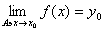
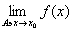
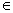
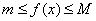
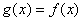
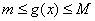

四、&nbsp;&nbsp;&nbsp;&nbsp;&nbsp;&nbsp;&nbsp;
四、&nbsp;&nbsp;&nbsp; 极限与连续

&nbsp;&nbsp;&nbsp; [变换的极限] &nbsp;假定<i>f</i>是把一个拓扑空间<i>X</i>里的一个点集<i>A</i>变进另一个拓扑空间<i>Y</i>的变换.又假定<i>x</i>0是<i>A</i>的一个聚点.如果<i>Y</i>里有一点<i>y</i>0，对<i>y</i>0的任何一个邻域<i>V</i>，<i>x</i>0有一个邻域<i>G</i>，使

<i>f</i>（(<i>G</i>\{<i> x</i>0}）∩<i>A</i>）<i>V</i>

那末称<i>y</i>0为<i>f</i>在<i>x</i>0的极限，记作

&nbsp;&nbsp;&nbsp;
注意，1o假定<i>y</i>0是<i>f</i>在点<i>x</i>0<i>A'</i>的极限，那末只有两种情形，一种情形是<i>x</i>0有一个邻域<i>G</i>使<i>f</i>（(<i>G</i>\{<i> x</i>0}）∩<i>A</i>）={<i> y</i>0}成立，否则就是对<i>x</i>0的任何一个邻域<i>G</i>，<i>y</i>0都是<i>f</i>（(<i>G</i>\{<i> x</i>0}）∩<i>A</i>）的一个聚点.

&nbsp;&nbsp;&nbsp;
2o一般，不一定存在，存在的话也不一定唯一.但是特别当<i>f</i>是把<i>A</i>变进一个<i>T</i>2空间的变换时，要么不存在，要么存在并且唯一.

&nbsp;&nbsp;&nbsp; [连续变换] &nbsp;假定<i>f</i>是把一个拓扑空间里的点集<i>A</i>变进一个拓扑空间的变换.假定<i>x</i>0是<i>A</i>的孤立点或者<i>x</i>0是<i>A</i>的聚点而=<i>f</i>（<i>x</i>0），那么称<i>f</i>在<i>x</i>0连续.

&nbsp;&nbsp;&nbsp;
如果<i>f</i>（<i>x</i>）在每一点<i>x</i><i>A</i>都连续，那末称<i>f</i>在<i>A</i>里连续，或称<i>f</i>为<i>A</i>的连续变换.

&nbsp;&nbsp;&nbsp;
定理&nbsp; 把拓扑空间里的一个点集<i>A</i>变进一个拓扑空间的变换<i>f</i>是<i>A</i>的连续变换的充分必要条件是：<i>f</i>（<i>A</i>）的任何一个相对开集的象源（就是这个相对开集里每一点的象源的全体）是<i>A</i>的相对开集（条件中的“开”可以改成“闭”）.

&nbsp;&nbsp;&nbsp; [使一个变换连续的最粗的拓扑]
&nbsp;假定一个变换<i>f</i>把一个集<i>A</i>变进一个拓扑空间的承载点集<i>B</i>，那末把<i>f</i>（<i>A</i>）的所有相对开集的象源全体当作<i>A</i>的一个拓扑亚基，就得到<i>A</i>的一个拓扑<i>τ</i>.这个拓扑<i>τ </i>就是使<i>f</i>在<i>A</i>里连续的最粗的拓扑.

&nbsp;&nbsp;&nbsp;
特别当<i>f</i>是在集<i>A</i>里定义的实函数（或者实泛函）<a
href="bword://None" name="_ftnref1" title="">*</a>时，<i>f</i>可以看作把<i>A</i>变进<i>R</i>1的变换，于是所有形如{<i>x</i>|<i>x</i><i>A</i>并且<i>a</i>&lt;<i>f</i>(<i>x</i>)&lt;<i>b</i>}的子集（其中<i>a</i>和<i>b</i>是任意实数）全体就可以繁殖出使<i>f</i>连续的最粗的拓扑.

&nbsp;&nbsp;&nbsp; [开拓定理——体策定理]&nbsp; 假定<i>f</i>是正常空间<i>X</i>的一个闭集<i>B</i>里的连续有界实函数，对任何<i>x</i><i>B</i>，成立，那末存在一个函数<i>g</i>在<i>X</i>（<i>X</i>的承载点集）里连续，并且对所有的<i>x</i><i>B</i>,，而对<i>X</i>里所有的点<i>x</i>，成立.

&nbsp;&nbsp;&nbsp;
它是下面实变函数连续函数性质的推广：

&nbsp;&nbsp;&nbsp;
假定<i>A</i>是一个拓扑空间里的点集，<i>f</i>1，<i>f</i>2，&frac14;是<i>A</i>里一列连续函数，一致收敛于函数<i>f</i>（也就是对任何正数<i>e</i> ，存在正整数<i>N</i>，使|<i> fn</i>（<i>x</i>）-<i>f</i>（<i>x</i>）|&lt;<i>e</i> 对任何<i>x</i><i>A</i>和任何<i>n</i>&gt;<i>N</i>成立），那末<i>f</i>在<i>A</i>里连续.

&nbsp;&nbsp;&nbsp; [拓扑变换与同胚] &nbsp;假定<i>X</i>和<i>Y</i>都是拓扑空间，<i>f</i>是一个把<i>X</i>的承载点集一对一地变上<i>Y</i>的承载点集的变换，在变换<i>f</i>下，<i>X</i>里的每个开集的象是<i>Y</i>里的开集，<i>Y</i>里的每个开集的象源也是<i>X</i>里的开集，那末称<i>f</i>为一个把<i>X</i>变上<i>Y</i>的拓扑变换（同胚变换），称<i>X</i>和<i>Y</i>在<i>f</i>下同胚或者拓扑地等价.

&nbsp;&nbsp;&nbsp;
定理&nbsp; 把拓扑空间<i>X</i>的承载点集一对一地变上拓扑空间<i>Y</i>的承载点集的变换为拓扑变换的充分必要条件是：<i>f</i>可逆连续（就是<i>f</i>和<i>f</i> -1都是连续变换）.

 

 

<a href="#None" name="_ftn1" title="">*</a> 当<i>A</i>是一个函数族时，习惯上把在<i>A</i>里定义的实函数称为实泛函.

