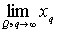
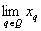
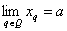
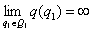
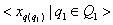
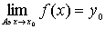
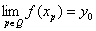
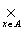

五、&nbsp;&nbsp;&nbsp;&nbsp;&nbsp;&nbsp;&nbsp;
五、&nbsp;&nbsp;&nbsp; 点网

&nbsp;&nbsp;&nbsp;
在实变数分析中，数列、函数列、函数值列等等是常见的基本工具.这些概念可以用拓扑空间里的点列这样一个统一的概念来概括.不过对一般拓扑空间的极限理论，点列的概念是过分狭隘的，应该推广为点网的概念，点网的作用就相当于实变数分析中点列所起的作用.

&nbsp;&nbsp;&nbsp; [汇总集] &nbsp;假定<i>Q</i>是一个集，<i>Q</i>里有一个大小关系&lt;，并且满足条件：（i）对任何<i>p</i><i>Q</i>和<i>q</i><i>Q</i>，式子<i>p</i>&lt;<i>q</i>, <i>p</i>=<i>q</i>, <i>q</i>&lt;<i>p</i>有一个且只有一个成立；（ii）若<i>p</i>, <i>q</i>, <i>r</i>都属于<i>Q</i>，并且<i>p</i>&lt;<i>q</i>和<i>q</i>&lt;<i>r</i>都成立，则<i>p</i>&lt;<i>r</i>成立；（iii）对任何<i>p</i><i>Q</i>和<i>q</i><i>Q</i>，存在<i>r</i><i>Q</i>使<i>p</i>&lt;<i>r</i>, <i>q</i>&lt;<i>r</i>都成立.那末称<i>Q</i>为汇总集.

&nbsp;&nbsp;&nbsp;
由定义看到，汇总集就是满足条件（iii）的分行集.

&nbsp;&nbsp;&nbsp; [点网]&nbsp; 一个汇总集<i>Q</i>变进一个拓扑空间<i>X</i>的变换<i>f</i>称为<i>X</i>里的点网，通常把一点<i>q</i><i>Q</i>的象<i>f</i>（<i>q</i>）记作<i>xq</i>，于是&lt;<i> xq</i> |<i>q</i><i>Q</i>&gt;={{<i>f</i>(<i>q</i>), <i>q</i>}|<i>q</i><i>Q</i>}是一个点网.

&nbsp;&nbsp;&nbsp;
特别当<i>Q</i>是有限序数的全体<i>ω</i>或者正整数的全体时，点网&lt;<i> xq</i> |<i>q</i><i>Q</i>&gt;称为点列.

&nbsp;&nbsp;&nbsp; [点网极限的两种定义<a
class=msocomanchor id="_anchor_1"
 href="#None" language=JavaScript
name="_msoanchor_1">[5191]</a>&nbsp;]

1°&nbsp;&nbsp;&nbsp;&nbsp;&nbsp;&nbsp;
1°&nbsp; 假定<i>Q</i>是一个汇总集，把<i>Q</i>看作分散空间.任意取一个不属于<i>Q</i>的事物（比如就是<i>Q</i>自己）记作∞，称为<i>Q</i>的无限大（终极）.把∞和<i>Q</i>里所有比某个元素<i>p</i>大的元素<i>q</i>的全体（就是{∞}∪{<i>q</i>|<i>q</i><i>Q</i>并且<i>q</i>&gt;<i>p</i>}）规定为<i>Q</i>∪{∞}里的一个开集.在上面规定下，在<i>Q</i>∪{∞}里繁殖一个拓扑.在这拓扑下，<i>Q</i>成了一个拓扑空间里的点集，∞是<i>Q</i>的唯一的聚点.

&nbsp;&nbsp;&nbsp;
拓扑空间<i>X</i>里的一个点网&lt;<i> xq</i> |<i>q</i><i>Q</i>&gt;是一个把<i>Q</i>变进<i>X</i>的变换，因此由上节变换的极限的定义，得到的概念，这个极限如果存在的话，就称为点网&lt;<i> xq</i> |<i>q</i><i>Q</i>&gt;的极限.在这个极限记号里∞不妨省去，写成，这是因为除∞外，没有别的聚点.

&nbsp;&nbsp;&nbsp;
如果一个点网的极限存在，则称这点网收敛于这个极限.

2°&nbsp;&nbsp;&nbsp;&nbsp;&nbsp;&nbsp;
2°&nbsp; 假定&lt;<i> xq</i> |<i>q</i><i>Q</i>&gt;是拓扑空间里的一个点网，那末

的意思就是对<i>a</i>的任一邻域<i>V</i>，总存在一个<i>p</i><i>Q</i>，使对所有的<i>q</i>&gt;<i>p</i>,<i> xq</i><i>V</i>成立.

&nbsp;&nbsp;&nbsp;
这就跟通常点列极限的定义在形式上更加一致了.

&nbsp;&nbsp;&nbsp; [子网与聚限] &nbsp;假定<i>Q</i>1是一个汇总集<i>Q</i>的没有上界的子集（也就是<i>Q</i>里没有元素能比<i>Q</i>1的所有元素都大），那末称<i>Q</i>1为<i>Q</i>的共终极的子汇总集.

&nbsp;&nbsp;&nbsp;
取这名字的理由是<i>Q</i>1必然也是一个汇总集，并且在<i>Q</i>∪{∞}里，终极∞也是<i>Q</i>1的唯一聚点.

&nbsp;&nbsp;&nbsp;
假定&lt;<i> xq</i> |<i>q</i><i>Q</i>&gt;是一个点网，又假定<i>Q</i>1是<i>Q</i>的一个共终极的子汇总集，那末&lt;<i> xq</i> |<i>q</i><i> Q</i>1&gt;称为&lt;<i> xq</i> |<i>q</i><i>Q</i>&gt;的子网.更一般，设<i>Q</i>1是一个汇总集，变换<i>q</i>(<i>q</i>1)把<i>Q</i>1变进<i>Q</i>去，,那末称为&lt;<i> xq</i> |<i>q</i><i>Q</i>&gt;的一个子网.

&nbsp;&nbsp;&nbsp;
一个点网的子网的极限称为这个点网的一个聚限.

&nbsp;&nbsp;&nbsp;
定理1&nbsp; 在一个拓扑空间里，一点<i>x</i>0为一个点集<i>A</i>的聚点的充分必要条件是：<i>A</i>\{<i> x</i>0 }里有一个点网收敛于<i>x</i>0.

&nbsp;&nbsp;&nbsp;
推论&nbsp; 在一个第一可数空间里，一点<i>x</i>0为点集<i>A</i>的聚点的充分必要条件是：<i>A</i>\{<i> x</i>0 }有一个点列收敛于<i>x</i>0.

定理2假定<i>A</i>是一个拓扑空间里的一个子集，<i>x</i>0是<i>A</i>的聚点，<i>f</i>是把<i>A</i>变进一个拓扑空间的变换，那末 的充分必要条件是：对<i>A</i>\{<i> x</i>0 }里所有收敛于<i>x</i>0的点网

&lt;<i> xp</i>|<i>p</i><i>Q</i>&gt;，.

&nbsp;&nbsp;&nbsp; [变换族的点点收敛拓扑] &nbsp;把一个集<i>A</i>变进一个拓扑空间<i>Y</i>的变换的全体是叠集<i>AY</i>.<i>AY</i>实际上可以看作直接积<i>Yx</i>，这里每个<i>Yx</i>都是同一个<i>Y</i>，因为每个变换<i>f</i>可以理解为有序组&lt;<i>f</i>(<i>x</i>)|<i>x</i><i>A</i>&gt;.

&nbsp;&nbsp;&nbsp;
由于<i>Y</i>是拓扑空间，可以把<i>AY </i>或者<i>Yx </i>看作拓扑乘积.<i>AY </i>的这个乘积拓扑称为点点收敛拓扑.

定理&nbsp; 假定<i>A</i>是一个集，<i>Y</i>是一个拓扑空间，那末跟<i>AY </i>的别的拓扑比较，点点收敛拓扑的特点是：<i>AY </i>里的任何一个点网&lt;<i> fp</i>|<i>p</i><i>Q</i>&gt;收敛的充分必要条件是：对每一个<i>x</i><i>A</i>，<i>Y</i>里的点网&lt;<i> fp</i>(<i>x</i>)|<i>p</i><i>Q</i>&gt;都收敛.

