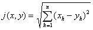
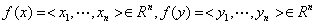
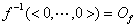
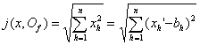
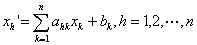
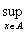

<b>§</b><b> </b><b>4&nbsp; </b><b>尺度空间与一致空间</b>

一、&nbsp; 一、&nbsp;&nbsp;&nbsp; 尺度空间

&nbsp;&nbsp;&nbsp; [尺度、距离与尺度空间]&nbsp; 假定<i>D</i>是一个集，<i>j</i>是一个把<i>D</i>&acute;<i>D</i>变进<i>R</i>1的变换，如果对于所有的<i>x</i><i>D</i>，<i>y</i><i>D</i>，<i>z</i><i>D</i>，满足条件：<i> </i>

&nbsp;&nbsp;&nbsp; (i)&nbsp; <i>j</i>（<i>x</i>，<i>y</i>）&sup3;0，等号只当<i>x</i>=<i>y</i>时成立，这里<i>j</i>（<i>x</i>，<i>y</i>）=<i>j</i>（&lt;<i>x</i>，<i>y</i>&gt;）；

&nbsp;&nbsp;&nbsp; (ii)&nbsp; <i>j</i>（<i>x</i>，<i>y</i>）=<i>j</i>（<i>y</i>，<i>x</i>）；

&nbsp;&nbsp;&nbsp; (iii)&nbsp; <i>j</i>（<i>x</i>，<i>y</i>）+<i>j</i>（<i>y</i>，<i>z</i>）&sup3;<i>j</i>（<i>x</i>，<i>z</i>）.

那末称<i>j</i>为<i>D</i>的一个尺度，<i>j</i>（<i>x</i>，<i>y</i>）是在<i>j</i>这个尺度下<i>x</i>和<i>y</i>的距离，<i>D</i>是以<i>j</i>为尺度的尺度空间（距离空间）.

&nbsp;&nbsp;&nbsp;
如果条件（i）中不附加“等号只当<i>x</i>=<i>y</i>时成立”，其余（ii），（iii）相同，那末称<i>j</i>为<i>D</i>的一个拟尺度.

&nbsp;&nbsp;&nbsp; [尺度空间的拓扑] &nbsp;假定<i>j</i>是集<i>D</i>的一个尺度，对一点<i>a</i><i>D</i>和一个实数<i>r</i>，把{<i>x</i>|<i>j</i>（<i>x</i>，<i>a</i>）&lt;<i>r</i>}（当<i>r</i>0时它表示空集）称为以<i>a</i>为球心<i>r</i>为半径的开球.所有开球全体所繁殖的拓扑称为<i>D</i>的尺度拓扑.实际上，所有开球的全体是这个拓扑的一个基.以后如果没有另外声明，凡是尺度空间都假定是以这个尺度拓扑为拓扑的拓扑空间.

&nbsp;&nbsp;&nbsp;
假定<i>a</i>是尺度空间里的一点，那末所有以<i>a</i>为球心，把有理数作为半径的开球的全体是<i>a</i>的一个邻域基.所以尺度空间一定是第一可数空间.此外也不难看到，尺度空间一定是<i>T</i>2空间.

&nbsp;&nbsp;&nbsp; [尺度化与尺度化定理]&nbsp; 假定一个拓扑空间<i>X</i>的承载点集有一个尺度，由这尺度得到的拓扑跟<i>X</i>原有的拓扑相等，那末称<i>X</i>可以尺度化.

&nbsp;&nbsp;&nbsp;
假定<i>Φ</i>是拓扑空间<i>X</i>里的一族点集的全体.如果<i>X</i>里每一点都有一个邻域至多只跟有限个属于<i>Φ</i>的点集有公共点，那末称<i>Φ</i>是局部有限的；特别如果任何两个属于<i>Φ</i>的点集的包都没有公共点，那末称<i>Φ</i>是绝缘的.

&nbsp;&nbsp;&nbsp;
定理&nbsp; 一个拓扑空间<i>X</i>可以尺度化的充分必要条件是：<i>X</i>为<i>T</i>3空间并且<i>X</i>的拓扑有一个基是可数个局部有限族的和集（这里“局部有限”可以改作“绝缘”，<i> T</i>3也可以改作<i>T</i>4）.

&nbsp;&nbsp;&nbsp; [<i>n</i>维欧氏空间与直角坐标法] &nbsp;假定<i>X</i>是一个以<i>j</i>为尺度的尺度空间，又假定存在一个把<i>X</i>变上<i>n</i>维实数空间<i>Rn</i>的一对一变换<i>f</i>，使对<i>X</i>里任何两点<i>x</i>和<i>y</i>，

<pre><i>&nbsp;&nbsp;&nbsp;&nbsp;&nbsp;&nbsp;&nbsp;&nbsp;&nbsp;&nbsp;&nbsp;&nbsp;&nbsp;&nbsp;&nbsp;&nbsp;&nbsp;&nbsp;&nbsp;&nbsp;&nbsp;&nbsp;&nbsp;&nbsp;&nbsp;&nbsp; </i></pre>

成立,这里，那末称<i>X</i>为<i>n</i>维欧几里得空间，简称<i>n</i>维欧氏空间，记作<i>En</i>，<i>f</i>是<i>En</i>的一个直角坐标法，称为点<i>x</i>的直角坐标，称为这直角坐标法下的原点.

<i>&nbsp;&nbsp;&nbsp; E n</i>的直角坐标法存在但是不唯一.假定<i>f</i>和<i></i>都是<i>E n</i>的直角坐标法，<i>f '</i>（<i>Of</i>）=&lt;<i>b</i>1
,×××,<i>bn</i>&gt;，而<i>E n</i>里任何一点<i>x</i>在<i>f</i>和<i>f '</i>下的坐标分别记作&lt;<i>x</i>1
,×××,<i>xn</i>&gt;和&lt;<i>x</i>1 ',×××,<i>xn'
</i>&gt;，那末由于

<pre>&nbsp;&nbsp;&nbsp;&nbsp;&nbsp;&nbsp;&nbsp;&nbsp;&nbsp;&nbsp;&nbsp;&nbsp;&nbsp;&nbsp;&nbsp;&nbsp;&nbsp;&nbsp;&nbsp;&nbsp;&nbsp;&nbsp;&nbsp;&nbsp;&nbsp;&nbsp;&nbsp;&nbsp; </pre>

得到

这里（<i>ahk</i>）是一个<i>n</i>&acute;<i>n</i>正交矩阵.

&nbsp;&nbsp;&nbsp;
反过来，只要（<i>ahk</i>）是任何一个<i>n</i>&acute;<i>n</i>正交矩阵,<i>b</i>1,×××,<i> b</i>n是任何<i>n</i>个实数，那末上面这组方程就代表了一个新的直角坐标法.所以直角坐标法是无限多的，而不同的直角坐标法间的变换就是通常所谓“转轴”、“移轴”的组合.

&nbsp;&nbsp;&nbsp;
此外，<i>En</i>的一个直角坐标法<i>f</i>实际上是把<i>En</i>变上<i>Rn</i>的一个拓扑变换，因此<i>En</i>里的一个开球在<i>f</i>下的象是<i>Rn</i>里的一族<i>n</i>维区间的和集，反过来，<i>Rn</i>里一个<i>n</i>维区间的象源是<i>En</i>里的开球的和集.

&nbsp;&nbsp;&nbsp;
因此在<i>Rn</i>里可以定一个尺度，使它成为<i>En</i>.这同时也就证明了<i>n</i>维欧氏空间的存在.

&nbsp;&nbsp;&nbsp; [空间的完备化] &nbsp;假定<i>X</i>是一个以<i>j</i>为尺度的尺度空间.如果&lt;<i>xn</i>|<i>n</i><i></i><i>ω</i>&gt;是<i>X</i>里的一个点列，对任何正数<i>e</i><i> </i>，总存在一个正整数<i>N</i>，使

<i>&nbsp;&nbsp;&nbsp;&nbsp;&nbsp;&nbsp;&nbsp;&nbsp;&nbsp;&nbsp;&nbsp;&nbsp;&nbsp;&nbsp;&nbsp;&nbsp;&nbsp;&nbsp;&nbsp;&nbsp;&nbsp;&nbsp;&nbsp;&nbsp;&nbsp;&nbsp;&nbsp;&nbsp;&nbsp;&nbsp;
j</i>（<i>xn</i>,<i> xm</i>）&lt;<i>e</i>

对比<i>N</i>大的一切正整数<i>n</i>和<i>m</i>都成立，那末称&lt;<i>xn</i>|<i>n</i><i></i><i>ω</i>&gt;是<i>X</i>里的柯西列.

&nbsp;&nbsp;&nbsp;
一个尺度空间里的任何一个收敛点列一定是柯西列，但是一个柯西列未必收敛.例如，把所有的有理数全体<i>S</i>看作一维实数空间<i>R</i>1的子空间的话，那末<i>S</i>里的柯西列就可能不收敛（因为它的极限可能是无理数）.

&nbsp;&nbsp;&nbsp;
如果一个尺度空间<i>X</i>里的任何柯西列都收敛，那末称<i>X</i>完备.

&nbsp;&nbsp;&nbsp;
假定<i>X</i>和<i>X'</i>都是尺度空间，<i>X'</i>完备，又假定存在一个把<i>X</i>等尺度同胚地变进<i>X'</i>的变换<i>f</i>，并且<i>X</i>的象<i>f</i>（<i>X</i>）在<i>X'</i>里处处稠密，那末称<i>X'</i>为<i>X</i>的完备化.

&nbsp;&nbsp;&nbsp;
定理&nbsp; 任何一个尺度空间都有完备化，并且任何两个完备化等尺度同胚.

&nbsp;&nbsp;&nbsp;
只要把尺度空间里一个柯西列看作一个元素，适当规定两个柯西列的距离（距离等于零时，认为两个元素是相同的）不难证明所有这些元素全体就是一个完备化.

&nbsp;&nbsp;&nbsp;
把两个实数的差的绝对值看作这两个实数的距离，那末一维实数空间<i>R</i>1就是所有的有理数全体的完备化.可以用这个办法来建立无理数的概念.

&nbsp;&nbsp;&nbsp;
柯西列当然可以推广成柯西网.不过由于尺度空间满足第一可数公理，用柯西网概念只能得到同样的完备化.

&nbsp;&nbsp;&nbsp; [有界变换族的一致收敛拓扑] &nbsp;假定<i>A</i>是一个集，<i>Y</i>是一个尺度空间，把<i>A</i>变进<i>Y</i> 的所有有界变换（把<i>A</i>变进一个开球的变换称为有界变换）的全体记作<i>F</i>.在<i>F</i>里规定距离如下：设<i>f</i><i>F</i>，<i>g</i><i>F</i>，则它们的距离

<i>&nbsp;&nbsp;&nbsp;&nbsp;&nbsp;&nbsp;&nbsp;&nbsp;&nbsp;&nbsp;&nbsp;&nbsp;&nbsp;&nbsp;&nbsp;&nbsp;&nbsp;&nbsp;&nbsp;&nbsp;&nbsp;&nbsp;
J</i>（<i>f</i>，<i>g</i>）= <i>j</i>（<i>f</i>（<i>x</i>），<i>g</i>（<i>x</i>））

这里<i>j</i>表示<i>Y</i>里的尺度.由<i>J</i>所产生的<i>F</i>的尺度拓扑称为<i>F</i>的一致收敛拓扑.

&nbsp;&nbsp;&nbsp;
注意，<i>F</i>的一致收敛拓扑只用<i>Y</i>的尺度定义，没有牵涉到<i>A</i>的拓扑.

&nbsp;&nbsp;&nbsp;
定理 有界变换族<i>F</i>的一致收敛拓扑跟其他拓扑比较起来其特点是：在这拓扑下，<i>F</i>里任何一个点网&lt;<i>fp</i>|<i>p</i><i>Q</i>&gt;收敛的充分必要条件是：对所有的<i>x</i><i>A</i>, &lt;<i>fp</i>(<i>x</i>)|<i>p</i><i>Q</i>&gt;在<i>A</i>里一致收敛（也就是对任何正数<i>e</i> ，存在一个<i>q</i><i>Q</i>，是对所有的<i>x</i><i>A</i>和<i>Q</i>里所有的<i>p&gt;q</i>,

<i>&nbsp;&nbsp;&nbsp;&nbsp;&nbsp;&nbsp;&nbsp;&nbsp;&nbsp;&nbsp;&nbsp;&nbsp;&nbsp;&nbsp;&nbsp;&nbsp;&nbsp;&nbsp;&nbsp;&nbsp;&nbsp;&nbsp;&nbsp;&nbsp;&nbsp;&nbsp;&nbsp;&nbsp;
j</i>（<i>fp</i>(<i>x</i>)，<i>fq</i>(<i>x</i>)）&lt;<i>e</i>

成立）.

<i>&nbsp;&nbsp;&nbsp; F</i>可以看作<i>AY</i>的子集.因此<i>AY </i>的点点收敛拓扑在<i>F</i>里有诱导拓扑，不妨称为<i>F</i>的点点收敛拓扑，因为同样是用“点点收敛”当收敛的.比较起来，一致收敛拓扑比点点收敛拓扑细.因为在一致收敛拓扑下，对每一点<i>f</i><i>F</i>，所有的集{<i>g</i>|对所有的<i>x</i><i>A</i>, <i>j</i>（<i>g</i>（<i>x</i>），<i>f</i>（<i>x</i>））&lt;<i>e</i> }（<i>e</i> 是一个任意正数）构成一个邻域基.而在点点收敛拓扑下，对每个<i>f</i><i>F</i>，所有的集{<i>g</i>|存在有限个<i>x</i><i>A</i>使<i>j</i>（<i>g</i>(<i>x</i>)，<i>f</i>(<i>x</i>)）&lt;<i>e</i> }构成一个邻域基.后一个邻域基里的每一个集显然都掩盖前一个邻域基里的一个集，但是倒过来说不行.

