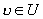

二、&nbsp;&nbsp;&nbsp;&nbsp;&nbsp;&nbsp;&nbsp;
二、&nbsp;&nbsp;&nbsp;&nbsp; 一致空间

&nbsp;&nbsp;&nbsp; [复合关系与逆关系]&nbsp; 假设<i>X</i>是一个集，<i>u</i>和<i></i>是<i>X</i>里的两个关系（即是<i>uX</i>&acute;<i>X</i>，<i>vX</i>&acute;<i>X</i>）,规定

<i>&nbsp;&nbsp;&nbsp;&nbsp;&nbsp;&nbsp;&nbsp;&nbsp;&nbsp;&nbsp;
&nbsp;&nbsp;&nbsp;&nbsp;&nbsp;&nbsp;&nbsp;&nbsp;&nbsp;&nbsp;u</i>={&lt;<i>x</i>,<i>y</i>&gt;|<i>xX</i>,<i>yX</i>，并且存在<i>zX</i>，使

&lt;<i>x</i>,<i>z</i>&gt;<i>u</i>并且&lt;<i>z</i>,<i>y</i>&gt;<i></i>}

<i>u</i>当然也是<i>X</i>里的一个关系，称为<i>u</i>和<i></i>的复合关系.

&nbsp;&nbsp;&nbsp; 再规定

<i>u
</i>-1 ={&lt;<i>x</i>,<i>y</i>&gt;|&lt;<i>y</i>,<i>x</i>&gt;<i>u</i>}，

那末<i>u </i>-1也是<i>X</i>里的一个关系，称为<i>u</i>的逆关系.

&nbsp;&nbsp;&nbsp; 容易证明

（<i>u</i>）-1=<i> V </i>-1<i>u </i>-1

&nbsp;&nbsp;&nbsp; [一致空间]&nbsp; 假定<i>X</i>是一个集，<i>U</i>是<i>X</i>里的一个不空的关系族（即<i>U</i>&sup1;<i>φ</i>并且<i>U</i>&Iacute;<i>X</i>&acute;<i>X</i>2），并且满足条件：

&nbsp;&nbsp;&nbsp; (i)&nbsp; 若<i>uU</i>，则对任何<i>xX</i>,&lt;<i>x</i>,<i>x</i>&gt;<i>u</i>；

&nbsp;&nbsp;&nbsp; (ii) 若<i>uU</i>，则存在<i></i><i>U</i>，使<i></i><i>u</i>；

&nbsp;&nbsp;&nbsp; (iii) 若<i>uU</i>，则<i>u</i>∩<i></i><i>U</i>；

&nbsp;&nbsp;&nbsp; (iv) 若<i>uU</i>，<i>u X</i>&acute;<i>X</i>，则<i> </i><i></i><i>U</i>；

&nbsp;&nbsp;&nbsp; (v) 若<i>uU</i>，则<i>u</i>-1<i></i><i>U </i>.

&nbsp;&nbsp;&nbsp; 那末称<i>U</i>为<i>X</i>的一个一致性，&lt;<i>X</i>,<i>U</i>&gt;称为一致空间（有时称<i>X</i>是在<i>U</i>这个一致性下的一致空间）.

&nbsp;&nbsp;&nbsp; 把满足条件（i）—（iv）的<i>U</i>称为<i>X</i>的一个拟一致性，对应的&lt;<i>X</i>,<i>U</i>&gt;称为拟一致空间.

&nbsp;&nbsp;&nbsp; 如果<i>U</i>和<i>U'</i>是集<i>X</i>的两个一致性，<i>UU'</i>，那末称<i>U</i>比<i>U'</i>粗，<i>U'</i>比<i>U</i>细.

&nbsp;&nbsp;&nbsp; 假定集<i>X</i>里有一个不空的关系族<i>V</i>，满足定义所说条件（i）和（ii），那末<i>X</i>的所有掩盖<i>V</i>的一致性的通集<i>U</i>0也是一个一致性，是能掩盖<i>V</i>的最粗的一致性，称为<i>V</i>所繁殖的一致性，<i>V</i>称为<i>U</i>0的一个亚基<a href="#None" name="_ftnref1" title="">*</a>.假定<i>V</i>是一致性<i>U</i>0的亚基，并且对任何<i>uU</i>0存在<i></i><i>V</i>使<i></i><i>u</i>，那末称<i>V</i>为<i>U</i>0的一个基.

&nbsp;&nbsp;&nbsp; 对任何一个集<i>X</i>，由{{&lt;<i>x</i>,<i>x</i>&gt;|<i>xX</i>}}所繁殖的一致性是最细的一致性.

&nbsp;&nbsp;&nbsp; 尺度空间可以看作一致空间的特例：假定<i>X</i>是一个尺度空间，把<i>X</i>里的关系族{{&lt;<i>x</i>,<i>y</i>&gt;|<i>x</i>和<i>y</i>的距离小于<i>γ</i>}|<i>γ</i>是一个正数}所繁殖的一致性称为由<i>X</i>的尺度产生的一致性.通常除特别声明外，一个尺度空间<i>X</i>总是看作在这个一致性下的一致空间.实际上，上面“<i>γ</i>是一个正数”的条件可以改作“<i>γ</i>是一个正有理数”（由于一致性的条件（iv）），所以由尺度产生的一致性一定有可数的基.

&nbsp;&nbsp;&nbsp; [一致拓扑与一致空间的尺度化]&nbsp; 假定&lt;<i>X</i>,<i>U</i>&gt;是一个一致空间.对<i>xX</i>，<i>uU</i>，把{<i>y</i>|&lt;<i>x</i>,<i>y</i>&gt;<i>u</i>}记作<i>u</i>[<i>x</i>]，称为<i>x</i>的一个邻域.由所有这种邻域所繁殖的拓扑称为<i>X</i>的一致拓扑.以后如果不另外声明，一个一致空间<i>X</i>总是看作在一致拓扑下的拓扑空间.

&nbsp;&nbsp;&nbsp; 如果在一个一致空间里可以规定一个尺度，由这尺度产生的一致性跟原来的一致性相同，那末称这一致空间是可以尺度化.

&nbsp;&nbsp;&nbsp; 一个一致空间可以尺度化的充分必要条件是：它的一致性有可数的基，并且它是<i>T</i>2空间.一个一致空间可以拟尺度化的充分必要条件是：它的一致性有可数的基.

&nbsp;&nbsp;&nbsp; [一致连续与一致同构变换]&nbsp; 假定&lt;<i>X</i>,<i>U</i>&gt;和&lt;<i>Y</i>,<i>V</i>&gt;是两个一致空间，<i>f</i>是一个把<i>X</i>变进<i>Y</i>的变换，如果对任何<i></i><i>V</i>，总存在<i>uU</i>，使对所有的&lt;<i>x</i>,<i>y</i>&gt;<i>u</i>,&lt;<i>f</i>（<i>x</i>）,<i>f</i>（<i>y</i>）&gt;<i></i>成立，那末称<i>f</i>为一致连续.一致连续必定连续，但是在一致拓扑下连续不一定一致连续.

&nbsp;&nbsp;&nbsp; 一个变上的可逆一致连续变换称为一致同构变换.一致同构变换一定是同胚变换，但是反过来说不一定对.

&nbsp;&nbsp;&nbsp; [一致收敛]&nbsp; 假定&lt;<i>Y</i>,<i>V</i>&gt;是一个一致空间，<i>X</i>是一个集，又假定&lt;<i>fp</i>|<i>pQ</i>&gt;是<i>X</i><i>Y</i>里的一个点网，<i>f XY </i>，如果对任何<i></i><i>V</i>，存在一个<i>qQ</i>使对所有的<i>p</i>&gt;<i>q</i>和所有的<i>xX</i>，

&nbsp;&nbsp;&nbsp;&nbsp;&nbsp;&nbsp; &nbsp;&nbsp;&nbsp;&nbsp;&nbsp;&nbsp;&nbsp;&nbsp;&nbsp;&nbsp;&nbsp;&nbsp;&nbsp;&nbsp;&nbsp;&nbsp;&lt;<i>fp</i>（<i>x</i>），<i>f</i>（<i>x</i>）&gt;<i>V</i>

成立，那末称&lt;<i>fp</i>|<i>pQ</i>&gt;一致收敛于<i>f</i>.

&nbsp;&nbsp;&nbsp; 假定&lt;<i>Y</i>,<i>V</i>&gt;是一致空间，<i>X</i>是一个集，那末还可以对<i>X</i><i>Y </i>规定一个一致收敛的一致性如下：对任何<i></i><i>V</i>，可以得到<i>X</i><i>Y </i>里的一个关系<i>w</i>

<i>&nbsp;&nbsp;&nbsp;&nbsp;&nbsp;&nbsp;&nbsp;&nbsp;&nbsp;&nbsp;&nbsp;&nbsp;&nbsp;&nbsp;
w</i> ={&lt;<i>f</i>,<i>g</i>&gt;|对所有的<i>x XX</i>，&lt;<i>f</i>（<i>x</i>），<i>g</i>（<i>x</i>）&gt;<i></i>成立}.

所有这些<i>w</i>的全体所繁殖的一致性称为<i>X</i><i>Y </i>的一致收敛的一致性.由这一致性所产生的拓扑称为<i>X</i><i>Y </i>的一致收敛拓扑.可以看到，<i>X</i><i>Y </i>里的一个点网一致收敛就是在一致收敛拓扑下收敛的意思.

 

 

<a href="#None" name="_ftn1" title="">*</a> 有些文献上规定亚基<i>V</i>
除了满足条件（i）和（ii）外还满足：对任何<i>u</i><i></i><i>V</i>,存在<i> </i><i></i><i>V</i>，使 <i></i><i>u</i>-1.

