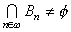
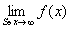

<b>§</b><b>5 </b><b>紧致点集与联结点集</b>

一、&nbsp; 一、&nbsp;&nbsp;&nbsp; 紧致点集

&nbsp;&nbsp;&nbsp; [紧致点集及其性质] &nbsp;假定<i>S</i>是一个拓扑空间里的一个点集，<i>S</i>的任何一个合盖开集族都一定有有限合盖子族，那末称<i>S</i>为紧致点集，或称<i>S</i>紧致.

&nbsp;&nbsp;&nbsp;
紧致点集具有性质：

1°&nbsp;&nbsp;&nbsp;&nbsp;&nbsp;&nbsp;
1°&nbsp; 紧致点集在连续变换下的象是紧致的.

2°&nbsp;&nbsp;&nbsp;&nbsp;&nbsp;&nbsp;
2°&nbsp; 一个拓扑空间里的点集<i>S</i>紧致的充分必要条件是：<i>S</i>的任何一个无限子集<i>Q</i>都至少有一个聚点<i>x</i>0<i>S</i>，并且对<i>x</i>0的任何邻域<i>G</i>，

&nbsp;&nbsp;&nbsp;&nbsp;&nbsp;&nbsp;&nbsp;&nbsp;&nbsp;&nbsp;&nbsp;&nbsp;&nbsp;&nbsp;&nbsp;&nbsp;&nbsp;&nbsp;&nbsp;&nbsp;&nbsp;&nbsp;&nbsp;
card(<i>G</i>∩<i>Q</i>)=card(<i>Q</i>)

(card的定义见§2).

3°&nbsp;&nbsp;&nbsp;&nbsp;&nbsp;&nbsp;
3°&nbsp; 一个拓扑空间里的点集<i>S</i>紧致的充分必要条件是：<i>S</i>里任何一个点网都有子网收敛于一点<i>x</i>0<i>S </i>.

4°&nbsp;&nbsp;&nbsp;&nbsp;&nbsp;&nbsp;
4°&nbsp; 紧致点集的相对闭集紧致.

5°&nbsp;&nbsp;&nbsp;&nbsp;&nbsp;&nbsp;
5°&nbsp; <i>T</i>2空间里的紧致点集为闭.

6°&nbsp;&nbsp;&nbsp;&nbsp;&nbsp;&nbsp;
6°&nbsp; 正则空间里的紧致点集的包紧致.

7°&nbsp;&nbsp;&nbsp;&nbsp;&nbsp;&nbsp;
7°&nbsp; 尺度空间里的点集<i>S</i>紧致的充分必要条件是：<i>S</i>全有界（即对任何正数<i>r</i>，<i>S</i>总能被有限个半径等于<i>r</i>的开球所合盖）并且完备.特别<i>n</i>维欧氏空间<i>En</i>里的点集<i>S</i>紧致的充分必要条件是：<i>S</i>有界并且闭.

8°&nbsp;&nbsp;&nbsp;&nbsp;&nbsp;&nbsp;
8°&nbsp; 一个分散点集<i>S</i>紧致的充分必要条件是：<i>S</i>有限.

9°&nbsp;&nbsp;&nbsp;&nbsp;&nbsp;&nbsp;
9°&nbsp; 一个拓扑空间里的点集<i>S</i>紧致的充分必要条件是：<i>S</i>的任何一族有限相交（即族里任何有限个集的通集都不空）的相对闭集的通集不空.

&nbsp;&nbsp;
10o&nbsp; 康托定理
假定&lt;<i>Bn</i>|<i>n</i><i></i><i>ω</i>&gt;是紧致点集<i>S</i>的不空的相对闭集，每个<i>Bn</i>&Eacute;<i> Bn</i>+1,(<i>n</i>=0，1，×××）那末.

&nbsp;&nbsp;
11o&nbsp; 吉洪诺夫定理
一族紧致空间的拓扑乘积紧致.

&nbsp;&nbsp;&nbsp; [变换族的紧致-开拓扑] &nbsp;假定<i>X</i>和<i>Y</i>是两个拓扑空间.在叠集<i>XY</i>（所有把<i>X</i>变进<i>Y</i>的变换全体）里造一个拓扑如下：对<i>Y</i>里任何一个开集<i>V</i>，<i>X</i>里任何一个紧致集<i>K</i>，所有把<i>K</i>变进<i>V</i>的变换全体<i>W</i>（<i>K</i>，<i>V</i>）规定为<i>XY </i>里的一个开集，并且从所有这种开集<i>W</i>（<i>K</i>，<i>V</i>）繁殖一个拓扑.这拓扑称为<i>XY </i>的紧致-开拓扑.

1°&nbsp;&nbsp;&nbsp;&nbsp;&nbsp;&nbsp;
1°&nbsp; 假定<i>X</i>是一个拓扑空间，<i>Y</i>是一个尺度空间，那末对属于<i>XY </i>的所有连续变换的全体<i>C</i>来说，跟<i>XY </i>别的拓扑比起来，紧致-开拓扑的特点是：任何一个连续变换网&lt;<i>fp</i>|<i>p</i><i>Q</i>&gt;收敛的充分必要条件是：对<i>X</i>里任何一个紧致集，&lt;<i>fp</i>(<i>x</i>)|<i>p</i><i>Q</i>&gt;在<i>K</i>里一致收敛.

因此，所有连续变换的全体<i>C</i>在<i>XY </i>的紧致-开拓扑下是闭集.

1°中“<i>Y</i>是尺度空间”可以改做“<i>Y</i>是一致空间”.

2°&nbsp;&nbsp;&nbsp;&nbsp;&nbsp;&nbsp;
2°&nbsp; 阿斯可里定理
假定<i>X</i>是一个正则局部紧致空间<a href="#None" name="_ftnref1" title="">*</a>，<i>Y</i>是一个以<i>j</i>为尺度的尺度空间，<i>C</i>表示所有把<i>X</i>变进<i>Y</i>的连续变换的全体.那末<i>C</i>的一个子族<i>F</i>在<i>XY </i>的紧致-开拓扑下紧致的充分必要条件是：

&nbsp;&nbsp;&nbsp; (i) <i>&nbsp;F</i>是<i>C</i>的相对闭集；

&nbsp;&nbsp;&nbsp; (ii) 对<i>X</i>里每一点<i>x</i>，<i>x</i>在所有属于<i>F</i>的变换下的象的全体的包是<i>Y</i>里的紧致集；

&nbsp;&nbsp;&nbsp; (iii) <i>F</i>同等连续（即假定<i>x</i>0是<i>X</i>里的一点，如果对任何正数<i>e</i>，总存在一个<i>x</i>0的邻域<i>V</i>，使对任何<i>x</i><i>V</i>和任何<i>f</i><i>F</i>，都有<i>j</i>（<i>f</i>（<i>x</i>），<i>f</i>（<i>x</i>0））&lt;<i>e</i>）.

&nbsp;&nbsp;&nbsp;
定理中“<i>Y</i>是一个尺度空间”可以改为“<i>Y</i>是一个<i>T</i>2一致空间”.

&nbsp;&nbsp;&nbsp; [紧致化] &nbsp;假定<i>X</i>是一个拓扑空间，<i>X*</i>是一个紧致空间.如果存在一个同胚变换<i>f</i>把<i>X</i>变进<i>X*</i>，并且<i>f</i>（<i>X</i>）在<i>X*</i>里处处稠密，那末称<i>X*</i>（或称&lt;<i>f </i>,<i>X*</i>&gt;）是<i>X</i>的一个紧致化.这时候，往往把<i>X</i>和<i>f</i>（<i>X</i>）混同起来，于是把<i>X</i>看成<i>X*</i>的子集.

1°&nbsp;&nbsp;&nbsp;&nbsp;&nbsp;&nbsp;
1°&nbsp;&nbsp;&nbsp; 单点紧致化&nbsp; 假定<i>X</i>是一个拓扑空间，<i>X</i>的承载点集记作<i>D</i>.随便把一个不属于<i>D</i>的事物记作∞.用<i>D</i>∪{∞}的下列两种子集的全体当拓扑亚基：（i）<i>X</i>里的开集，（ii）<i>X</i>里任何一个紧致闭集在<i>D</i>∪{∞}里的余集.由这个亚基得到<i>D</i>∪{∞}的一个拓扑<i>τ</i><i>*</i>.拓扑空间<i>X*</i>=&lt;<i> D</i>∪{∞},<i>τ*</i>&gt;是一个紧致空间.在恒等变换下，<i>X</i>同胚地变进<i>X*</i>并且<i>X</i>在<i>X*</i>里处处稠密，因此<i>X*</i>是<i>X</i>的一个紧致化，称为<i>X</i>的单点紧致化，∞称为<i>X*</i>里的无限远点.

&nbsp;&nbsp;&nbsp;
一维复数空间<i>C</i>1的单点紧致化称为复数球面.

&nbsp;&nbsp;&nbsp;
一维实数空间<i>R</i>1的单点紧致化跟圆周同胚.

2°&nbsp;&nbsp;&nbsp;&nbsp;&nbsp;&nbsp;
2°&nbsp;&nbsp;&nbsp; 广一维实数空间&nbsp; 随便把两个不是实数的东西（如{}和）记作∞和

-∞，在<i>R</i>1∪{∞}∪{-∞}里把所有下列点集的全体当拓扑亚基：（i）<i>R</i>1里的开集，（ii）（<i>a</i>,∞）∪{∞}，（iii）（-∞,<i>b</i>）∪{-∞}.用这个拓扑亚基所繁殖的拓扑当拓扑，<i>R</i>1∪{∞}∪{-∞}是一个紧致空间，称为广一维实数空间，是在恒等变换<i>f</i>({ <i>x</i>=<i>f</i>(<i>x</i>)|<i>x</i><i> R</i>1<i> </i>})下的<i>R</i>1的一个紧致化.

&nbsp;&nbsp;&nbsp;
在广一维实数空间里，∞是任何一个无上界的实数集合的聚点.假如<i>f</i>是把一个无上界的实数集<i>S</i>变进一拓扑空间的变换，那末由于∞是<i>S</i>的一个聚点，的意义就包括在§3，四的极限定义中了.

 

 

<a href="#None" name="_ftn1" title="">*</a> 一个拓扑空间里的每点都有一个紧致的邻域，就是把它称为局部紧致空间.

