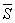

二、&nbsp;&nbsp;&nbsp;&nbsp;&nbsp;&nbsp;&nbsp;
二、&nbsp;&nbsp;&nbsp; 联结点集

&nbsp;&nbsp;&nbsp; [联结点集×区域×连续域]&nbsp; 假定一个拓扑空间里的点集不是两个没有公共点的不空的相对闭集的和集，那末称它为一个联结点集.联结的开集称为区域.不止包含一点的联结的闭集称为连续域.

&nbsp;&nbsp;&nbsp;
注意，在§2，六里“连续域假设”指的是一维实数空间<i>R</i>1里的连续域.

&nbsp;&nbsp;&nbsp;
在上面联结点集的定义中，“相对闭集”显然也可以改为“相对开集”.

&nbsp;&nbsp;&nbsp;
联结点集的定义也可以改为“没有不空的相对既开又闭的真子集的点集”.

&nbsp;&nbsp;&nbsp; [联结点集的性质]

1°&nbsp;&nbsp;&nbsp;&nbsp;&nbsp;&nbsp;
1°&nbsp; 联结点集在连续变换下的象联结.

2°&nbsp;&nbsp;&nbsp;&nbsp;&nbsp;&nbsp;
2°&nbsp; 如果<i>S</i>是联结点集，<i>A</i><i></i>，那末<i>S</i>∪<i>A</i>联结.特别，联结点集<i>S</i>的包<i></i>联结.

3°&nbsp;&nbsp;&nbsp;&nbsp;&nbsp;&nbsp;
3°&nbsp; 如果一族联结点集的通集不空，那末这族联结点集的和联结.

4°&nbsp;&nbsp;&nbsp;&nbsp;&nbsp;&nbsp;
4°&nbsp; 一维实数空间<i>R</i>1里的联结点集只有下列九种：<i>R</i>1自己，（<i>a</i>，<i>b</i>），（<i>a</i>，<i>b</i>]，[<i>a</i>,<i>b</i>),[<i>a</i>，<i>b</i>]，（<i>a</i>，∞),[<i>a</i>,∞),(-∞,<i>b</i>),(-∞,<i>b</i>,这里<i>a</i>和<i>b</i>表示任意实数.

&nbsp;&nbsp;&nbsp;
性质1°可以看作微分学中下述定理的推广：假定<i>f</i>是一个区间里的连续实函数，取到两个数值<i>a</i>和<i>b</i>，那末一定取到<i>a</i>和<i>b</i>间的任何一个数值.

&nbsp;&nbsp;&nbsp; [用线联结的点集]&nbsp; 实数闭区间[<i>a</i>，<i>b</i>]有一个变进一个拓扑空间<i>X</i>的连续变换下的象称为这空间<i>X</i>里的一条曲线.如果一个拓扑空间里的一个点集里的任何两点都属于这点集的一条子曲线，那末称这点集是用线联结的.

&nbsp;&nbsp;&nbsp;
用线联结的点集联结.

&nbsp;&nbsp;&nbsp; [局部联结与局部用线联结] &nbsp;拓扑空间里的一个点集，如果它的任何一点的任何一个相对邻域一定掩盖这一点的一个联结的相对邻域，那末称这个点集局部联结.如果“联结”换作“用线联结”，那末称这点集局部用线联结.

&nbsp;&nbsp;&nbsp;
例如<i>n</i>维欧氏空间<i>En</i>里任何一个开集都是局部用线联结的，这是因为任何一个开球都是用线联结的.

&nbsp;&nbsp;&nbsp;
一个局部用线联结的点集联结的充分必要条件是：它用线联结.特别<i></i>里的开集是区域的充分必要条件是：它用线联结.

&nbsp;&nbsp;&nbsp; [独立片与全不联结] &nbsp;假定拓扑空间里一个点集的一个子集联结并且不是别的联结子集的真子集，那末称这子集为这点集的一个独立片.

&nbsp;&nbsp;&nbsp;
拓扑空间的一个点集是它的所有独立片的和集，每个独立片都是相对闭集，任何两个不同的独立片没有公共点.特别，开集的每个独立片都是区域，所以是相对既开又闭的子集.开集是一族两两没有公共点的区域的和集.闭集的每个不止包含一点的独立片是连续域，闭集是一族两两没有公共点的联结闭集的和集.

&nbsp;&nbsp;&nbsp;
注意，无限个两两没有公共点的联结闭集的和集不一定是闭集.

&nbsp;&nbsp;&nbsp;
假定一个拓扑空间里的一个点集的每个独立片都只包含一点，那末称这点集全不联结.例如<i>R</i>1里的有理数全体和无理数全体都是全不联结的.

