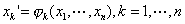

<b>§</b><b> </b><b>6&nbsp; </b><b>流</b><b>&nbsp;&nbsp; </b><b>形</b>

&nbsp;&nbsp;&nbsp; [<i>n</i>维实流形]&nbsp; 假定<i>M</i>是<i>T</i>2联结空间，<i>M</i>有一个合盖开集族<i>S</i>，对每个开集<i>V</i><i></i><i>S</i>，存在一个拓扑变换<i>fV</i>把<i>V</i>变上一个<i>n</i>维区间，那末称{<i> fV</i>|<i>V</i><i></i><i>S</i><i> </i>}为<i>M</i>的一个<i>n</i>维实流形结构，称<i>M</i>是一个<i>n</i>维实流形.

&nbsp;&nbsp;&nbsp; [局部坐标法]&nbsp; 假定{<i> fV</i>|<i>V</i><i></i><i>S</i><i> </i>}是流形<i>M</i>的一个流形结构，那末称每个<i>V</i><i></i><i>S</i>是坐标区域.每个<i>fV </i>是<i>V</i>里的局部坐标法，对每点<i>x</i><i>V</i>，

<i></i>

称为<i>x</i>的坐标，实数<i>xk</i>（<i>k</i>=1,××× ,<i>n</i>）称为<i>x</i>的第<i>k</i>个坐标.

&nbsp;&nbsp;&nbsp; [衔接关系] &nbsp;假定<i>V</i><i></i><i>S</i>，<i>V'</i><i></i><i>S</i>，<i>V</i>∩<i>V'</i>&sup1;<i>φ</i> ，那末每一点<i>x</i><i>V</i>∩<i>V'</i>在<i>fV
</i>和<i>fV' </i>这两个局部坐标法下各有坐标<i></i>和<i></i>，它们的关系可表示为

<pre><i>&nbsp;&nbsp;&nbsp;&nbsp;&nbsp;&nbsp;&nbsp;&nbsp;&nbsp;&nbsp;&nbsp;&nbsp;&nbsp;&nbsp;&nbsp;&nbsp;&nbsp;&nbsp;&nbsp; </i>&nbsp;（1）</pre>

由流形的定义，是把<i>fV</i>（<i>V</i>∩<i>V'</i>）变上<i>fV'</i>（<i>V</i>∩<i>V'</i>）的拓扑变换，称为从局部坐标法<i>fV </i>到局部坐标法<i>fV' </i>的衔接关系.

&nbsp;&nbsp;&nbsp; [微分结构与微分流形] &nbsp;假定{<i> fV </i>|<i>V</i><i></i><i>S</i><i> </i>}是流形<i>M</i>的一个流形结构，是从<i>fV</i><i> </i>到<i>fV' </i>的衔接关系. 的表达式（1）可以改写为方程组

<i>&nbsp;&nbsp;&nbsp;&nbsp;&nbsp;&nbsp;&nbsp;&nbsp;&nbsp;&nbsp;&nbsp;&nbsp;&nbsp;&nbsp;&nbsp;&nbsp;&nbsp;&nbsp;&nbsp;&nbsp;&nbsp;&nbsp;&nbsp;&nbsp;&nbsp;&nbsp;&nbsp;&nbsp;
</i>（2）

如果（2）中各个函数<i></i>在<i>fV</i>（<i>V</i>∩<i>V'</i>）里关于实变数<i>x</i>1,×××,<i>x</i>n的1到<i>m</i>各阶偏导数都存在并且连续，那末称是<i>m</i>级可连续微分的.如果每个的各阶偏导数在<i>fV</i>（<i>V</i>∩<i>V'</i>）里都存在（因此都连续），那末称是∞级可连续微分的.如果每个在<i>fV</i>（<i>V</i>∩<i>V'</i>）里解析（即在每点&lt;<i>x</i>10,×××,<i>x</i>n0&gt;（<i>fV</i>（<i>V</i>∩<i>V'</i>））的一个邻域里,(<i> x</i>1,×××,<i>x</i>n)都可以展开成<i>n</i>个实变数<i></i>的幂级数），那末称是解析的或者<i>ω</i>级可连续微分的.

&nbsp;&nbsp;&nbsp;
如果一个流形结构{<i> fV</i>|<i>V</i><i></i><i>S</i><i> </i>}的所有衔接关系都是<i>m</i>级可连续微分的（因此都是可逆<i>m</i>级可连续微分的），那末称它为<i>m</i>级微分结构.如果一个流形结构的所有衔接关系都是∞级可连续微分的，那末称它为∞级微分结构.如果一个流形结构的所有衔接关系都是解析的，那末称它为解析结构.

&nbsp;&nbsp;&nbsp;
假定一个实流形<i>M</i>的一个流形结构{<i> fV</i>|<i>V</i><i></i><i>S</i><i> </i>}是<i>m</i>阶微分结构或者∞级微分结构或者实解析结构，那末分别说<i>M</i>是这结构下的<i>m</i>级微分流形或者∞级微分流形或者实解析流形.

&nbsp;&nbsp;&nbsp;
[微分结构的等价]&nbsp; 假定{<i> fV</i>|<i>V</i><i></i><i>S</i><i> </i>}是流形<i>M</i>的一个<i>m</i>级微分结构.又假定<i>G</i>是<i>M</i>里的一个开集，<i>f</i>是在<i>G</i>里定义的一个函数.对每一点<i>x</i><i>G</i>∩<i>V</i>（<i>V</i><i></i><i>S</i>），<i>f</i>（<i>x</i>）可以表示为

<i>f</i>（<i>x</i>）=（<i></i>）

假定关于<i></i>这<i>n</i>个实变数的1到<i>k</i>（0<i>k</i><i>m</i>）各阶偏导数都连续，那末称<i>f</i>在<i>G</i>∩<i>V</i>里可<i>k</i>级连续微分.如果<i>f</i>在每个<i>G</i>∩<i>V</i>（<i>V</i><i></i><i>S</i>）里都可<i>k</i>级连续微分，那末称<i>f</i>在<i>G</i>里可<i>k</i>级连续微分，记作<i>f</i><i>Ck</i>（<i>G</i>），由于{<i> fV</i>|<i>V</i><i></i><i>S</i><i> </i>}的所有衔接关系都可<i>m</i>级连续微分，并且假设0<i>k</i><i>m</i>，上面这样的定义对任何<i>x</i><i>V</i>∩<i>V'</i>（<i>V</i><i></i><i>S</i><i>, V'</i><i></i><i>S</i>）都不会产生矛盾.

&nbsp;&nbsp;&nbsp;
设{<i> fV</i>|<i>V</i><i></i><i>S</i><i> </i>}和{<i> fW</i>|<i>W</i><i></i><i>π </i>}是流形<i>M</i>的两个<i>m</i>级微分结构（其中<i>π</i>
也是<i>M</i>的一个合盖开集族）.如果{<i> fV</i>|<i>V</i><i></i><i>S</i><i> </i>}∪{<i> fW</i>|<i>W</i><i></i><i>π </i>}是<i>M</i>的一个<i>m</i>级微分结构，那末称{<i> fV</i>|<i>V</i><i></i><i>S</i><i> </i>}和{<i> fW</i>|<i>W</i><i></i><i>π </i>}等价.流形<i>M</i>的两个<i>m</i>级微分结构等价的充分必要条件是：对<i>M</i>里任何开集<i>G</i>，它们所决定的各个函数族<i>Ck</i>（<i>G</i>）(<i>k</i>=0，1，×××，<i>m</i>）一致.

&nbsp;&nbsp;&nbsp;
流形<i>M</i>的两个∞级微分结构等价或两个实解析结构等价的概念也可类似地定义.

&nbsp;&nbsp;&nbsp; [可定向流形] &nbsp;假定<i>n</i>维实数空间里的一点<i></i>的一个邻域被一个拓扑变换<i>f</i>变上一点<i></i>的一个邻域，即<i>f</i>（<i></i>）=<i></i>.如果<i>f</i>可逆连续微分，并且雅可比式

&nbsp;&nbsp;&nbsp;&nbsp;&nbsp;&nbsp;&nbsp;&nbsp;&nbsp;&nbsp;&nbsp;&nbsp;&nbsp;&nbsp;&nbsp;&nbsp;&nbsp;&nbsp;&nbsp;&nbsp;

那末称<i>f</i>在<i></i>这一点保持架势.

&nbsp;&nbsp;&nbsp;
如果<i>f</i>不可微分，用差商（见第五章）代替偏导数同样可规定<i>f</i>在一点<i></i>保持架势.

&nbsp;&nbsp;&nbsp;
假定流形<i>M</i>有一个流形结构，它的任何一个衔接关系都在各自的定义开集里的每一点保持架势，那末称这流形结构是一个定向流形结构，称流形<i>M</i>被它定了向.

&nbsp;&nbsp;&nbsp;
假定{<i> fV</i>|<i>V</i><i></i><i>S</i><i> </i>}和{<i> fW</i>|<i>W</i><i></i><i>π </i>}是流形<i>M</i>的两个定向结构，而{<i> fV</i>|<i>V</i><i></i><i>S</i><i> </i>}∪{<i> fW</i>|<i>W</i><i></i><i>π </i>}也是<i>M</i>的一个定向结构，那末称它们定的向一致.

&nbsp;&nbsp;&nbsp;
假定{<i> fV</i>|<i>V</i><i></i><i>S</i><i> </i>}是流形<i>M</i>的一个定向结构，又假定

<i>&nbsp;&nbsp;&nbsp;&nbsp;&nbsp;&nbsp;&nbsp;&nbsp;&nbsp;&nbsp;&nbsp;&nbsp;&nbsp;&nbsp;&nbsp;&nbsp;&nbsp;&nbsp;&nbsp;&nbsp;&nbsp;&nbsp;
fV</i>（<i>x</i>）=<i>&nbsp;&nbsp; x</i><i>V</i>

那末

<i>gV</i>（<i>x</i>）=<i>&nbsp; x</i><i>V</i>

是另一个定向结构{<i> gV</i>|<i>V</i><i></i><i>S</i><i> </i>}.显然{<i> fV</i>|<i>V</i><i></i><i>S</i><i> </i>}∪{<i> gV</i>|<i>V</i><i></i><i>S</i><i> </i>}不再是定向结构.那末称{<i> fV</i>|<i>V</i><i></i><i>S</i><i> </i>}和{<i> gV</i>|<i>V</i><i></i><i>S</i><i> </i>}定的向相反.

&nbsp;&nbsp;&nbsp;
因此，如果流形<i>M</i>有一个定向结构，那末<i>M</i>有两类定向结构，同一类的结构定的向相同，不同类定的向相反.所以在未指定那一类定向结构的时候，只说有定向结构的流形<i>M</i>是可定向的.

&nbsp;&nbsp;&nbsp;
可以证明，可定向流形的任何一个流形结构只要象上面规定<i>gV</i>那样修改一部分局部坐标法，就可以成为一个定向结构，定的向可以跟这一类定向结构一致，也可以跟另一类的一致. 

&nbsp;&nbsp;&nbsp;
因此，一个可定向的微分流形的微分结构虽然不都是定向的，但是每个微分结构等价类中，一定包含两种定向结构，定的向彼此相反.

不可定向的流形最简单的例子是“麦比乌斯（M&ouml;bius）带”，它是一个单侧曲面，它的模型可以用下面方法得到，把一个长方形的纸&nbsp;&nbsp;&nbsp; 扭转180°，把两边<i>ad</i>和<i>cb</i>粘起来，<i>a</i>与<i>c</i>重合，<i>b</i>与<i>d</i>重合.

&nbsp;[复解析流形] &nbsp;把二维实数空间<i>R</i>2里的点&lt;<i>x</i>1,<i> x</i>2&gt;改记作复数<i>x</i>1+<i>ix</i>2，就得到一维复数空间<i>C</i>1，<i>C</i>1就是<i>R</i>2的普通拓扑当拓扑.<i>R</i>2的普通拓扑可以用二维区间全体当基，也可以用开圆全体当基.在<i>C</i>1里为了记号方便，用后者当基比较常见.一个以复数<i>z</i>0为中心的开圆可以表示为{<i>z</i>|<i>z</i><i>C</i>1且|<i>z</i>&shy;－<i>z</i>0|&lt;<i>r</i>}，这里半径<i>r</i>是一个正数. <i>n</i>个<i>C</i>1的拓扑乘积称为<i>n</i>维复数空间<i>Cn</i>，<i>Cn</i>的拓扑的一个基是<i>n</i>个<i>C</i>1里的开圆的直接积的全体，<i>n</i>个开圆的直接积称为<i>n</i>重柱.

&nbsp;&nbsp;&nbsp;
在流形的定义中，如果把“<i>n</i>维区间”改作“<i>n</i>重柱”，就成为“复流形”的定义.

&nbsp;&nbsp;&nbsp;
复流形的复解析结构跟实流形的实解析结构同样定义.特别，一维复解析流形称为黎曼面，是复变函数论的一个重要概念（见第十章）.

&nbsp;&nbsp;&nbsp; [存在定理]

&nbsp;&nbsp;&nbsp;
定理1&nbsp; 有的流形不可能有一级微分结构.

&nbsp;&nbsp;&nbsp;
注意，当<i>m</i><i>m'</i>1时，由定义，<i>m</i>级微分结构必定是<i>m'</i>级微分结构，所以定理1所说的那种流形一定不可能有任何级的微分结构.

&nbsp;&nbsp;&nbsp;
定理2&nbsp; 第二可数实流形的一个<i>m</i>（<i>m</i>1）级微分结构一定有等价的∞级微分结构（这里等价的意思是当作<i>m</i>级微分结构看）.

&nbsp;&nbsp;&nbsp;
定理3&nbsp;&nbsp; 8维欧氏空间里的球面<i></i>有不等价的微分结构.

从定理3知道，不等价的微分结构的流形确实存在.至于对球面<i></i>的微分结构问题本身的认识，现在已经证明了每个<i></i>的微分结构的不同的等价类的数目<i>dn
</i>等于某个有限群的元素的个数，并且有很多<i>dn</i>已经算出来了，例如

<table class=MsoNormalTable border=1 cellspacing=0 cellpadding=0
 style='border-collapse:collapse;border:none'>
 <tr style='height:15.75pt'>
  <td width=31 valign=top style='width:23.4pt;border-top:solid black 1.5pt;
  border-left:none;border-bottom:solid black 1.0pt;border-right:solid black 1.0pt;
  padding:0mm 5.4pt 0mm 5.4pt;height:15.75pt'>
  
<i>n</i>

  </td>
  <td width=39 valign=top style='width:29.25pt;border-top:solid black 1.5pt;
  border-left:none;border-bottom:solid black 1.0pt;border-right:none;
  padding:0mm 5.4pt 0mm 5.4pt;height:15.75pt'>
  
1

  </td>
  <td width=42 valign=top style='width:31.5pt;border-top:solid black 1.5pt;
  border-left:none;border-bottom:solid black 1.0pt;border-right:none;
  padding:0mm 5.4pt 0mm 5.4pt;height:15.75pt'>
  
2

  </td>
  <td width=35 valign=top style='width:26.25pt;border-top:solid black 1.5pt;
  border-left:none;border-bottom:solid black 1.0pt;border-right:none;
  padding:0mm 5.4pt 0mm 5.4pt;height:15.75pt'>
  
3

  </td>
  <td width=35 valign=top style='width:26.25pt;border-top:solid black 1.5pt;
  border-left:none;border-bottom:solid black 1.0pt;border-right:none;
  padding:0mm 5.4pt 0mm 5.4pt;height:15.75pt'>
  
4

  </td>
  <td width=34 valign=top style='width:25.35pt;border-top:solid black 1.5pt;
  border-left:none;border-bottom:solid black 1.0pt;border-right:none;
  padding:0mm 5.4pt 0mm 5.4pt;height:15.75pt'>
  
5

  </td>
  <td width=33 valign=top style='width:25.1pt;border-top:solid black 1.5pt;
  border-left:none;border-bottom:solid black 1.0pt;border-right:none;
  padding:0mm 5.4pt 0mm 5.4pt;height:15.75pt'>
  
6

  </td>
  <td width=31 valign=top style='width:23.05pt;border-top:solid black 1.5pt;
  border-left:none;border-bottom:solid black 1.0pt;border-right:none;
  padding:0mm 5.4pt 0mm 5.4pt;height:15.75pt'>
  
7

  </td>
  <td width=35 valign=top style='width:26.25pt;border-top:solid black 1.5pt;
  border-left:none;border-bottom:solid black 1.0pt;border-right:none;
  padding:0mm 5.4pt 0mm 5.4pt;height:15.75pt'>
  
8

  </td>
  <td width=42 valign=top style='width:31.5pt;border-top:solid black 1.5pt;
  border-left:none;border-bottom:solid black 1.0pt;border-right:none;
  padding:0mm 5.4pt 0mm 5.4pt;height:15.75pt'>
  
9

  </td>
  <td width=49 valign=top style='width:36.75pt;border-top:solid black 1.5pt;
  border-left:none;border-bottom:solid black 1.0pt;border-right:none;
  padding:0mm 5.4pt 0mm 5.4pt;height:15.75pt'>
  
10

  </td>
  <td width=49 valign=top style='width:36.75pt;border-top:solid black 1.5pt;
  border-left:none;border-bottom:solid black 1.0pt;border-right:none;
  padding:0mm 5.4pt 0mm 5.4pt;height:15.75pt'>
  
11

  </td>
  <td width=49 valign=top style='width:36.75pt;border-top:solid black 1.5pt;
  border-left:none;border-bottom:solid black 1.0pt;border-right:none;
  padding:0mm 5.4pt 0mm 5.4pt;height:15.75pt'>
  
12

  </td>
  <td width=42 valign=top style='width:31.5pt;border-top:solid black 1.5pt;
  border-left:none;border-bottom:solid black 1.0pt;border-right:none;
  padding:0mm 5.4pt 0mm 5.4pt;height:15.75pt'>
  
13

  </td>
  <td width=42 valign=top style='width:31.5pt;border-top:solid black 1.5pt;
  border-left:none;border-bottom:solid black 1.0pt;border-right:none;
  padding:0mm 5.4pt 0mm 5.4pt;height:15.75pt'>
  
14

  </td>
  <td width=56 valign=top style='width:42.0pt;border-top:solid black 1.5pt;
  border-left:none;border-bottom:solid black 1.0pt;border-right:none;
  padding:0mm 5.4pt 0mm 5.4pt;height:15.75pt'>
  
15

  </td>
 </tr>
 <tr style='height:15.4pt'>
  <td width=31 valign=top style='width:23.4pt;border-top:none;border-left:none;
  border-bottom:solid black 1.5pt;border-right:solid black 1.0pt;padding:0mm 5.4pt 0mm 5.4pt;
  height:15.4pt'>
  
<i>dn</i>

  </td>
  <td width=39 valign=top style='width:29.25pt;border:none;border-bottom:solid black 1.5pt;
  padding:0mm 5.4pt 0mm 5.4pt;height:15.4pt'>
  
1

  </td>
  <td width=42 valign=top style='width:31.5pt;border:none;border-bottom:solid black 1.5pt;
  padding:0mm 5.4pt 0mm 5.4pt;height:15.4pt'>
  
1

  </td>
  <td width=35 valign=top style='width:26.25pt;border:none;border-bottom:solid black 1.5pt;
  padding:0mm 5.4pt 0mm 5.4pt;height:15.4pt'>
  
?

  </td>
  <td width=35 valign=top style='width:26.25pt;border:none;border-bottom:solid black 1.5pt;
  padding:0mm 5.4pt 0mm 5.4pt;height:15.4pt'>
  
1

  </td>
  <td width=34 valign=top style='width:25.35pt;border:none;border-bottom:solid black 1.5pt;
  padding:0mm 5.4pt 0mm 5.4pt;height:15.4pt'>
  
1

  </td>
  <td width=33 valign=top style='width:25.1pt;border:none;border-bottom:solid black 1.5pt;
  padding:0mm 5.4pt 0mm 5.4pt;height:15.4pt'>
  
1

  </td>
  <td width=31 valign=top style='width:23.05pt;border:none;border-bottom:solid black 1.5pt;
  padding:0mm 5.4pt 0mm 5.4pt;height:15.4pt'>
  
28

  </td>
  <td width=35 valign=top style='width:26.25pt;border:none;border-bottom:solid black 1.5pt;
  padding:0mm 5.4pt 0mm 5.4pt;height:15.4pt'>
  
2

  </td>
  <td width=42 valign=top style='width:31.5pt;border:none;border-bottom:solid black 1.5pt;
  padding:0mm 5.4pt 0mm 5.4pt;height:15.4pt'>
  
8

  </td>
  <td width=49 valign=top style='width:36.75pt;border:none;border-bottom:solid black 1.5pt;
  padding:0mm 5.4pt 0mm 5.4pt;height:15.4pt'>
  
6

  </td>
  <td width=49 valign=top style='width:36.75pt;border:none;border-bottom:solid black 1.5pt;
  padding:0mm 5.4pt 0mm 5.4pt;height:15.4pt'>
  
992

  </td>
  <td width=49 valign=top style='width:36.75pt;border:none;border-bottom:solid black 1.5pt;
  padding:0mm 5.4pt 0mm 5.4pt;height:15.4pt'>
  
1

  </td>
  <td width=42 valign=top style='width:31.5pt;border:none;border-bottom:solid black 1.5pt;
  padding:0mm 5.4pt 0mm 5.4pt;height:15.4pt'>
  
3

  </td>
  <td width=42 valign=top style='width:31.5pt;border:none;border-bottom:solid black 1.5pt;
  padding:0mm 5.4pt 0mm 5.4pt;height:15.4pt'>
  
2

  </td>
  <td width=56 valign=top style='width:42.0pt;border:none;border-bottom:solid black 1.5pt;
  padding:0mm 5.4pt 0mm 5.4pt;height:15.4pt'>
  
16256

  </td>
 </tr>
</table>

从表上看到，<i></i>一共有28类微分结构，不同类的不等价.<i>
d</i>3，也就是<i></i>的不等价的微分结构的数目，还没有算出来.

&nbsp;&nbsp;&nbsp;
定理4&nbsp; 第二可数的可定向的二维实流形的任何一个<i>m</i>（1<i>m</i>∞）级微分结构跟一个复解析结构等价（把后者看作<i>m</i>级实微分结构）.

